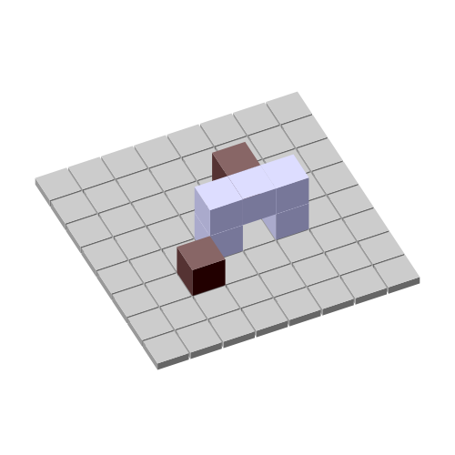

# 3D, baby!
    
*Originally published on [19 June 2009](http://strangelyconsistent.org/blog/3d-baby) by Carl Mäsak.*

Last night I had one of those rapid prototyping sprints where everything goes just right. I wanted to scout the terrain for drawing a 3D Druid board using SVG.

The result is this.

Yup, Raku did that, with a little help from me.

It was very pleasing to see this image grow step by step. I literally started with a grey rectangle. Then I programmatically massaged the coordinates, adding projections, translations, scalings and rotations until I had what I wanted. [Here's the code.](https://github.com/masak/druid/blob/d309b630710f9dc8d1bca00b995519b188ba9bfd/bin/generate-board)

I still feel two things are missing.

- **Real perspective.** Because I currently project the 3D coordinates flatly onto the canvas, the result is isometric perspective. For some reason I don't like that — to me, the furthermost corner looks like it's sloping upwards from the plane of the board. I think I'd be happy with [this kind of perspective](https://en.wikipedia.org/wiki/3D_projection#Diagram), so I'll try that next. I was offline today, and had a couple of minutes to sit down and do the (really simple) math. I'm glad to see Wikipedia agrees with what I got. 哈哈 [**Update**: Fixed, see comment.]
- **Non-cheating with the piece order.** I cheat right now in the sense that I placed the pieces in an order which looks good when drawn. The moves in a real game will not abide by such a restriction. I've already realized that I can draw all the horizontal surfaces in a separate pass, and don't need to sort those. I keep wondering whether I need to sort all the vertical surfaces separately, or whether it's enough to sort the pieces. Also, I'm thinking there might be nice, fast ways to determine that a surface will be completely covered by other surfaces, and can be thrown away. (Apart from the very simple case with the three surfaces on the back of each piece. I know about that one already.) [**Update**: Fixed, see comment.]

Anyway, I've been wanting to do this for a long time, and I'm glad that when I finally sat down to do it, not only was the result quite satisfactory, but also the process of getting there. It's 2009, and I'm using Raku to rapid-prototype 3D board games. Cool!
