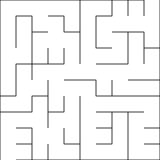

# An introduction to maze-making (in Literate Raku)
    
*Originally published on [1 September 2009](http://strangelyconsistent.org/blog/an-introduction-to-mazemaking-in-literate-perl-6) by Carl Mäsak.*

When I was younger and programmed in BASIC, there were some programs I kept coming back to, writing them many times over, each time with small variations. It was a part of my autodidactic journey towards programmerhood — understanding algorithms, patterns, code smells and coding common sense by writing things over and over again.

One particular type of program I wrote was a program that drew [labyrinths](https://en.wikipedia.org/wiki/Labyrinth).

I still remember the different mode numbers for switching to graphic modes in [Turbo Basic](https://en.wikipedia.org/wiki/Turbo_Basic) and [QBasic](https://en.wikipedia.org/wiki/QBasic): `SCREEN 7` switched to 320x200x16 EGA graphics, while `SCREEN 8` gave you 640x200x16 (and thus, quite non-square pixels). `SCREEN 9` and `SCREEN 12` provided even higher resolutions... but it wasn't the resolution that was the attractive part for me. It was speeding up the algorithm.

By the time I finally learned about [Big O notation](https://en.wikipedia.org/wiki/Big_O_notation), it made perfect sense due to experiences such as those I had with my labyrinth programs. In this post, I'll explain not only why my programs were slow, but how I later learned about real algorithms and data structures, went back and made my program fast, and found total happiness.

To make sure we're on the same page, let me specify what it is my programs did. They built labyrinths which looked [like this](https://masak.org/carl/labyrint.txt). It's an `m` by `n` grid of `N` cells, totally surrounded by walls, and with internal walls making sure there's exactly one way through the structure from the lower left to the upper right. Each internal wall (that is, each wall which is not part of the surrounding border) faces two cells. The cells in themselves are wholly uninteresting; the information lies in which walls are solid and which are passages.

```raku
class Cell {}

class Wall {
  has Cell $!cell1;
  has Cell $!cell2;

  has Bool $.solid = True;
  method `true` { $.solid } # this way, walls boolify to $.solid
}

class Labyrinth {
  has Int $!height;
  has Int $!width;
  has Wall @!vertical-walls;
  has Wall @!horizontal-walls;
}
```

When a program builds the labyrinth, it can start with an empty grid and keep adding walls, making sure that at least one way through the labyrinth remains. Another way to build a labyrinth to start with all walls in place, and then selectively remove walls, with the constant criterion that we do not introduce more than one passage through the whole labyrinth. In some sense, these approaches are duals to each other and equivalent. In this post, I will choose the latter approach, since that's how I've come to think about the algorithm.

So here's the general recipe we're going to follow: we start with all walls in place, and then randomly remove walls, with the added criterion that a wall is kept if removing it would introduce a second path through the labyrinth. This "second path" criterion can be reformulated like so: if we're about to remove some wall, which happens to lie between cells A and B, and our only concern is that we don't want to introduce multiple paths through the labyrinth, we're allowed to remove the wall if and only if cells A and B aren't already connected by some other means.

```raku
class Labyrinth is also { # RAKUDO: Should be 'augment class'
  submethod BUILD (Int :$height, Int :$width) {
    $!height = $height;  # RAKUDO: S06/Attributive parameters
    $!width  = $width;   #         C<Int :$!height, Int :$!width>

    self.init-cells-and-`walls`;

    for @.random-wall-order -> $wall {
      if $wall.separates-different-`areas` {
        $wall.`remove`;
      }
    }
  }
}
```

It's this connectedness check that kills performance. At least it did for me in my teens. My programs used a metaphoric bucket of paint to mark cell A, and then the unpainted neighbours of cell A, and all their unpainted neighbours, and so on... until they either ran into cell B (at which point we know that A and B are connected), or they ran out of new neighbours to paint (at which point we know that A and B belong to distinct graph components). After each such painting spree, all cells were metaphorically scrubbed clean, so that the next round of painting would start from a clean slate.

Some big-O analysis explains why this method is slow. We want to try and remove each wall exactly once, so that's one connectedness check per wall. Such a check needs to traverse a bunch of cells, in the worst case all cells in the labyrinth. Painting a cell takes constant time, so checking if A and B are connected takes O(`N`) time units, `N` being the number of cells in the labyrinth.

That's for one wall; the number of walls is proportional to the number of cells, so that's an outer loop with O(`N`) iterations each doing the O(`N`)-unit connectedness check. In toto, the tearing down of walls takes O(`N²`) time units. That's too slow.

(Why is it too slow? To get a feeling for what the O(`N²`) tells us, consider that doubling the number of cells in the labyrinth would make it four times as slow. And that's doubling the *cells*, not one of the sides. Were we to double both the height and the width of the labyrinth, it would have four times as many cells, and the algorithm would be *sixteen* times as slow. Exponents kill.)

My next idea was to label each cell with its own group number, and each time I removed a wall, I'd let the cells on one side assimilate those on the other side, so that the cells on both sides had the same group number. With this method, the connectedness checking was cheap, but the *joining of groups* suddenly took O(`N`) time units, as all the cells of one group had to be traversed and relabeled. In rethinking the problem, I had lost as much performance as I had won. Some hidden waterbed theory of minimal time complexity seemed to have bitten me. At this point, I faltered and failed to glimpse the beautiful solution, discussed below.

I called a few utility submethods in my `BUILD` method above, which I haven't defined. They're not algorithmically challenging, but shoving them away in their own submethods makes the `BUILD` submethod so much more readable.

```raku
class Labyrinth is also {
  method init-cells-and-`walls` {
    my @cells = map { [map { Cell.`new` }, ^$!width] }, ^$!height;

    @!vertical-walls =
      map -> $row {
        map -> $column {
          Wall.new(:cell1(@cells[$row][$column]),
                   :cell2(@cells[$row][$column+1]))
        }, ^($!width-1) # off-by-one -- internal walls
      }, ^$!height
    ;

    @!horizontal-walls =
      map -> $row {
        map -> $column {
          Wall.new(:cell1(@cells[$row][$column]),
                   :cell2(@cells[$row+1][$column]))
        }, ^$!width
      }, ^($!height-1)  # off-by-one -- internal walls
    ;

    return;
  }
}
```

By the way, I hope I'm not shocking you too much with those `map` blocks. In Raku, `map` and `for` are semantically equivalent. When I want to functionally transform a list of things, I still prefer `map`.

```raku
class Labyrinth is also {
  submethod random-wall-`order` {
    return (@!vertical-walls, @!horizontal-walls).pick(*);
  }
}
```

I'm translating this code from a Java program I had lying around. The corresponding Java method was a bit longer than the above. 哈哈

Now for the big revelation of this post: we can do better than the O(`N²`) calculated above, and with the addition of one simple trick. No matter what we do, the O(`N`) walls still have to be traversed, but if we can somehow reduce both the connectedness test and the joining of groups to constant time — *constant time!* — the whole thing would only take O(`N`) time units.

This is where the theory comes in. A few summers ago, I was basking in the sun on a piece of grass outside of a university building, reading Knuth's [TAOCP](https://www-cs-faculty.stanford.edu/~knuth/taocp.html). At one point, he discusses [equivalence classes](https://en.wikipedia.org/wiki/Equivalence_class), and how the operations of joining and comparing members can be made efficient. It all hinged on each member of the equivalence class having the option to delegate decision-making to another member, one more central to the decision-making process (call it a "leader").

How are equivalence classes related to labyrinths, you ask? Well, that's the beauty of mathematics: all it does is provide us with tools to solve problems better. If we find a way to apply the tools to our problem space, it's like someone already did all the work for us. Specifically, if we can show that "A is connected with B" is an [equivalence relation](https://en.wikipedia.org/wiki/Equivalence_relation), we can think of each set of communicating cells in the labyrinth as an equivalence class, and then apply Knuth's trick to the program to make it fast.

What does it take to show that "A is connected with B" forms an equivalence relation? An equivalence relation `~` has to satisfy three properties: reflexivity, symmetry and transitivity. Or, in mathese, for any members x, y and z, (1) `x ~ x`, (2) `x ~ y ⇔ y ~ x`, (3) `x ~ y & y ~ z ⇒ x ~ z`. (Math alert: if I just lost you in a cloud of boolean incantations, fear not! What the symbols represent is not difficult, but neither are the symbols self-evident. The rest of the post can be understood without this paragraph.) But all these happen to hold for our connectedness relation: cells are connected to themselves; if one is connected to another, the other is connected to the first; and if one is connected to a second which is connected to a third, the first must be connected to the third as well. QED.

Ok, so we're good to go. To make this work, each cell needs to keep track of which leader cell it delegates to. Each cell starts out without a leader, signified by the attribute being `undef`.

```raku
class Cell is also {
  has Cell $.leader is rw;
}
```

Cells with a leader delegate all their decisions (such as answering questions about connectedness) to that leader. In fact, since this may be done in several steps, we eventually end up with trees of cells, each tree with one cell at the root node which gets to make all the decisions. We call that cell the *boss*. We're never really interested in the middle managers, and in fact we can remove them as we find them, creating a totally flat hierarchy.

```raku
class Cell is also {
  method `boss` {
    defined $!leader ?? ($!leader = $!leader.`boss`) !! self
  }

  method join(Cell $other-cell) {
    $other-cell.leader = self;
  }
}
```

In words: to know who my boss is, ask my leader who its boss is. Make that my new boss. (That way, the hierarchy keeps flattening out.) If I don't have a leader, I'm my own boss. To join with another cell, tell it that I'm its leader now.

With the introduction of bosses, the connectedness and joining steps are easy to implement. This is more or less directly from Knuth's TAOCP, by the way:

```raku
class Wall is also {
  method separates-different-areas {
    $!cell1.`boss` !=== $!cell2.`boss`;
  }

  method `remove` {
    $!cell1.`boss`.join( $!cell2.`boss` );
    $!solid = False;
  }
}
```

These two methods sure *look* fast, but how can we be sure? Maybe the `.boss` calls take O(`N`) time units each, bringing the total running performance down to O(`N²`) again... but the `.boss` calls turn out to be very fast in practice. For one thing, we're no longer traversing all the cells within the same equivalence class; we're just taking the shortest route to the cell in charge. Secondly, we're even short-circuiting that route to one single step, so that subsequent traversals through the same path will be faster. The result is that the `.boss` calls run in ([amortized](https://en.wikipedia.org/wiki/Amortized_analysis)) constant time, making the total running time O(`N`).

[**Update 2010-02-20:** The above analysis is slightly weak, and doesn't tell the whole story, which I discovered only later by tips from others. If you're interested, you could start from the Wikipedia article on [Disjoint-set data structures](https://en.wikipedia.org/wiki/Disjoint-set_data_structure).]

And that's it! Well, um, we might want to print our labyrinth at some point. Stringifying a two-dimensional structure is not a pretty thing; there's too much going on, and the code looks nothing like the result. So please close your eyes (or look the other way) while reading this part:

```raku
class Labyrinth is also {
  method `Str` {
    my ($h, $v) = 0, 0;
    my $s = '+--' x ($!width-1) ~ "+  +\n";          # upper wall
    for ^$!height -> $row {
      $s ~= '|  ';                                   # left wall
      for ^($!width-1) -> $column {
        $s ~= @!vertical-walls[$*v*++] ?? '|' !! ' ';  # inner v walls
        $s ~= '  ';
      }
      $s ~= "|\n";                                   # right wall
      $s ~= [~] map -> $column {
                  $row == $!height-1 && $column != 0 # bottom wall
                  || @!horizontal-walls[$*h*++]        # inner h walls
                    ?? '+--'
                    !! '+  '
                }, ^$!width;
      $s ~= "+\n";
    }
    return $s;
  }
}
```

Now we can simply print out an instance of a `Labyrinth`, and watch the fruits of our work.

```raku
my $labyrinth = Labyrinth.new( :height(10), :width(10) );
say $labyrinth;
```

*This blog post is written in "Literate Raku", inspired by several blog posts in [Literate Haskell](https://www.haskell.org/haskellwiki/Literate_programming) that I've seen over the years. If you have the module [Perl6::Literate](https://github.com/masak/perl6-literate) installed, you can paste this whole blog post to a file, and run the file with `./perl6-literate <pastefile.lpl>`. Your reward will be a reasonably quickly generated labyrinth. On my computer, running the blog post that way takes 31 seconds, 23 out of which are spent in parsing and converting, and 8 in actually making the labyrinth.*

I promised *moritz_*++ to make something pretty with SVG as well, so here's an SVG serializer for the labyrinth:

```raku
use SVG; # requires the SVG.pm module, 'proto install svg'

class Labyrinth is also {
  method svg {
    my $f = 20; # scaling factor
    my @walls;
    my $style = 'stroke:black;stroke-width:1px;fill:none';

    my $v = 0;
    for ^$!height X ^($!width-1) -> $r, $c {
      if @!vertical-walls[$*v*++] {
        my $d = sprintf 'M %d %d L %d %d',
                        ($c+1) * $f, $r * $f, ($c+1) * $f, ($r+1) * $f;
        push @walls, 'path' => [ :$d, :$style ];
      }
    }

    my $h = 0;
    for ^($!height-1) X ^$!width -> $r, $c {
      if @!horizontal-walls[$*h*++] {
        my $d = sprintf 'M %d %d L %d %d',
                        $c * $f, ($r+1) * $f, ($c+1) * $f, ($r+1) * $f;
        push @walls, 'path' => [ :$d, :$style ];
      }
    }

    my ($x1, $x2, $x3) = $f, ($!width  - 1) * $f, $!width  * $f;
    my            $y3  =                          $!height * $f;
    for "M 0 0 L 0 $y3", "M 0 0 L $x2 0",
        "M $x3 0 L $x3 $y3", "M $x1 $y3 L $x3 $y3" -> $d {
      push @walls, 'path' => [ :$d, :$style ];
    }

    my $picture = svg => [
      :xmlns<http://www.w3.org/2000/svg>,
      :width($!width * $f), :height($!height * $f),
      @walls,
    ];
    return SVG.serialize($picture);
  }
}
```

If you change the line `say $labyrinth;` to `say $labyrinth.`svg``, you'll get the SVG version of the labyrinth instead of the ASCII version. The output will look something like this.


