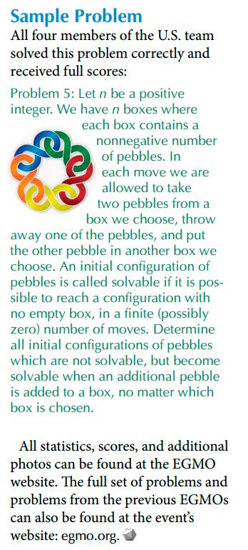

# Boxes and pebbles
    
*Originally published on [16 June 2014](http://strangelyconsistent.org/blog/boxes-and-pebbles) by Carl Mäsak.*

As I was riding to the airport the other day to pick up a friend, I stumbled
across this math problem tweet:



I started out drawing stuff in my notebook to solve it, but at some point I
decided to bring in Raku. The solution turned out to be quite illustrative,
so I decided to share it.

Below, I reproduce the problem specification, piece by piece, and interleave it
with REPL interaction.

## The problem
  
> Let *n* be a positive integer. We have *n* boxes where each box contains a nonnegative number of pebbles.

```
$ raku
> class Conf { has @.boxes where *.all >= 0; method gist { "[$.boxes]" } }
> sub conf(@boxes) { Conf.new(:@boxes) }; Nil
> sub n(Conf $c) { $c.boxes.elems }; Nil
```

I was a bit saddened to learn that the `where` clause on the attribute isn't
enforced in Rakudo. There's now [an RT
ticket](https://rt.perl.org/Ticket/Display.html?id=122109) about that.

The `Nil` at the end of some lines is to quiet inconsequential or repetitive
output from the REPL.

Let's take as our running concrete example the starting configuration `[2, 0]`.
That is, two boxes, one with two pebbles and one empty. As we will see, this is
one of the smallest answers to the problem.

```raku
> n(conf [2, 0])
2
```
  
> In each move we are allowed to take two pebbles from a box we choose, throw away one of the pebbles, and put the other pebble in another box we choose.

```
> sub but(@list, &act) { my @new = @list; &act(@new); @new }; Nil
> sub add($c, $to, $count) { conf $c.boxes.&but(*.[$to] += $count) }; Nil
> sub remove($c, $from, $count) { conf $c.boxes.&but(*.[$from] -= $count) }; Nil
>
> sub move($c, $from, $to) { $c.&remove($from, 2).&add($to, 1) }; Nil
> sub moves-from($c, $from) { (move($c, $from, $_) for ^n($c)) }; Nil
> sub moves($c) { (moves-from($c, $_) if $c.boxes[$_] >= 2 for ^n($c)) }; Nil
> 
> moves(conf [2, 0])
[1 0] [0 1]
```

The condition `if $c.boxes[$_] >= 2` ensures that we don't make a move when
there aren't enough pebbles in a box.
  
> An initial configuration of pebbles is called solvable if it is possible to reach a configuration with no empty box, in a finite (possibly zero) number of moves.

```
> sub has-empty-box($c) { so any($c.boxes) == 0 }; Nil
>
> has-empty-box(conf [2, 2, 2, 0])
True
> has-empty-box(conf [2, 2, 2, 1])
False
> sub is-solvable($c) { !has-empty-box($c) || so is-solvable any moves $c }; Nil
>
> is-solvable(conf [2, 0])
False
> is-solvable(conf [3, 0])
True
```

The definition of `is-solvable` is the first case where I feel that Raku
shines in this problem. That one-liner lets us perform a search using all
possible moves for any configuration that has no empty boxes.

For example, if we did this:

```
> is-solvable(conf [4, 0, 0])
```

Then the tree search that happens in the background is this:

```
[4 0 0]
    [3 0 0]
        [2 0 0]
            [1 0 0]
            [0 1 0]
            [0 0 1]
        [1 1 0]
        [1 0 1]
    [2 1 0]
        [1 1 0]
        [0 2 0]
            [1 0 0]
            [0 1 0]
            [0 0 1]
        [0 1 1]
    [2 0 1]
        [1 0 1]
        [0 1 1]
        [0 0 2]
            [1 0 0]
            [0 1 0]
            [0 0 1]
```

...and `is-solvable` concludes that no matter how it moves the pebbles, it
always ends up with a zero *somewhere*, so this configuration isn't solvable,
and so the result is `False`.

By the way, we know that any search like this is finite, because every move
reduces the net amount of pebbles.
  
> Determine all initial configurations of pebbles which are not solvable, but become solvable when an additional pebble is added to a box, no matter which box is chosen.

```
> sub add-pebble($c, $to) { conf $c.boxes.&but(*.[$to] += 1) }; Nil
> sub add-pebble-anywhere($c) { (add-pebble($c, $_) for ^n($c)) }; Nil
> 
> add-pebble-anywhere(conf [2, 0])
[3 0] [2 1]
> sub is-answer($c) { !is-solvable($c) && so is-solvable all add-pebble-anywhere($c) }; Nil
> is-answer(conf [2, 0])
True
> is-answer(conf [4, 0, 0])
True
```

So as we see, our example configuration `[2, 0]` is a possible answer, because
it is not in itself solvable, but adding a pebble in any of the two boxes makes
it solvable. Similarly, the `[4, 0, 0]` that we tree-searched above isn't
solvable, but becomes solvable with a pebble added anywhere.

## Hostages, heroes and civilians

Having specified the problem thus far, I started to use to make it clearer in
my mind by introducing idiosyncratic terminology. I started thinking of the
empty boxes as **hostages**, because they need saving before the end of the
day.

```
> sub hostages($c) { +$c.boxes.grep(0) }; Nil
> hostages(conf [2, 0])
1
> hostages(conf [3, 0, 0])
2
```

Likewise, some pairs of pebbles are **heroes**... but not all of them. First
off, the two pebbles have to be in the same box to make up a hero.

Secondly, the bottom pebble is effectively fixed and cannot contribute to a
hero. (Because if we removed it, there would be no pebbles left, and we'd have
created another hostage.)

In other words, if we take the pebbles in a box,
subtract one, divide by two, and round down, we get the number of heroes in
that box.

```
> sub heroes($c) { [+] ($c.boxes »-» 1) »div» 2 »max» 0 }; Nil
> heroes(conf [2, 0])
0
> heroes(conf [3, 3, 0])
2
```

Heroes live to save hostages. In fact, any move which *doesn't* use a hero to
save a hostage will just end up wasting a pebble. We can use this knowledge to
define a better `moves-from` sub, restricting it to moves that save hostages:

```
> sub moves-from($c, $from) { (move($c, $from, $_) if $c.boxes[$_] == 0 for ^n($c)) }; Nil
```

The search moves faster with this condition. For example, the search tree from
above gets trimmed to this:

```
[4, 0, 0]
    [2, 1, 0]
        [0, 1, 1]
    [2, 0, 1]
        [0, 1, 1]
```

Changing the literal `2` to `3` in the function `moves` (in recognition of the
fact that the bottom pebble never figures in a viable move) cuts the tree down
even further:

```
[4, 0, 0]
    [2, 1, 0]
    [2, 0, 1]
```


I noticed the pattern that any possible answer configuration I could come up
with had the property that there was exactly one more hostage than there were
heroes.

```
> sub one-more-hostage-than-heroes($c) { hostages($c) == heroes($c) + 1 }; Nil
> one-more-hostage-than-heroes(conf [2, 0])
True
> one-more-hostage-than-heroes(conf [3, 1, 0])
False
```

This makes intuitive sense: a configuration that is an answer needs to be not
solvable (less than one hero per hostage), but it also needs to be *just
barely* not solvable. That is, there has to be just one hostage too many.

Does this fully describe a solution, though? It turns out it doesn't, but in
order to see it, let's bring in a testing tool.

## Proving stuff with QuickCheck

We'll want to generate thousands of random configurations for this, so I
defined the following two routines. The configuration space is infinite, and it
was hard to know how to choose configurations randomly. In the end I favored
an approach with small finite configurations with relatively few pebbles,
hoping it would catch all relevant cases.

```raku
sub random-box { Bool.pick ?? 0 !! (1..5).pick }
sub random-conf {
    my $n = (0..5).pick;
    conf [random-`box` xx $n];
}
```

Next up, a function that tests a certain property on a lot of random
configurations. It's not a total guarantee of correctness, but once you've
tested something against 1000 random inputs, you can have a fairly high
confidence that no exception has slipped through. Think of it as a kind of
probabilistic proof.

```raku
sub quickcheck(&prop, $N = 1000) {
    for ^$N {
        print "." if $_ %% 20;
        my $c = random-conf;
        return "Counterexample: $c.`gist`" unless &prop($c);
    }
    return "All $N cases passed.";
}
```

First up, let's test the statement that if some configuration is a solution,
then it has one more hostage than it has heroes.

Because these properties end up talking a lot in terms of if-then
relationships, let's create a operator for logical implication.

```raku
sub infix:«⇒»($premise, $conclusion) { !$premise || $conclusion }
sub if-answer-then-one-more-hostage($c) {
    is-answer($c) ⇒ one-more-hostage-than-heroes($c);
}
> quickcheck &if-answer-then-one-more-hostage
..................................................All 1000 cases passed.
```

Ok, that turns out to be true. How about in the other direction?

```raku
sub if-one-more-hostage-then-answer($c) {
    one-more-hostage-than-heroes($c) ⇒ is-answer($c);
}
> quickcheck &if-one-more-hostage-then-answer
.Counterexample: [0 1]
```

This is why QuickCheck-based testing is great; it not just tells us that
something fails, it also gives us a *counterexample* by which we can see
clearly *how* and *why* it fails. In this case, that 1 in there is not enough
to save the hostage. Nor is it enough if that box gets another pebble.

Clearly there is some factor at work here besides hostages and heroes.

We've accounted for that bottom pebble, the useless one that we can never do
anything with. On top of it are zero or more pairs of pebbles; our heroes. But
on top of *that* can be yet another pebble; let's define a lone pebble like
that to be an **everyday hero**, because all it takes is a small push (one more
pebble) to create a hero out of an everyday hero.

The bottom pebble + pairs of pebbles for heroes + everyday hero pebble = a
positive even number of pebbles. So the easiest way to state "this box is
either a hostage or an everyday hero" is to say "there's an even number of
pebbles in this box".

Let's see if adding that condition is enough to predict answers.

```raku
sub all-hostages-or-everyday-heroes($c) { so $c.boxes.all %% 2 }
sub if-one-more-hostage-and-all-hostages-or-everyday-heroes-then-answer($c) {
    (one-more-hostage-than-heroes($c)
        && all-hostages-or-everyday-heroes($c))
        ⇒ is-answer($c)
}
> quickcheck &if-one-more-hostage-and-all-hostages-or-everyday-heroes-then-answer
..................................................All 1000 cases passed.
```


It is enough! Now that we know if it's a sufficient condition, let's find out
if it's also a necessary one.

```raku
sub one-more-hostage-and-all-hostages-or-everyday-heroes-means-answer($c) {
    (one-more-hostage-than-heroes($c)
        && all-hostages-or-everyday-heroes($c))
        == is-answer($c)
}
> quickcheck &one-more-hostage-and-all-hostages-or-everyday-heroes-means-answer
..................................................All 1000 cases passed.
```

Ooh, and it *is*! Lovely.

Notice how much of a simplification this brings about. The two conditions we
just defined (`one-more-hostage-than-heroes` and
`all-hostages-or-everyday-heroes`) just check surface properties of a
configuration, whereas `is-answer` has to perform a possibly large tree search.
But `quickcheck` tells us that the combination of the two conditions is
completely equivalent to the whole tree search.

Awesome.

Just to bring that point home, let's drop all the cute terminology, and just
write it in terms of the mathematical properties we need to check:

```raku
sub pebbles-are-twice-boxes-minus-two-and-all-boxes-even-means-answer($c) {
    ([+]($c.boxes) == 2 * n($c) - 2 && so($c.boxes.all %% 2))
        == is-answer($c)
}
> quickcheck &pebbles-are-twice-boxes-minus-two-and-all-boxes-even-means-answer
..................................................All 1000 cases passed.
```

And that's the answer.

(You can also read the solution
[here](https://egmo2014.tubitak.gov.tr/sites/default/files/solutions-day2.pdf),
problem 5.)

## Enumerating all answers

We might consider ourselves having solved the problem completely, but it feels
a bit weird to leave it at that. Can't we get a list of all the answers too?

I started writing a custom recursive solution, but ended up recognizing what I
was doing from the output I was getting. (And from the fact that the number of
answers of each size led me to [this OEIS sequence](https://oeis.org/A000041).)

What we're looking for is really a kind of integer partitions. That makes
sense; we have a fixed number of pebbles, and we want to distribute them among
the boxes in all possible ways.

As one does nowadays, I went out on Stack Overflow to look for a suitable
algorithm to compute integer partitions. Found [this elegant Python
solution](https://stackoverflow.com/a/10036764). This is my Raku rendering of
it:

```raku
sub partitions($n) {
    uniq :as(*.Str), gather {
        take [$n];
        for 1..^$n -> $x {
            take ([($x, .list).sort] for partitions($n - $x));
        }
    }
}
```

Of course, once we have the partitions, we need to massage them a little bit.
To be exact, we reverse the partition (because I like reading them in
descending order), double the numbers (to get only even numbers), and we pad
with zeroes at the end.

```raku
sub double(@list) { @list »*» 2 }
sub pad(@list, $size) { [@list, 0 xx ($size - @list.elems)] }
sub all-answers($n) { (.reverse.&double.&pad($n) for partitions($n - 1)) }
```

Note by the way that these answers are "symmetry broken". For each solution,
the order of the boxes is immaterial to the problem, so all permutations of
boxes are also viable answers. So picking a canonical order and sticking with
it makes the output a lot smaller without missing anything essential.

Finally, we print the answers. Sorting is not necessary, just esthetic.

```raku
sub array-cmp(@xs, @ys) { [||] @xs Z<=> @ys }
for 1..* -> $n {
    my @answers = all-answers($n).sort(&array-cmp);
    say "{@answers.elems} answers of size $n:";
    say "  ", .&conf for @answers;
}
```

This is how they look. These are just the first seven iterations; it goes on
for a while.

```
1 answers of size 1:
  [0]
1 answers of size 2:
  [2 0]
2 answers of size 3:
  [2 2 0]
  [4 0 0]
3 answers of size 4:
  [2 2 2 0]
  [4 2 0 0]
  [6 0 0 0]
5 answers of size 5:
  [2 2 2 2 0]
  [4 2 2 0 0]
  [4 4 0 0 0]
  [6 2 0 0 0]
  [8 0 0 0 0]
7 answers of size 6:
  [2 2 2 2 2 0]
  [4 2 2 2 0 0]
  [4 4 2 0 0 0]
  [6 2 2 0 0 0]
  [6 4 0 0 0 0]
  [8 2 0 0 0 0]
  [10 0 0 0 0 0]
```

## So, it has come to this

I put all the code from this blog post [in a
gist](https://gist.github.com/masak/f865b7d9dd33e535b501) if anyone wants to
play with it.

This problem is now officially flushed out of my system. I like how Raku rose
to the challenge of helping me solve it. I'm also positively surprised by the
"feel" of doing QuickCheck testing. Gotta do more of that.

I worked under a self-imposed restriction that things written in the REPL ought
to fit on one line. It made me reach for ways to chunk ideas into functions,
which I think ended up bringing out the intent of each step a bit better.

Finally, although I knew it from before, junctions and hyperops and ranges and
list comprehensions and functions and metaoperators and custom operators and
lazy lists... they all conspire to make problem solving and exploratory
programming like this a really pleasant experience.
