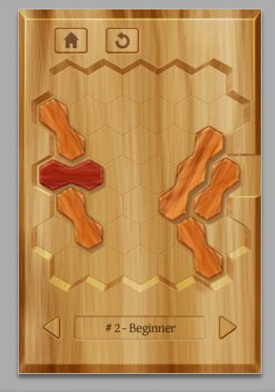
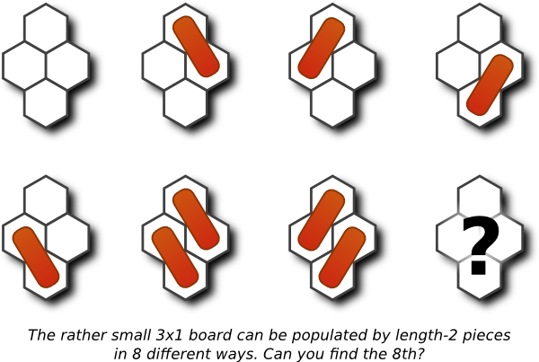
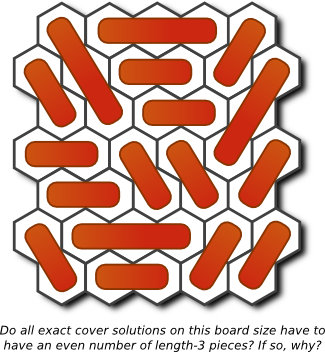

# Counting t4 configurations
    
*Originally published on [25 March 2012](http://strangelyconsistent.org/blog/counting-t4-configurations) by Carl Mäsak.*


I discovered the t4 task in a beach paradise on the island Ko Lanta in
Thailand. I was there with friends, having a long-awaited December vacation,
away from dreary Swedish cold and dark and snow. Instead, we were enjoying
sun and shade, cool drinks on the beach or the quiet of our air-conditioned
condo, getting caught up with reading, talking amongst ourselves, and exploring
our surroundings. We seemed to have gotten there just a few weeks before the
normal wave of tourism, so we felt uniquely at peace and at ease.

One day I was playing around with my Android phone, looking for some game to
distract me in this oddly tranquil place. Since I'm ever fascinated with games
on hexagonal grids, I searched for "hex". And I found this hex-grid-based
one-player puzzle game that had me instantly hooked.

The easiest way to understand the t4 task is probably to play the game, and actually drag some pieces around.



The description of t4 merely captures in formal writing what the puzzle game
shows plainly:

This problem makes use of a board of hexagonal cells that looks like this:
```
      i1  i2  i3  i4  i5
    j1  j2  j3  j4  j5  j6
      k1  k2  k3  k4  k5
    l1  l2  l3  l4  l5  l6
      m1  m2  m3  m4  m5
    n1  n2  n3  n4  n5  n6
      o1  o2  o3  o4  o5
```
Each cell has up to six neighbors. l3 has neighbors (clockwise) k3, l4, m3,
m2, l2, and k2.

The board is populated with some number of straight pieces of length 2 and 3.
Pieces never overlap, but they can move in the direction of their length,
which we will refer to as a "groove". So for example, a piece that starts out
on locations l1 and l2 can "slide" over to rest on locations l5 and l6.

No valid move can make a piece leave the groove in which it was first found.
We write "groove" because "row" doesn't quite capture how the pieces can be
situated. Besides the above seven rows of the table, a groove (and thus the
pieces in it) can also run along a diagonal direction, like this:
```
      e1  d1  c1  b1  a1
    f1  e2  d2  c2  b2  a2
      f2  e3  d3  c3  b3
    g1  f3  e4  d4  c4  b4
      g2  f4  e5  d5  c5
    h1  g3  f5  e6  d6  c6
      h2  g4  f6  e7  d7
```
Or a groove and its pieces could run along the other diagonal direction:
```
      p2  q4  r6  s7  t7
    p1  q3  r5  s6  t6  u6
      q2  r4  s5  t5  u5
    q1  r3  s4  t4  u4  v4
      r2  s3  t3  u3  v3
    r1  s2  t2  u2  v2  w2
      s1  t1  u1  v1  w1
```
There are a total of 23 grooves on the board, 7 horizontal, and 8 for
each diagonal. Grooves vary in length from 2 (out in the corners) to
7 (around the main diagonals).

The t4 description goes on for some time, but I'll stop there for now, because
this post doesn't consider the dynamic aspects of the puzzle, only the board
configurations.

Parenthetically, figuring out a decent coordinate system for the board, which
manages to encode the fact that the grooves constrain the pieces, and the way
each location on the board is the intersection of (exactly) three grooves, took
me somewhere between hours and days of thinking. I was a bit disappointed to
have to make that part public (in order to rein in the solutions enough and to
be able to write base tests for the task). Looking at the solutions sent in,
I don't think many people appreciated how much one can actually get for free
with this particular encoding.

The t4 task is to write an algorithm that gets one special piece from one side
of the board to another. Sometimes other pieces will block its way, and will
have to be moved away first. And so on, recursively. The "and so on" bit is
what makes this an interesting problem.

My attention quickly focused on more basic matters, though.

The app on my Android phone sports a thousand distinct puzzles. Presumably the
good people at [Tiny Bite Games](https://tinybitegames.com/) generated these
algorithmically somehow. Some of these are on slightly different boards, but
I've chosen to ignore those for the purposes of t4. There's also a non-free
version with ten thousand puzzles.

How many puzzles are there?

Or, to be precise, how many board configurations are there? By "board
configuration", I mean every legal way to strew pieces on the board, everything
from leaving the board empty to completely filling it up with length-2 and
length-3 pieces. All of them.



As we headed out from Ko Lanta, I tried to upper-bound this, with just pen and
paper, just multiplying out all the ways to place length-2 and length-3 pieces
in all the grooves but without accounting for collisions. I arrived at a
ridiculous number of combinations: about 3e57. I looked out the window of the
taxi-jeep and saw my first real-life elephant. It looked small in comparison.

Now, "all possible board configurations" isn't the only number that might
interest us here. It's just the "universe" of objects that we're dealing with
in t4. As days and weeks went by (and I eventually got back home from
vacation), finding the exact number of configurations became a worthy
challenge, a Mount Everest of sorts.

But there are other, smaller numbers, which are also interesting:

- The number of configurations with a piece l12. ("start-configurations")
- The number of configurations with a piece l12 *and no other l-groove piece*.
- The number of solvable start-configurations.
- The number of trivially solvable start-configurations (where the solution is
simply `l[12 -> 56]`).

But I didn't want to attack these problems until I had felled the beast.
Finding the number of all possible configurations, the size of the problem
space, the extent of the universe. Which was hopefully a lot smaller than 3e57.

Here's one way to solve it, in pseudocode:

```
Set confs <- 0
For all combinations of piece placements
    If there are no forbidden overlaps
        Set confs <- confs + 1
Output confs
```

It's a wonderfully simple program to think up. And it only has one loop in it.
Let's say we happen to have an unbelievably fast computer at hand, which runs
the loop in an optimized way so that each iteration takes a nanosecond on
average. That's faster than today's computers, for sure.

Yeah, so. You run that on your fast computer, and I'll go brew some coffee.
See you in nine and a half million million million million million million
years.

So, that clearly wouldn't work. The program was simple to implement, but it
just wouldn't terminate before our physical universe did. Basically, if you
have to loop over ~3e57 things, you're screwed.

I needed something that could intelligently weed out impossible branches as it
went along, that didn't make the stack or the RAM blow up. Come to think of it,
something a little like the [Dancing
Links](https://en.wikipedia.org/wiki/Dancing_Links) algorithm, which computes
solutions to "[exact cover](https://en.wikipedia.org/wiki/Exact_cover)"-type
problems quickly (considering), and in constant space.

Conveniently, I had written a DLX solver in 2011. In C, no less (for speed).
The idea with that project, which was only partly realized, is to make it very
easy to specify problems in some "human" representation, and then frontends and
backends to the solver would take care of the translation.

Of course, the board configuration enumeration problem wasn't an exact cover
problem, I knew that. It would be if I was only interested in all the possible
ways to fill up the board completely with length-2 and length-3 pieces. (There
are 11,071,306 such configurations. Because I knew you were wondering.) But I
didn't want that, I wanted board configurations with "gaps" in them too.
(Especially since these are the only ones that can actually be solved!) But I
figured I could extract the "essence" of the DLX algorithm, which is to be
clever about possible alternatives at each choice point.



After a week of trying and failing to write an algorithm that borrowed the
"essence" of the DLX algorithm, I came to an embarrassing realization.

The problem I wanted to solve *is* an exact cover problem. It can be solved
directly using the DLX code I already had.

It was the word "gaps" that had me confused. Exact cover problems are
characterized by the fact that their solutions have no overlaps, and no gaps.
(That's what the "exact" in "exact cover" means.) But, fine, let's replace the
word "gap" by the word "marshmallow". Now, what I was looking for was all the
possible ways to fill the board with length-2 pieces, length-3 pieces, and
marshmallows. Voilà, exact cover problem.

Some problems are made solvable simply by restating them. Also, don't
underestimate the power of reifying nothingness.

So, I fed a representation of the problem into my DLX solver. It ran for two
weeks on a decent computer, enumerating millions of configurations a second. It
came up with this answer:

There are 4,783,154,184,978 board configurations. A bit short of five million
million. Graah, I felled the beast!

Before this long calculation was even finished, it had occurred to me that (1),
(2) and (4) on my list were *also* describable as exact cover problems. Only
(3) is tricky and requires actually making moves on the board. But the other
three questions can be formulated as exact cover problems by changing the shape
of the board, essentially "forbidding" either one groove to occupy a location,
or forbidding the location outright.

I started generating such exact cover models with a [100-line Raku
script](http://gist.github.com/masak/2189078). The numbers that fell out were these:

- There are 573,538,221,334 configurations with a piece l12.
- There are 375,873,151,406 configurations with a piece l12 and no other l-groove pieces.
- *The number of solvable start configurations is still unknown as of this writing.*
- There are 7,767,954,496 trivially solvable configurations.

At least now it doesn't feel unlikely at all that some game company manages to
generate ten thousand hex puzzles.
