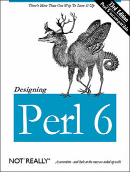

# Happy 10th anniversary, Raku
    
*Originally published on [18 July 2010](http://strangelyconsistent.org/blog/happy-10th-anniversary-perl-6) by Carl Mäsak.*

On this date exactly 10 years ago, Jon Orwant threw coffee mugs against a wall during a meeting. Wikipedia chronicles the announcement of Raku as being on July 19 ten years ago... but the throwing of mugs on the 18th can be said to spark the birth of Raku.

Why did he throw mugs? [Larry Wall's own explanation](https://web.archive.org/web/20080323150418/http://www.spidereyeballs.com/os5/set1/small_os5_r06_9705.html) covers it in sufficient detail:

> We spent the first hour gabbing about all sorts of political and
organizational issues of a fairly boring and mundane nature. Partway through,
Jon Orwant comes in, and stands there for a few minutes listening, and then he
very calmly walks over to the coffee service table in the corner, and there
were about 20 of us in the room, and he picks up a coffee mug and throws it
against the other wall and he keeps throwing coffee mugs against the other
wall, and he says "we are fucked unless we can come up with something that
will excite the community, because everyone's getting bored and going off and
doing other things".

> And he was right. His motivation was, perhaps, to make bigger Perl
conferences, or he likes Perl doing well, or something like that. But in
actual fact he was right, so that sort of galvanized the meeting. He said "I
don't care what you do, but you gotta do something big." And then he went
away.

> Don't misunderstand me. This was the most perfectly planned tantrum you
have ever seen. If any of you know Jon, he likes control. This was a perfectly
controlled tantrum. It was amazing to see. I was thinking, "should I get up
and throw mugs too?"

When I thought up this blog post, I knew about the incident but wasn't sure when it had happened. I made some Internet research on my own, and couldn't really find a source mentioning the day of the mug throwing.

I did find [this email](https://www.nntp.perl.org/group/perl.packrats/2002/07/msg3.html), which outlines the participants and the number of mugs thrown.

In the end, I asked Larry Wall on IRC about the date. The ensuing pun-ridden discussion is quite typical of #raku.

```
<*TimToady*> masak: btw, the mugs were the day before
<jnthn> mugs? I thought it was just one mug!
<masak> jnthn: five.
<masak> jnthn: only one broke, though.
<masak> *TimToady*: thanks. still time to prepare for an anniversary blog post,
        then.
<jnthn> masak: Smashing.
<*TimToady*> I wish I'd collected the broken mug
<masak> "Raku: breaking mugs and backwards compat since 2000"
* pmichaud fires up photoshop, looks to cafepress
<masak> pmichaud: "Raku: the greatest language ever to emerge out of the
        shards of a mug."
<pmichaud> "Break mug in case of language stagnation."
<jnthn> "Raku. It's Perl with a cupple of improvements."
<pmichaud> "Raku mugs -- another lucky break!"
<masak> "if $mug === all @shards { say 'We need a break from all the mug puns!' }
<jnthn> Oh, you can handle it. :P
* masak shatters from laughter
<*TimToady*> "Why's Jon throwing donuts?"  --topologist
<masak> :P
<*TimToady*> "This is a broken mug.  <mug> This is your brane on broken mugs.
           <camelia> Any questions?"
<masak> "Raku: seeking the holy grail after accidentally smashing it ten
        years ago."
<jnthn> "How is mug re-formed?"
<masak> They need to do way instain Jon Orwant.
<jnthn> Who harms 5 mugs that cannot frigth back!
<masak> My pary are with the cleaner.
<masak> "Raku: poculum iacta est."
```

By now, Raku has a 10-year history. I thought I'd spend the rest of the blog post recounting it from (mostly) my perspective. With this I hope I will manage to convey not only the actual sequence of events, but also some of my enthusiasm about the project, and why I think Jon Orwant's broken mug kicked off one of the coolest projects in modern programming language history.

## The early years

Perhaps you've heard about **the RFC process**. This was right at the beginning of Raku's life, when even Larry Wall wasn't sure which direction to take Raku, and a system was created wherein people could send in their proposals for language features. Something on the order of 20 or 30 RFCs were excpected before the closing date.

361 RFCs were sent in.

Not only were they many more than expected; they were all over the map, mutually inconsistent, and overall each of them advocated one feature without much concern for the rest of the language. Had we somehow decided to go right ahead and just make a language of all those RFCs, we probably would have ended up with something very much like this famous parody of Raku.



There was also little concern for *how* the proposed features would be added. Mark-Jason Dominus wrote in his [Critique of the Raku RFC Process](https://www.perl.com/pub/2000/11/perl6rfc.html) how a large part of the RFCs neglected to consider the implementation of the proposed features:

> It leads to a who-will-bell-the-cat syndrome, in which people propose all sorts of impossible features and then have extensive discussions about the minutiae of these things that will never be implemented in any form. [...] It distracts attention from concrete implementation discussion about the real possible tradeoffs. [...] Finally, on a personal note, I found this flippancy annoying. There are a lot of people around who do have some understanding of the Perl internals.

Jarkko Hietaniemi countered with a [more optimistic view](https://www.perl.com/pub/2000/11/jarkko.html) of the process:

> [...] now we have an idea of the kind of things (both language-wise and application/data-wise) people want to do in Perl and with Perl, or don't like about Perl. [...] Based on that feedback Larry can design Raku to be more flexible, to accommodate as many as possible of those requests in some way. [...] Without the RFC process we wouldn't have had that feedback.</div>

In the end, Larry Wall took on the work of triaging the RFCs and distilling them into a coherent whole. He did this in the form of **Apocalypses**, which collected the RFCs in different categories and commented on them one by one. The RFCs were either accepted with different amounts of caveats, or rejected. The Apocalypse numbers were based on different chapters in the Camel book; for example, chapter 3 of that book describes operators, so Apocalypse 3 talks about operators in Raku.

Here are all the Apocalypses that were published:

- Apocalypse 1, May 2001
- Apocalypse 2, May 2001
- Apocalypse 3, Oct 2001
- Apocalypse 4, Jan 2002
- Apocalypse 5, Jun 2002
- Apocalypse 6, Mar 2003
- Apocalypse 12, Apr 2004

In other words, the whole period 2001-2004 can be seen as the period when Raku was still being distilled from the various wishes people had about it.

Along with the Apocalypses were published same-numbered **Exegeses**, by Damian Conway who also had a central role in designing Raku. Where the Apocalypses were geared towards explaining language decisions for and against features, the Exegeses set out to showcase the new combinations of features, and to explain to Perl programmers the improvements introduced in Raku.

Reading the Exegeses today, what's especially noticeable is the sense of Raku as a variant of Perl. Sure there are lots of little tweaks and changes, but as Damian notes after writing a rather elaborate script in E02, "In fact, that's only 40 characters (out of 1779) from being pure Perl. And almost all of those differences are @'s instead of $'s at the start of array element look-ups. 98% backwards compatibility even without an automatic p52p6 translator...pretty slick!".

Not much remains of that idea today; if you'd step into the channel and ask "is Raku like Perl?", we'd tell you that while the general goals and ideas can still be discerned, the syntax is so different that it's probably better to start learning it than try to code Raku like one would code Perl.

In 2004, the Apocalypses were summarized down into **Synopses**, which contained the decisions from the Apocalypses without all the explanatory monologue. The Synopses would form a specification for Raku the language, and were directed towards language implementors. They're fairly dense, but still a good read for anyone seriously interested in the language. The synopses are still normative and kept up-to-date. At the time of writing, I count [33 synoptic documents](https://github.com/Raku/old-design-docs). Synopses 2 through 6 tend to be fairly stable, although changes still occur. The remainder of the synopses are still drafts for the most part, awaiting more feedback from implementations and language use.

During all this, efforts to start implementing Raku were planned, started and abandoned. Already before the mug throwing and the RFCs, Chip Salzenberg started developing a project code-named **Topaz** in *C*++, which was slated to grow into Raku. The Topaz project, a rewrite of Perl internals, was eventually abandoned. [I asked Larry](https://irclogs.raku.org/perl6/2010-04-27.html#19:31-0003) why, and he replied that "reimplementing insanity is insane". (Meaning "don't try to extend the Perl internals into Raku".)

There was also a one-week exploration project called **Sapphire**; another rewrite of Perl internals in September 2000, shortly after the announcement of Raku, Sapphire was mostly intended to be a sort of tracer bullet to learn things about an eventual real implementation.

Finally, **Parrot** was a fledgling virtual machine created with the express purpose to be good at running dynamic languages; especially Raku, the dynamickest language of the bunch. **Ponie** was an attempt to drag the Perl internals, kicking and screaming, into the Parrot Virtual Machine and have them run there. The Ponie project, as can be read [here](https://www.nntp.perl.org/group/perl.ponie.dev/2006/08/msg487.html) suffered from a too-low bus number as well as Parrot's relative immaturity; Ponie was ultimately "put out to pasture" in 2006. An early implementation of Raku on Parrot was also developed at this time, but by 2004 it had also [proved to be unworkable](https://github.com/parrot/parrot/blob/RELEASE_0_3_1/languages/raku/README).

As someone on the outside looking in, I knew of Parrot, but not of the other projects. I didn't know about the Raku project that already existed on Parrot, only about the Apocalypses and the Exegeses, all of which I had read with interest. What happened now? Would this programming language ever become a reality? No-one seemed to know. And nothing exciting seemed to happen.

In early 2005, a certain A. Tang made an entrance, posting a short [announcement](https://www.mail-archive.com/perl6-all@perl.org/msg45008.html) on the list of a "side-effect-free subset of Raku". (Notice the parallels between the tone of this email and Linus Torvald's famous "nothing serious like GNU" announcement.) Before I knew it, the side-effect-free subset of Raku had mutated into something called **Pugs**, a full-fledged implementation.

## Pugs: The golden age

I remember stumbling into the #raku channel on freenode, still fairly dazed by the fact that someone was taking the Synopses and implementing them. Add to this that Audrey Tang turned out to be a frighteningly productive hacker with a magnetic personality which drew other people into the project like nothing I or many others had ever seen. Being on the #raku channel was like standing close to the eye of a hurricane; things just magically happened, either because Audrey had just landed another set of commits, or because someone had started a cool side project and was hacking on that, all the while bringing interesting ideas and thoughts into the channel.

And we were all running (an early version of) Raku! Operators, subs, classes, operator overloading... one by one, the cool features we had anticipated started working. We introduced bots to be able to run Raku code right in the channel. Audrey threw out commit rights to the Pugs repository to anyone who made as much as a peep about possible improvements. And it worked! Hundreds of people were given commit-bits, and rather than seeing a massive amount of vandalism like you would on a wiki, we saw a great number of these people contributing constructively to the project. The slogan at that time was to "trust the anarchy", a seriously scary notion. A happy Audrey stood in the middle of it all, guiding the various efforts along, blogging almost daily, contributing insane amounts of code herself, and injecting steam into an ever-more concrete Raku community.

Pugs is written in Haskell, and many of the cultural traits at the beginning came from the Haskell culture. Pugs hackers went by the moniker "lambda-camels". There was an unusually high amount of references to comp.sci. papers, and books about Haskell, and esoteric books about programming in general. A representative list can still be found in Pugs' [READTHEM](https://github.com/raku/mu/raw/master/READTHEM) file. The humor was intelligent and often riffed off of some computer topic or other.

```
<audreyt> Alias_: my eyeglasses has style="border: none"
<Alias_> doesn't matter
<Alias_> optical edge cases at the boundaries create border: solid 1px #99999
<audreyt> true
<audreyt> though it's more like ridged in my case
* audreyt sighs at the general geekiness
<audreyt> apparently *malaire*++ is to blame
<audreyt> I mean, to praise
<audreyt> or to annotate
```

The predominant interjection was "woot!". The predominant user of the interjection "woot!" was Audrey. Karma points were the new currency, and bots roamed the channel keeping track of the karma points, or handing them out while emitting real-time commit messages.

Let me be clear about one thing: at that point on the #raku channel, I was a groupie. I didn't contribute significantly to Pugs, or to the discussion around the Synopses or the language itself. I did try my best to contribute to the jokes.

In March 2005, I had made enough silly noise to get a commit bit:

```
<autrijus> welcome aboard!
<masak> thx. i could hardly sleep last night because of pugs :)
<autrijus> all excited?
<masak> overly so
<autrijus> I know that feeling :)))
```

Audrey kept up a high development tempo, often leading to jokes about her productivity:

```
<autrijus> I'll brb -- shower &
<geoffb> So the rumors of autrijus ircing in the shower appear to be
         false . . . .
<geoffb> or maybe he just lurks, with the laptop right outside the curtain.
<autrijus> yup.
<autrijus> that's usually the case.
<autrijus> to avoid damaging the keyboard I usually type with a toothbrush
           or so.
<geoffb> LOL
<Juerd> Every *book* about Raku is outdated.
<Juerd> They are outdated two hours after they are pressed.
<Juerd> By the time they are in stores, they are a month behind
<Juerd> And by the time you buy and read them, an entire perl 6
        interpreter was written by autrijus :)
<mauke> while he was sleeping!
<castaway> autrijus sleeps?
<nothingmuch> castaway: sometimes he claims that
* castaway doesnt believe it
<mauke> maybe his computer has a neural interface and he codes in his dreams
<castaway> this would not surprise me :)
<Juerd> castaway: Well, he sometimes says he's off to bed, and then after a
        few hours you see a huge commit in the logs. So I don't
        believe it :)
<castaway> hehe
<castaway> from what I figure, he sleeps only in max. 30 min chunks,
           or something
<Juerd> I think he hyperthreads
```

Audrey was once found saying "People think I'm this awesomely great coder, but it's really Haskell and Parsec [a parser combinator library for Haskell] that do all the magic". I didn't see people stop commenting on Audrey's prolificacy because of that, however.

Somewhere in 2006, Larry Wall joined the channel. He never really left.

```
<avar> ?eval <good fast cheap>.pick(2)
<evalbot_r16148> ("good", "cheap")
<*TimToady*> that's us all right...
```

We did lose Audrey, however. After her [gender change](https://web.archive.org/web/20070308223544/http://pugs.blogs.com/audrey/2005/12/runtime_typecas.html), she continued work at an unabated pace; but then she was hit by a serious hepatitis infection, and disappeared in 2007 in the middle of a tough refactor of Pugs, never to return. Pugs ground to a halt. The channel became a lot quieter after she was gone.

Pugs was (and is) still around, but it had stopped evolving, and it wasn't a full Raku implementation yet. The community still existed, but the central person to hold it together was manifestly missing. Not knowing what the future would hold, I longed for more Pugs.

(The reason for Audrey's disappearance didn't surface until two years later, when she made a tentative [blog post](https://web.archive.org/web/20090826162253/http://pugs.blogs.com/audrey/2009/08/why-such-me.html) about it.)

## Rakudo: The silver age

Pugs sort of let the genie out of the bottle. Once Audrey had created a "rogue" project that just took off and increasingly embodied the Raku idea, several other people started making **"little" implementations**, too. Between 2005 and now, about a dozen "little" implementations sprang into existence, several of which are still active today. Their respective goals range from exploring to actually implementing the whole language. I call them "little" mainly because they have few developers and a small user base.

While Pugs arrived with a bang and went dark just as quickly, work continued on implementing Raku on top of Parrot. Progress came much more slowly here, because Parrot was an immature platform and needed a toolchain and compiler ecosystem in order to build Raku. Starting in 2005, Patrick Michaud began writing a grammar engine (PGE) and compiler toolkit (PCT) for Parrot. These eventually led to a fledgling Raku implementation in 2007, which in early 2008 was given the name "**Rakudo** Raku". To be honest, I didn't pay much attention to it before it got the Rakudo name.

Patrick had a vision that a Raku implementation needs to have [a decent Raku grammar engine](https://www.mail-archive.com/perl6-internals@perl.org/msg23564.html) at its foundation, followed by a good compiler-building toolchain. Once those bits were in place, Patrick turned to the actual Raku compiler and runtime. An intrepid guy named Jonathan Worthington had in an unguarded moment promised Patrick to implement junctions (only to realize that junctions required multi-dispatch, which required the type system, which required much of the OO system to work...).

Together, Patrick and Jonathan put in feature after feature during the first half of 2008.

Things were happening again. It didn't look playfully effortless like with Audrey and Pugs; the features I picked up and tried out invariably broke. But things were happening again. Between Pugs, a relatively featureful project which no longer responded to pings, and Rakudo, a slow-moving but active project which could one day be made to do the things Pugs did, I gradually turned my attention to Rakudo.

The summer of 2008 is a bit of a blur. We (viklund and I) wrote a wiki engine in the not-yet-housebroken Rakudo. It was just a wacky idea we had. If we succeeded in any sense of the word, we said, we'd go to YAPC::EU and present it all in a lightning talk.

Well, we eventually made it. We went to YAPC::EU, and were thrilled at the audience reaction upon hearing the news of someone writing a web app in Raku. But, um... the corners we cut on the way there. The workarounds for missing features we invented. The bugs we discovered. And it wasn't like we could just pop in on #raku and haul out some failing piece of code from our *secret project*. No; the code had to be scrubbed clean of all wiki-ness first. It was during this time I learned the value of golfing bug reports.

I submitted many bug reports that summer. All of them scrubbed. It became a bit of a thing, like when little kid starts collecting bottle caps. And it wasn't like Rakudo had a shortage of bugs. For a while, it felt like Rakudo was mostly *built* out of bugs. This is not meant to be a slight towards Patrick and Jonathan; they were, and are, doing an excellent job. But every project needs to be tested out in the field, and no-one had done that until viklund and I came along. I made field-testing and bug reporting into a sport, going round in a never-ending cycle of doing something new with Rakudo, seeing it break, and submitting a bug ticket about it.

It felt pretty good to be not so much of a groupie any more, and more of a contributor. Since then I've written a lot of Raku code, and even gotten a Rakudo commit-bit... but I suspect I will remain "the guy who submits all the bugs" for a long time hence.

The current cultural references seem to lean heavily on lolcat references, exotic smilies, and other contemporary internet memes. Makes for a light-hearted atmosphere, and the contrast between lolcats and compiler guts is often quite refreshing.

```
<pmichaud> good morning, #raku
<jnthn> morning, pmichaud
<PerlJam> greetings pm
<colomon> o/
<mathw> o/ pmichaud
<moritz_> /o/
<mathw> \o\
<jnthn> \o/ |\o/| o< /o\
<jnthn> ;-)
<mathw> aaaaargh
* mathw hides
<okeCay> o/\o !
```

As Rakudo keeps maturing, the Synopses change with it. This is scary to some. How can one start learning a language that keeps changing? Why won't the specification keep still? I can only speak for myself on this issue: I wouldn't want the specification to be "locked down" or "frozen", not as long as the changes going into it are ever-smaller adjustments, most of them responses to insights gained from implementations like Rakudo. On the one hand, the Raku specification changes more than for any other language I know; on the other hand, it's becoming more stable by the day. We call it a kind of "whirlpool development", where later steps in the process are allowed to affect earlier ones, but things are successively centering on one single point.

IRC can be quite a brusque and unforgiving place, but the #raku channel has a reputation as one of the kindest places on the Net. A huge amount of time is spent answering newcomers' questions, helping sort out people's syntax errors, clarifying language terms and design decisions to outsiders and to ourselves, reviewing code, reviewing each other's blog posts, and generally making people feel welcome and cared for on the channel. #raku almost never sleeps entirely nowadays, since it has active participants from all over the globe. While we do feel that we have a really cool language to showcase to the world, we're also quite proud over the quality of the Raku culture.

The story with Rakudo since 2008 is that it's slowly established itself as the front-runner among implementations, even surpassing Pugs in most areas. Rakudo now has most of the operators and control structures in place, excellent regexes and grammars (thanks, Patrick!), excellent OO and multi dispatch (thanks, Jonathan!), and many other very solid features. There are many other smaller implementations which help drive the spec and scout the solution domain in various ways; but Rakudo is the one with the most person-tuits put into it by far nowadays. The list of contributors in the monthly release announcement usually lands at a couple dozen people. Raku is again arriving a little more every day. Life is good. I'm still submitting about one rakudobug a day, but the things submitted are increasingly more high-level and less and less about glaring omissions.

The action in the past year has been a pretty huge refactor, first of the grammar subsystem, but then of various other subparts that needed ripping out and rewriting. Inwardly, this has been known as a number of smaller projects all being part of a big Rakudo refactor. Outwardly, it has been known as the imminent release of Rakudo Star.

## Rakudo Star: Raku takes off

Ok, so this part of history hasn't happened yet. But it's about to. On July 29, the Rakudo team is releasing **Rakudo Star**, the first distribution of Rakudo Perl, a Raku implementation. (Info links [here](https://web.archive.org/web/20090808091757/http://use.perl.org/~pmichaud/journal/39411), [here](https://web.archive.org/web/20090811031523/http://use.perl.org/~pmichaud/journal/39424), and [here](https://web.archive.org/web/20100623010206/http://use.perl.org/~pmichaud/journal/40407).)

I find it quite fitting that 10 years and a couple of days after the Jon Orwant mug that started it all, the Raku people come forth and say "Here. We made this, and it's at a first stage of ready. We've been tinkering with it for quite some time, fixed a lot of bugs and polished the pearl to a relative shine. We'd like you to try it out and make something cool with it."

I, and many people with me, have been excited about this porcelain descendant for many years now. It's time to let a bigger circle of people in, and let them get excited as well.
