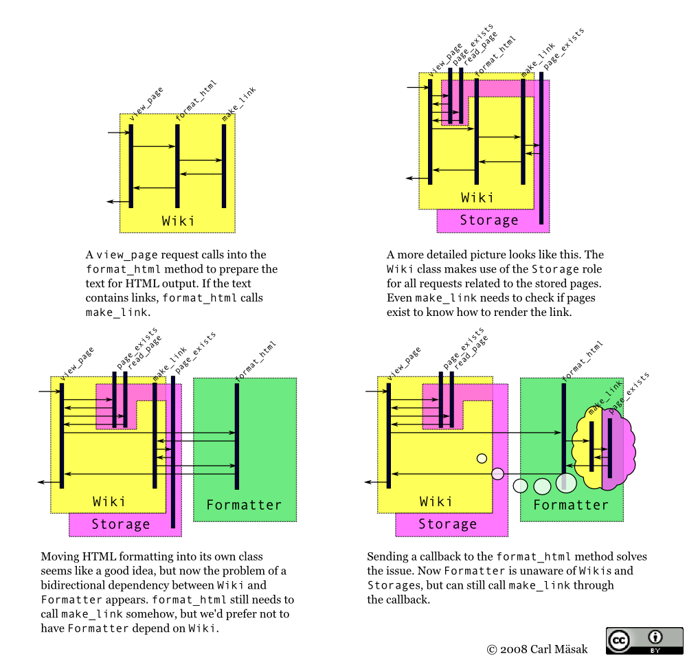

# I'll call you back
    
*Originally published on [24 September 2008](http://strangelyconsistent.org/blog/ill-call-you-back) by Carl Mäsak.*

I'm re-reading Heinlein's "The number of the Beast", in which four adventurers explore different universes in their flying car. I like it even more than the first time I read it.

After a brief visit to the land of Oz, the travelers meet [Glinda the Good](http://en.wikipedia.org/wiki/Glinda) who gifts them with a bathroom in their vehicle, something they'd sorely missed on their travels so far. The bathroom has a number of vaguely unsettling properties: it's [larger on the inside](http://tardis.wikia.com/wiki/Dimensionally_transcendental), sunlight keeps coming in through its windows (but there are no such windows on the outside of the car), and there's gravitational pull towards the floor, even when the car itself is weightless in outer space. All in all, the bathroom works as if it were on the ground in sunny Oz, regardless of where the car goes.

From this I deduce that Glinda, in installing the bathroom, used the magical equivalent of a [callback](http://en.wikipedia.org/wiki/Callback_(computer_science)). And about a week ago during a refactor, November started using the same trick. Here's how.

The reason for the refactor was that I wanted the HTML formatting out of `Wiki.pm` and put it in its own class. (Eventually we want to allow for all kinds of markups, so this was a necessary step.) But like with a bowlful of entangled spaghetti, merely pulling out the desired pieces left a lot of tricky dependencies going both ways. I wrote [a contemplative mail](http://groups.google.com/group/november-wiki/msg/d81c345b61804344) about it, then chanced upon the solution (and a few Rakudo bugs), and drew [a diagram](http://masak.org/carl/dependency-injection.png) to explain it to myself and others.



The call to the formatter went from this:

```raku
    format(
        $.storage.read_page($page)
    )
```

...to this:

```raku
    Text::Markup::Wiki::Minimal.new.format(
        $.storage.read_page($page),
        **{ self.make_link($^page) }**
    )`
```

That second argument is the callback. It adjusts for the fact that what we want to send along is a method, but we can't send a method as-is, because at the receiving end there's no object to call it on. It also makes modest use of Raku's placeholder variables, effectively making this a one-parameter closure. We're not sending in `make_link` in itself, but a piece of code which knows how to call it.

I feel a bit of the same wonderment as the adventurers in Heinlein's novel did with their new bathroom. I'm very happy Rakudo is complete enough and stable enough to allow me to think a thought as complex as callbacks to its conclusion.
