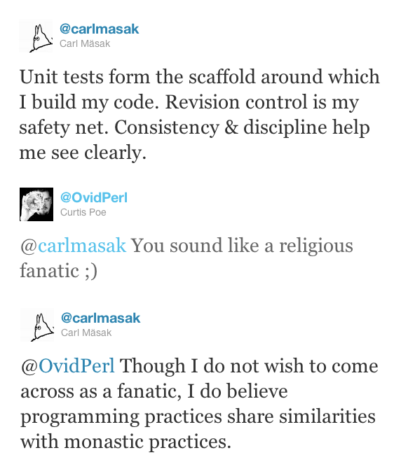

# I'm doing science and I'm still alive
    
*Originally published on [26 December 2010](http://strangelyconsistent.org/blog/im-doing-science-and-im-still-alive) by Carl Mäsak.*

This is an attempt at describing in words the way I code nowadays.

Getting software right is hard. This has been pointed out time and again by people who, one suspects, know:

*Caveat emptor: The cost of software maintenance increases with the square of the programmer's creativity.*

&mdash; First Law of Programmer Creativity, Robert D. Bliss, 1992

*Debugging is twice as hard as writing the code in the first place. Therefore, if you write the code as cleverly as possible, you are, by definition, not smart enough to debug it.*

&mdash; Brian Kernighan

Lately &mdash; in the past three years or so &mdash; I've been increasingly finding the benefits of keeping things Excruciatingly Simple. In its purest form, this entails writing a failing test, making it pass, cleaning up, and then making a commit. Sounds simple, but there are a number of things in there that I didn't take for granted three years ago:

- I have a test suite.
- If I can, I write the tests *first*.
- I have a revision control system.
- I tend to commit each atomic change (passing a test, making a refactor).
- I do the above things because they extend my reach as a programmer.

I'd describe number 5 on that list as *discipline*. That may sound like a bad word to some, but when it's self-imposed like in this case, there's nothing negative about it. No-one's forcing me; I can be undisciplined any time I want to. (And I often am.) The discipline is a crutch, something I can lean on when things are getting over my head. Just as the computer itself, discipline is a tool I use to complement my (often insufficient) brain.

At its core, the discipline is a way not to have to constantly ad-lib answering the question "what's the next step?".

When I tweeted about this about a year ago, I got this reaction:

If I were to add anything now to that dialogue, it is that I don't know nearly enough about the lives of monks. 哈哈 What I know is mostly from TV. But I live on in my prejudice about disciplined monastic life and disciplined programming sharing a certain something.

For me, the right-brain activity of discipline is nicely complemented by a left-brain activity which I tend to think about as *science*. (A more appropriate but slightly more boring term would be *empiricism*.) This is what kicks in every time a test doesn't do what I want, or I think I've found a bug in my program &mdash; or a bug in Rakudo/Niecza &mdash; or generally when my expectations suddenly don't match what just happened. Some part of my brain always does a little "yes!" gesture when it enters this mode.

> *How often have I said to you that when you have eliminated the impossible, whatever remains, however improbable, must be the truth?*

&mdash; Sherlock Holmes

When I encounter something that didn't match my expectations, I know I stand to learn something. Often enough the lesson is "I've been sloppy (again)", which tends to reinforce my desire for discipline. But it happens that the lesson is "something isn't right in the design here", "my program has a bug", or even "the Raku implementation has a bug". Regardless, I get to *react* to what I just learned and improve something somewhere. Even if it's just my lack of discipline. 哈哈

On the path between realizing something's wrong and realizing *what's* wrong, I tend to systematically boil things down to the simplest possible bit of code that still exposes the incongruity. This practice is a remnant from the days when, secretly working on November, we needed to scrub/anonymize the code before submitting it to the request tracker. But even afterwards, it's stuck around as a Generally Good Thing To Do, because it helps everyone involved. It helps the bug submitter understand *exactly* what's wrong. (And sometimes at this point, I realize that it's not Rakudo that's wrong, it's me. Better to catch such gaffes early.) It helps the implementor fixing the bug, because the faulty behavior is easier to understand, and to fix (or contradict).

The process can be described as forming a model and then posing pointed questions to the actual system to try to enrich your model. Alternatively, it's about forming hypotheses and then doing "experiments" with the system to prove-disprove these. For me, that's the fun, alive part of programming. The part that doesn't make it just be straight lines and easy winnings.

Everything I've written so far can be boiled down to "in order not to drown in accidental complexity, keep things *really* simple". Even when &mdash; *especially* when &mdash; trying to implement something really complicated.

I suppose there's also a third component involved, *insight*. That's the part of me that feels bigger than my conscious parts, the part that switches on when I myself have switched off. (In the shower, likely as not.)

I don't even know where to start analyzing that part, though. Then again, sudden insight makes up less than 1% of the whole programming experience and, cool as it is, it's not perfectly reliable either.
