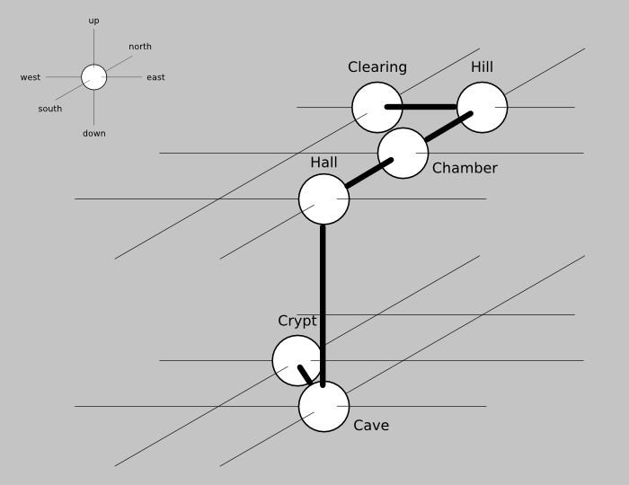

# June 29 2011: Text Adventure I
    
*Originally published on [18 July 2011](http://strangelyconsistent.org/blog/june-29-2011-text-adventure-i) by Carl Mäsak.*

The adventure game is large and we will approach it in two stages. We introduce a kind of
skeleton today, consisting of only the six rooms of the game.

Have a look at [the code](https://gist.github.com/masak/1090618). Also try to run it (with the accompanying `room-descriptions` file).

Most of the code is built up of things we've seen before, but a few things merit special focus.

## Directions

Note how we use the `< >` quoting environment to create both arrays and hashes without too much repetetive writing. It works in the hash case as well, because assigning a list to a hash container makes it interpret the list as a sequence of keys and values.

The `subset` declaration allows us to typecheck strings to make sure they belong to a predefined set.

Note the use of `.invert` to extrapolate the second half of the opposite directions from the first half.

## Rooms

There are two roles, `Thing` and `Room`. That will make more sense tomorrow, when we actuall introduce things that aren't rooms.

In the game, the rooms are connected as shown on this map:



There are no coordinates placing the rooms anywhere. One *could* view them as sitting in a 2x3x2 grid, with coordinates to denote position, and neighbourhood relations being indicated by nearness, or something. It would be a bit fragile, but could be made to work.

What we're really interested in, however, is how the rooms are connected. During the course of the game, we'll also want to connect and disconnect rooms as new exits are presented and old ones are taken away. That's what the `.connect` and `.disconnect` methods do.

There are two methods whose names begin with `on_`. Per convention, these are *callback methods*, which are normal methods called under certain circumstances. For example, `on_examine` is called on anything we examine, allowing some special thing to happen when we examine something. Similarly, `on_enter` is called when we enter a room.

All the callback methods are called with a `self.?on_something` syntax &mdash; note the question mark &mdash; allowing the method to not be there without an error occurring. Most rooms and things will not have a given callback method.

The `on_try_exit` callback method is called *before* an exit is taken, and its return value (a true or a false value) is used to determine whether the player is actually allowed to take that exit. This is what happens in the Cave: a fire is preventing the player from exiting to the northwest, and it's `on_try_exit` which enforces that.

## Walking around

The game loop takes care of all the ways a player might type a move command. All of the following ones work:

```
east
go east
e
go e
```

This works by massaging all of the above into a "standard form" (`east`, incidentally) and then acting on that. Liberal use of the `proceed` keyword allows the `given` statement to fall through several `when` cases if necessary.

Some massaging is also done with the directions `in` and `out`, which aren't considered *primary* directions, but more like aliases for some actual direction.

...and that's it for today. Tomorrow we'll add objects into the mix, filling the game with puzzles and interactions.
