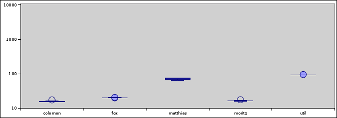
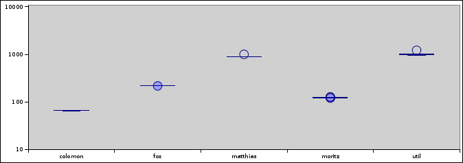
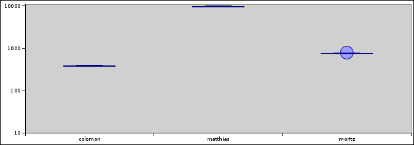

# Longest common substrings: a New Hope
    
*Originally published on [15 March 2011](http://strangelyconsistent.org/blog/longest-common-substrings-a-new-hope) by Carl Mäsak.*

Ok, here's my new runs for the p5 task of my Raku Coding Contest. They do indeed paint a different picture.

First off, what do I now consider to have gone wrong the first time around? Two things:

- The data was one-sided. It was synthetically generated from a small number of different characters, and so favored some algorithms to others.
- All the data for one algorithm was collected during one run of that program. That probably allowed for quite heavy measurement errors as memory usage increased (thus decreasing the speed) with each new measurement.

With that in mind, the new measurements run each program anew. (But the timings are still done at runtime, so as not to penalize parsing.)

Here's the data I used this time:

Mostly, we're just a bunch of ants all cooperating (sort of) to haul food
toward the nest (on average). There are many groups of people working on
various bits and pieces as they see fit, since this is primarily a volunteer
effort.  This document does not attempt to summarize all these subprojects--see
http://raku.org for such information. What we can say here is that, unlike
how it was with Perl, none of these projects is designed to be the Official
Perl.

It is my fond hope that those who are fond of Perl will be fonder still of
Raku. That being said, it's also my hope that Perl will continue trying to be
all things to all people, because that's part of Perl too.  While I accept the
RFC in principle (that is, I don't intend to go raving mad), I have some major
caveats with it, because I think it is needlessly fearful that any of several
programming paradigms will "take over" the design. This is not going to happen.

I did three runs. Run A did just the first sentence from each of the paragraphs. Run B did the first two sentences. Run C did the whole paragraphs.

Here are the results. Again, lower is better, and the Y axis is logarithmic.

**Run A.** colomon, fox, and moritz are doing fine down at the bottom, around 15-20 seconds.

**Run B.** The players are spreading over the field. moritz pulls up slightly, fox a bit more.

**Run C.** fox and util are gone; I didn't get any data from them. My guess is that they maxed out on memory and the OS killed their processes. (I only got 3 out of 10 data points for matthias, for what I guess are similar reasons, and 9 out of 10 data points due to a GC error.) That difference you see there between colomon and moritz corresponds to a factor of about two.

I must say these results feel much better. Might have something to do with the algorithm actually fastest on paper now also being fastest in the graphs.

Looking at the [statistics provided by colomon](https://justrakudoit.wordpress.com/2011/03/09/more-on-masaks-p5/) I have this conclusion: if you ever find yourself with a choice between these five algorithms for comparing strings:

- Strings really short, as in <30 characters? use fox's or moritz'.
- Strings shortish (<100 characters) but DNA? use moritz' or colomon's.
- Strings long (>100 characters)? Use colomon's.

So there we are. Stand by for the very exciting conclusion of this contest.
