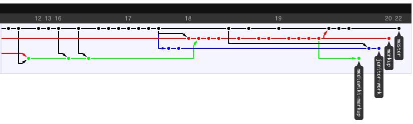

# Nonlinear development history
    
*Originally published on [23 October 2008](http://strangelyconsistent.org/blog/nonlinear-development-history) by Carl Mäsak.*

This summer when we started the November project, we chose git as our revision control system. During the past week, seeing how we have been effortlessly throwing around commits and branches — we're up to five right now — and generally being very productive in our environment, I think I'm not just learning to live with git, but actually starting to like it.

[Wikipedia](http://en.wikipedia.org/wiki/Git) has this to say: "Git supports rapid branching and merging, and includes specific tools for visualizing and navigating a non-linear development history."

One such tool is [the network graph](https://github.blog/news-insights/the-library/say-hello-to-the-network-graph-visualizer/) at github. Here's a snapshot of the last few days of development in November. Four of our five active branches are visible.

I've gotten into the habit of checking that graph regularly. Partly to see if anyone's committed anything new, but partly because seeing that graph is like getting a message from git, saying "here's all the complexity I'm handling for you automatically". Because, the thing is, doing branching and merging doesn't *feel* complicated. Branching and merging is rapid and painless, and has that *It Just Works* feeling to it.

As John Wiegley says in [Git from the bottom up](https://web.archive.org/web/20080501165407/http://www.newartisans.com/blog_files/git.from.bottom.up.php), "Most other systems have led me to believe they've reached their conceptual plateau — that allelse from now will be only a slow refinement of what I’ve seen before. Git gives me the opposite impression, however. I feel we’ve only begun to see the potential its deceptively simple design promises."

Thanks, git.
