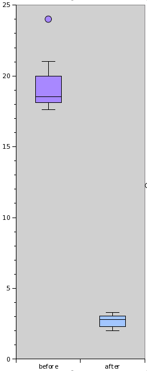

# November 7 2010 — man, do we suck at this
    
*Originally published on [7 November 2010](http://strangelyconsistent.org/blog/november-7-2010-man-we-suck-at-this) by Carl Mäsak.*

> 60 years ago today during a particularly brisk gale, the Tacoma Narrows Bridge [collapsed](https://en.wikipedia.org/wiki/Tacoma_Narrows_Bridge_(1940)), thereby winning everlasting recognition in the pages of engineering history.

> The bridge's collapse had a lasting effect on science and engineering. In many physics textbooks, the event is presented as an example of elementary forced resonance with the wind providing an external periodic frequency that matched the natural structural frequency, though its actual cause of failure was [aeroelastic flutter](https://en.wikipedia.org/wiki/Aeroelasticity#Flutter).

A newspaper editor, Leonard Coatsworth, was the last person to drive on the bridge. He describes it like this:

> Just as I drove past the towers, the bridge began to sway violently from side to side. Before I realized it, the tilt became so violent that I lost control of the car...I jammed on the brakes and got out, only to be thrown onto my face against the curb...Around me I could hear concrete cracking...The car itself began to slide from side to side of the roadway.

> On hands and knees most of the time, I crawled 500 yards (460 m) or more to the towers...My breath was coming in gasps; my knees were raw and bleeding, my hands bruised and swollen from gripping the concrete curb...Toward the last, I risked rising to my feet and running a few yards at a time...Safely back at the toll plaza, I saw the bridge in its final collapse and saw my car plunge into the Narrows.

There was one casualty.

> No human life was lost in the collapse of the bridge. Coatsworth's dog Tubby, a black male cocker spaniel, was the only fatality of the Tacoma Narrows Bridge disaster; he was lost along with Coatsworth's car. Professor Farquharson [hired to try to solve the problem of the oscillations] and a news photographer attempted to rescue Tubby during a lull, but the dog was too terrified to leave the car and bit one of the rescuers. Tubby died when the bridge fell, and neither his body nor the car were ever recovered. Coatsworth had been driving Tubby back to his daughter, who owned the dog. Coatsworth received US $364.40 in reimbursement for the contents of his car, including Tubby.

And now, if you've never seen concrete wobble before, I'd like you to watch [an eerie Youtube clip](https://www.youtube.com/watch?v=j-zczJXSxnw) of the collapse, in recognition of all we've learned about suspension bridges since 1940, and in memory of Tubby the dog.

Those who tuned in yesterday might recall that I had realized that `Str.trans` was [really, really slow](November-6-2010-ideals-separation-and-pragmatism.html), and that I theorized that it could easily be sped up a bit. Today I put my tuits where my mouth is, and rewrote the `Str.trans` method to see if it would get any faster.

While preparing the patch, I collected some speed statistics. Using yesterday's blog post (~5kB) as input, and the same arguments as in the `.trans` call in `html_escape`, I called `Str.trans` 10 times and had a script register the time each invocation took. I did this before and after applying the patch.

My patch makes `Str.trans` about 500% faster than the old version.

As [discussed on IRC](https://irclogs.raku.org/perl6/2010-11-07.html#14:52), the timings of the old algorithm actually get worse over time. This is probably due to a buildup of objects; the old algorithm creates a lot of small strings, which it then joins together. They should be GC'd, but maybe they're not for some reason. The little pink ball at the top is an outlier, a run that was hit particularly hard for some reason, and took 24 seconds. (24 seconds! For 5 kilobytes of text! On a modern computer!)

I wrote yesterday "Now I understand a little better why it is so slow." What I was referring to was that the old algorithm basically works its way forward character by character. Its run time grows proportionally with the length of the string. Maybe that explains why I was the first one to suffer from its abysmal performance: I might be the first one to put longish strings into `Str.trans`.

What my algorithm does is keep a hash with the next index of each substring to be substituted, and then pick the smallest one through each iteration. (Or, more informally, "skip the boring parts".) This makes the number of iterations through the main loop proportional to the number of substitutions actually made.

Oh, and my code [is shorter](https://github.com/rakudo/rakudo/commit/2c66f9a19607046e4d6ceffbbfb7b47710286c2f), too.

Rakudo is often claimed to be slow, and with good reason. However, I hadn't previously suspected that some of the slowness was due to suboptimal algorithms. Now I feel almost morally compelled to read the `src/core` directory in search for similar spots where we can make quick speed gains just by doing things in a slightly more clever way.

By the way: since Rakudo takes a while to build, I decided to monkey-patch in my version of `Str.trans` rather than change it in-place and then rebuilding Rakudo each time. This sped me up significantly; all I needed to recompile each time was my small script with an `augment class Str` in it. I also threw in the relevant spectests, so that they ran after my benchmarking. Nice way to work; gotta remember that.

Oh, and I've put back my `html-escape` sub into `psyde`, now that it's not ridiculously slow anymore. So if you're reading this post through RSS, the `&`'s `<`'s and `>`'s in this post have been escaped (efficiently!) with Raku.
