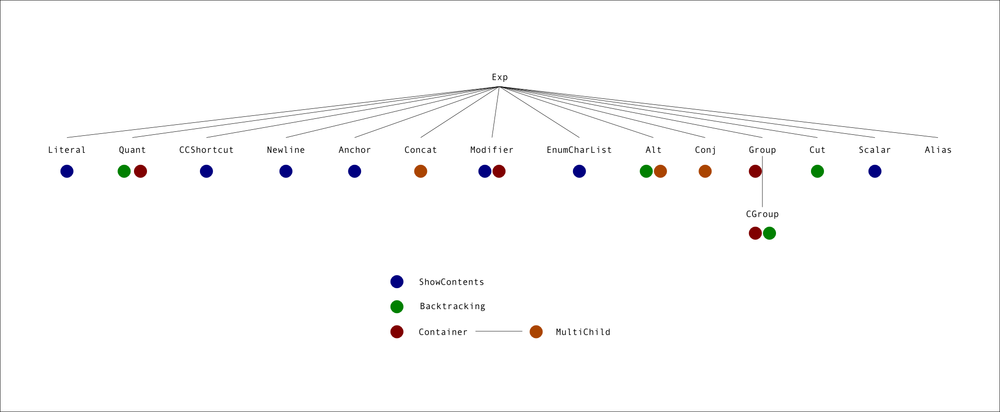

# Ovid is right: roles are awesome
    
*Originally published on [16 January 2010](http://strangelyconsistent.org/blog/ovid-is-right-roles-are-awesome) by Carl Mäsak.*

A class hierarchy of expression nodes: it's so much the prototypical use case for run-time method polymorphism that it's almost a cliché. One can close one's eyes and picture the way parts of the expression tree interact in rich, complex ways, shaped by the very types of the nodes themselves, in a dynamic dance of late bindings and virtual methods. Switch statmement, get thee behind me. Et cetera.

I'm [building one](https://github.com/masak/gge). And I'm having almost too much fun doing it. In between trying to use the strengths of Raku and keeping true to the [original program](https://github.com/leto/parrot/tree/master/compilers/pge/) I'm porting, I've discovered an important thing: Ovid is right about roles.

Specifically, I'm having trouble picturing how I would cram all the type information into my expression node class hierarchy, were I not using roles. The roles definitely help manage complexity in my case.

Here's a pretty diagram of my class hierarchy.

It's a flat beast. Apart from everything deriving from `Exp`, I have only one case of old-skool inheritance in the diagram. And even that one is more making a point than actually shortening the code.

Then there's all the colorful dots, representing the roles I'm mixing into my types. Some are for convenience (like the blue ones), others are vital for my program (like the green ones), and the rest are somewhere in between on the convenient/vital scale.

I even have a case of inheritance between two of the roles! Which means, in practice, that those classes with an orange dot also act as if they had a red dot. Very handy.

During the infancy of Rakudo, I've gotten used to learning to live without various features. Were I to do what I'm doing here without using roles, I could use two other mechanisms. The first is regular inheritance. The very thought gives me a bit of vertigo; I don't think I'd be able to turn the colored dots into base classes. Definitely not all of them at once; I'd have to choose. And that choice would affect the entire design of the program, probably resulting in loss of clarity.

The second way I could compensate for not having roles would be by using `.can` a lot. The presence of a given role in a class is isomorphic to the presence of a given method in a class. So that would definitely work, but I don't think I would like it as much. There's something to be said for declaring `is` and `does` relationships at the very top of the class declaration.

All in all, I'm very happy about the way things work. I'm wondering whether, had I not read all of Ovid's posts on managing the complexity of class hierarchies with roles, I would have come up with this design myself. Maybe, maybe not. But anyway: thanks, Ovid! This rocks!

A still-open question for me is whether the topmost type, `Exp`, should be a class or a role. Synopsis 12 has this to say about when to use roles:

i> Classes are primarily for instance management, not code reuse. Consider using `roles` when you simply want to factor out common code.

I *am* using `Exp` for code reuse, and for giving all of the other classes in the hierarchy a common base type. So I guess I could indeed turn it into a role. But it's just that... I don't see a *reason* to do so, and I still feel instinctively reluctant about it. Maybe I'm a bit hung up about it being a *class* hierarchy.

This point has [come up before](https://irclogs.raku.org/perl6book/2009-11-11.html#19:58-0001) on IRC, and I've yet to hear a satisfactory way to resolve it: when faced with making a base type a class or a role, which way should one go?
