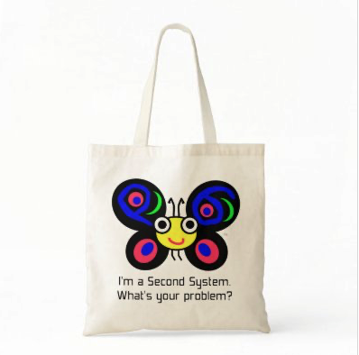

# Raku is now half as old as Perl
    
*Originally published on [16 February 2013](http://strangelyconsistent.org/blog/perl6-is-now-half-as-old-as-perl) by Carl Mäsak.*

Today Raku is as old as Perl was when Raku was announced.

```
$ raku -e 'say Date.new(2000, 7, 18) + (Date.new(2000, 7, 18) - Date.new(1987, 12, 18))'
2013-02-16
```

The 1987 date is the release of Perl 1. The 2000 date is the [throwing of the mugs](Happy-10th-anniversary-raku), which I consider to be Raku's birthday.

It's a bit interesting to compare Raku at this point with Perl back then. They are two fairly different projects, even though the people are overlapping to a great extent.

## Bottom-up vs top-down

In any programming project, you can start from the small pieces and build upwards to the overreaching goals and ideas, or you can start from the ideas and build downwards to the nitty-gritty stuff.

Perl is a bottom-up project: the Perl 1 release looks puny today. It didn't do much. But it did run. It did solve people's problems. And there's an unbroken chain of commits leading from Perl 1 to today's Perl.

Raku is definitely a top-down project. Larry mulled over those RFC's and wrote the Apocalypses. These eventually resulted in the Synopses, which guide implementation work. Implementations reach up towards the spec, and are in some sense always built bottom-up... but on the most zoomed-out scale, Raku is built from the top down.

This difference was very much deliberate. For the Raku project, it was felt that a specification (and a corresponding test suite) was needed. The Pugs project is currently very dormant and not actively developed, but it *did* result in both the Synopses and the spectest suite. Both are essential artifacts for any Raku implementer.

## Second system syndrome
  
> "It's important to remember that when you start from scratch there is **absolutely no reason** to believe that you are going to do a better job than you did the first time."

&mdash; Joel Spolsky, [Things You Should Never Do, Part I](https://www.joelonsoftware.com/articles/fog0000000069.html)

Look, here's the thing: everyone knows that The Big Rewrite isn't a good idea. That's like, Software Project Management 101. Even the people going into this project knew that. The jokes about second systems have been with us from the start, as a part of our cultural heritage.



There have been efforts to mitigate the risks and to calm people on the way. The Ponie project was an effort to put Perl on Parrot, for example, to provide for a migration path or simply a communication bridge from Perl to Raku.

Early on, it was also felt that Raku wouldn't be so different from Perl, syntactically. Sure, the sigils would come out being invariant, and a comma would have to be added here and there for consistency. But that was about it. Perl programmers would still feel right at home.

Well, guess what? The Ponie project, even with brilliant developers behind it, slowed and finally halted at the height of the Pugs era. Turns out the reasons people wanted to further themselves from the existing Perl internals &mdash; that they are a big hairy mess of intertwined C macros &mdash; also made porting to Parrot exceedingly difficult. Ponie brought some permanent improvements to the Perl core, but in the end it didn't reach its goal of Perl targeting Parrot.

In the meantime, Raku kept improving and evolving, syntactically as well as semantically. The differences piled up. Raku, unfettered by backward-compatibility, could take sometimes vast leaps and reach places in the state-space Perl could only dream of. Also, things kept shaking around and stabilizing, features growing together into a unified whole instead of this. All good and well, but it meant that Raku drifted further away from Perl.

So here we are, a decade later, with two distinct languages, and no way for them to interoperate. Having them actually talk to each other is still very much on the agenda. It's just that it's a big undertaking. A couple of recent projects are attempting to put Perl on a platform where it can talk to Raku.

I think the biggest thing to realize in all this is that Raku, even from the very start, could never have followed the trajectory Perl did. There was one thing that existed in 2000 that didn't exist in 1987, when Perl was announced: Perl. *That's* why Raku is a top-down project. *That's* why it's a second system. And *that's* why the obvious measure-stick of Raku is Perl, with its 13-year head start.

## Rubber, meet road

I'm not complaining about this, mind. We *should* compare Raku to Perl. And to all other scripting languages that have popped up in the same niche. We should steal ideas and adapt to modern practices, like we always do, in both Perl and Raku.

But for a top-down project, the biggest challenge is always to reach all the way down to the ground: to actually start being useful for someone. That's perhaps our big challenge. It was back in 2008 when I became heavily involved in the Raku effort, and it still is today: be useful. Be usable. Put food on someone's family.

Raku is useful to me today. Not to the extent that I can write Raku code all day, but to the extent that it makes me more effective and more productive now and then. Bringing that kind of usefulness to others requires lots of work writing modules, documentation, books, and tutorials, as has been discussed elsewhere. We're making some headway with this. I'm more optimistic than I was two years ago.

We also need to work on things such as performance. Raku is fast enough for some things, but overall implementations are still fairly slow. Sometimes ridiculously slow. Good work is being done in this area, too.

But here's what makes me the most optimistic about the Raku effort: after a few years of watching things evolve, I've noticed that while Raku is being developed top-down on the outermost scale, it's actually a series of bottom-up projects that drive Raku forwards.

jnthn likes to tell about how he promised to implement junctions in Rakudo back in 2008, and then realized that junctions were actually tied to method dispatch and the object system, so he had to implement those, too. Later, while pmichaud was rebuilding the parser according to our current understanding of it, jnthn was building Rakudo's meta-object protocol, a project called 6model. Each step on the way replacing the layer below based on what we had found that the layer above required. The 6model work is part of what now enables us to port nqp and Rakudo to the JVM.

That's what makes me optimistic. While Raku is undeniably, unchangeably a top-down project, highly competent people are factoring that top-down knowledge into the design of components in a bottom-up way. What's been happening in these 13 years is that we've become increasingly better and more efficient at building Raku.

## So, how're we doing?
  
> "Chuck Norris has actually been using Raku since 1987, and has been waiting for Larry to play catch-up. :)"

&mdash; dukeleto on #raku

Let's stop and compare the state of Raku today with the state of Perl back in 2000.

- **Mugs**.

Back then, Jon Orwant threw coffee mugs against a wall because he felt there was nothing to energize the community and people would walk off to other things.

Are sixers doing any mug-throwing nowadays? Yup, we did, at the Perl Reunification Summit. Liz felt, and still feels, that if we don't actively bring Perl and Raku together, then both projects are eventually going to fizzle out.

- **Crisis**.

As part of that, the feeling Jon Orwant was expressing was that Perl was stagnating or going nowhere.

Is Raku stagnating? I wouldn't say so. We're still extremely small compared to Perl, but my general sense is that we're still *gaining* speed, becoming stronger every day. Still very much pre-peak.

- **Usefulness**.

In 2000, Perl was on its thirteenth year of solving everyday problems for people.

What about Raku today? Well, it's very different. Part of this is due to the top-down nature of the project. People are waiting for it to be useful to them. Part of it is *perception*: people are *waiting*, instead of jumping in and using the language in cases where it could already be useful to them. We see this in the verb tenses people are using when they ask stuff: "Will Raku..." Raku is about the future, but if we don't do something about that perception, we'll never get there. The problem with "tomorrow" is that it never actually arrives.
- 
**Community**.

In 2000, Perl drew thousands of people to conferences each year.

Is Raku drawing thousands? No. The Perl people are kind enough to let us piggyback on Perl conferences and workshops, and through them we have an audience of thousands. I keep feeling that there's a big interest in Raku, both from within the Perl community and from other communities. But there's also a sense of waiting, of not-yet-production-ready. (And I agree.)

## What remains?

Which brings us to the last, perhaps most important question. What's left for Raku to become a viable, useful solution to most people out there?

For years I wouldn't go near that question. Just working along, head looking down at the current sub-projects, making Raku more useful to myself and hoping that was enough. But my recent visit to FOSDEM made me realize that some kind of production release is actually within reach &mdash; say, a few years away &mdash; and a focused effort to reach a releasable state by some criteria would be highly useful for us and for others.

So here are my four criteria. This is what Raku needs to be ready for the world.

- **Features**.

Slightly simplified, this is what we've been working on since the Pugs days. [We are doing well](http://raku.org/compilers/features) on features. There's not much I feel is missing nowadays from the core language. It's a pleasant language to use and to express thoughts in. There are bugs, sure, but with each month that passes, those bugs are becoming less frequent and less serious.

- **Speed**.

Working on it. I won't make any promises about the JVM port, but I have a strong feeling it will make a big difference. Parallel to this, there are various already-implemented or to-be-implemented efforts to make the compiler smarter about generating efficient code.

- **Concurrency**.

There are some good ideas in the specification about concurrency. Some of them will work fine, some probably won't pan out. What's needed now is a solid implementation of concurrency in either Rakudo or Niecza, a test-bed for the ideas in the spec, so that users can get a feel for what's there and what's missing. I'd really like for Raku to have a decent concurrency story, because it's one of the things that were promised early on for Raku, and one of the things that Perl never got right. Also, concurrency in all its various forms seems to be growing increasingly important in the programming world of today.

- **CPAN**.

Sure, we have [an ecosystem](http://raku.land) for Raku. But it isn't CPAN. It's three orders of magnitude as small as CPAN. And it's not realistic to port all of CPAN either &mdash; that'll simply never happen. What we really need is a high-bandwidth connection between Perl and Raku. We need for them to run in the same runloop. Once they do that, Raku programmers can have their CPAN modules, and Perl programmers can work Raku code into their projects. This is also something that was promised early on. It's not an easy task.

## Conclusion

Raku is a multi-year project. Though today's date is a little bit arbitrary, it's worthwhile to look both backwards and forwards, to see where we currently are. And though we're structurally different from the Perl project, it's still interesting to make comparisons.

We believe we're building something really nice with Raku. 2013 may not be the year when we're finally production-ready, but it sure feels like a year where a lot of significant things will happen (and are already happening). And, unlike 2012, I finally feel ready to speculate about the light at the end of the tunnel.
