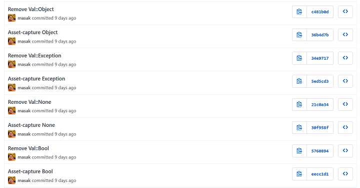
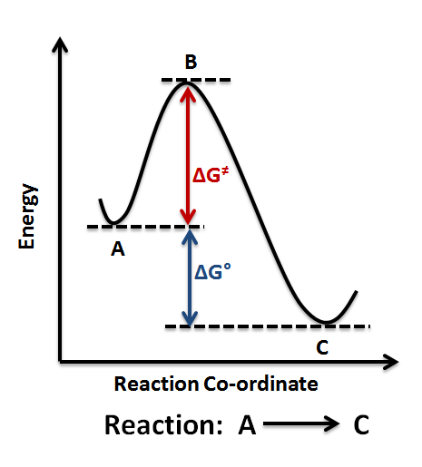

# Refactoring the universe
    
*Originally published on [5 May 2019](http://strangelyconsistent.org/blog/refactoring-the-universe) by Carl Mäsak.*

I'm here to share a thing I'm working on, and chew gum; and I'm all out of gum. The purpose of this post is both to break a disagreeable silence that has befallen this blog, and to be able to geek out about a niche topic here in writing, partially sparing friends and family.

I'm currently refactoring 007's type system in a branch. Basically, ever since 007 was created, a type in 007-land has corresponded to a class/role in Raku, the host system that's implementing 007.

Here's what the implementation of `Int` looks like [currently](https://github.com/masak/alma/blob/475701461f4931dd899d7ebc442aa8e2aedf0657/lib/_007/Val.pm6):

```raku
class Val::Int does Val {
    has Int $.value;
    method truthy {
        ?$.value;
    }
}`
```

And here's what it looks like as I'm doing the [refactor](https://github.com/masak/alma/blob/18cfd26ab11964f53b21d9f5d9f91513b2ffd75c/lib/_007/Value.pm6):

```raku
constant TYPE is export = {};
BEGIN {
    # ...
    TYPE<Int> = make-type "Int", :backed;
    # ...
}`
```

So, instead of corresponding to *types* on the host level, all the 007 types are about to correspond to *values*. The former implementation was the one that felt obvious at the time (four-plus years ago), but it's become blindingly, painstakingly obvious that it really needs to be the latter.

Here's why: as soon as you want to implement class declarations in 007, in the former model you also need to bend over backwards and come up with an entirely new type in the host system. The Raku code to do that looks like [this](https://github.com/masak/alma/blob/475701461f4931dd899d7ebc442aa8e2aedf0657/lib/_007/Val.pm6#L496):

```raku
return $.type.new(:type(EVAL qq[class :: \{
    method attributes \{ () \}
    method ^name(\$) \{ "{$name}" \}
\}]));`
```

Which is... even someone as [EVAL-positive](The-root-of-all-eval.html) as I wishes for a less clunky solution.

In the new model, a new class comes down to calling `make-type` and dropping the result in that `TYPE` hash. (Wait. Or not even dropping it in the `TYPE` hash. That hash is only for things used by 007 itself, not for user types.)

This is a refactor I've tried once before, back in 2017, but I failed back then because the code got too complicated and ran too slow. This time around I have a much better feeling.

By the way, there's also an `is-type` subroutine, and similarly a `make-int` and an `is-int` subroutine, and so on for every registered type. I figure why not wrap those simple things up in very short function names. So far that turns out to have been a very good decision. "Fold the language of your domain model into your code", and so on.

This is one of the things I'm doing better this time around; last time one of the problems was that each line I touched got longer and messier because there were more layers of indirection to dig through. Concerns were scattered all over the place. This time, it feels like the codebase is getting *simpler* thanks to those named subroutines. Maybe it can be likened to putting all your database-specific code in one place.

I sometimes get slight vertigo due to the bootstrapping aspects of this type system. One example: `Object` is an instance of `Type`, but the *base class* of `Type` is `Object` &mdash; a circularity. But, it turns out, if you have absolute power over the object graph, you can always bend things to your will:

```raku
BEGIN {
    TYPE<Type> = _007::Value.new(:type(__ITSELF__), slots => { name => "Type" });
    TYPE<Object> = make-type "Object";
    {
        # Bootstrap: now that we have Object, let's make it the base of Type and Object
        TYPE<Type>.slots<base> = TYPE<Object>;
        TYPE<Object>.slots<base> = TYPE<Object>;
    }
    # ...
}`
```

I'm slightly reminded of a thing [Gilad Bracha](https://gbracha.blogspot.com/) wrote once (which I can't find the exact quote for, unfortunately): that if mutual dependencies and recursive definitions are something that stump you, what you need is a healthy dose of `letrec`. It's twisty, yes, but it's basically a solved problem.

Like last time, I'm tackling the big task in small steps, one type at a time. I feel I've learned this from Martin Fowler's concept of [asset capture](https://www.martinfowler.com/bliki/AssetCapture.html). The idea is to end up back with a running system with passing tests often. I do this by replacing one old thing at a time by a new thing. Sounds obvious, but I'm actually not sure I would have been sensible enough on my own to tackle it this way, had I not known about asset capture.



One drawback is that you're sort of running the old system and the new system in parallel, as the old one is being phased out. Only once the whole thing has been asset-captured can complexity associated with the old system be completely removed.



It's a pleasant way to work. To me it's been at least a partial answer to the problem of [the big rewrite](https://www.joelonsoftware.com/2000/04/06/things-you-should-never-do-part-i/). If we're free to refactor the insides, we can successively arrive at a point where the new better thing has completely replaced the old thing. The way there is allowed to be a little bit more complex (on the inside) than either endpoint. Importantly, you keep a running system throughout.

I don't have a concluding thought, except to say that I just managed to asset-capture arrays. Which is harder than it sounds, because arrays are *everywhere* in the compiler and the runtime.
