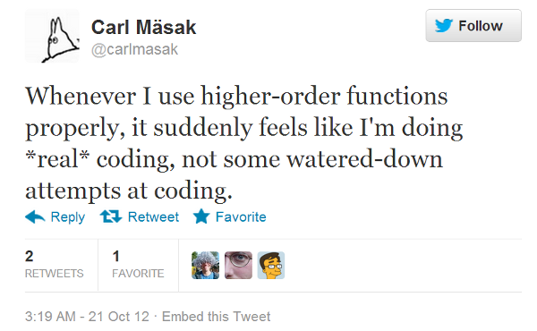
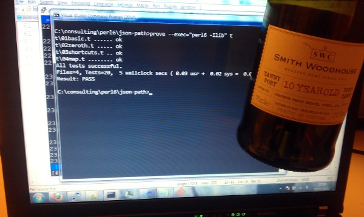

# Sweet ports
    
*Originally published on [26 October 2012](http://strangelyconsistent.org/blog/sweet-ports) by Carl Mäsak.*

I had invited jnthn over because I had invested in a bottle of nice port wine that I really wanted to try, but one whole bottle was too much for me. For both of us, during the course of an afternoon, it was about right.


So that was the premise. Because we both like bad puns &mdash; jnthn admittedly more than I do &mdash; we decided to make it a "porting hackathon", where we would port some piece of software to Raku while sipping the sweet beverage from Portugal.

**Which piece of software did we end up porting?**

[`JSON::Path`](https://metacpan.org/module/JSON::Path) from CPAN. It's a module that does for JSON what XPath did for XML.

Well, actually `JSON::Path` is not very tied to the JSON format at all. It just expects your data to be a hierarchy of arrays, hashes, and scalar values, just like JSON.

Here are some JsonPath examples, just to give you a taste of it:

```raku
$.class.student[0].name           name of first student in class hash
$['class']['student'][0]['name']  same, with an alternate notation
$.beers[*]                        all beers
$.beers[*].name                   names of all beers
$..author                         recursively find all 'author' entries
```

See [here](https://goessner.net/articles/JsonPath/) for a more detailed specification.

**Any nice insights along the way?**

Yes, we found a pattern which we really liked. Not sure what it's called, or if it has a name. We're certainly not the first to come across it &mdash; it's probably well-known in FP circles. But as soon as we came up with the idea, the rest of the design basically fell into place.

Perhaps the easiest way to explain the pattern is to say this: our action methods make little subroutines.

```raku
method command:sym<.>($/) {
    my $key = ~$<ident>;
    make sub ($next, $current, @path) {
        $next($current{$key}, [@path, "['$key']"]);
    }
}
```

This is especially apt, because the JsonPath language is all about how to find data in a hierarchical data structure. So each little subroutine outlines how one particular piece of syntax digs further down into the data structure. In the above case, it's saying that a JsonPath fragment such as

```raku
.foo
```

will be translated to Raku code such as

```raku
$current{'foo'}
```

All the other action methods also return little anonymous subs like this one. To make it all work, the grammar is structured so that the fragments end up nesting around each other from left to right:

```raku
token commandtree {
    <command> <commandtree>?
}
```

The resulting AST comes out looking like a Matryoshka doll of `commandtree` nodes. Or a chain where each link is generated by its own specific rule. The links of the chain are forged together by the `commandtree` action method, that uses `assuming` to pre-set the `$next` parameter of the anonymous functions:

```raku
method commandtree($/) {
    make $<command>.ast.assuming(
        $<commandtree>
            ?? $<commandtree>[0].ast
            !! #`[create a function that returns the result];
}
```

And that's it. Long ago in the mists of computer history, AI researchers must have felt that intelligence would sprout from depths of LISP because they knew about patterns like this one: how to build up complex behavior by forging together little links in a chain, each one a simple "atom" of behavior. At least that's how it felt to see this experiment work.

It also made me tweet this:



**Yes, but how was the port?**

Oh, it was pretty nifty. I've decided to provisionally like port wine after this. It's fruity and sweet, and goes really well with cheese, or quality chocolate.

Here's a picture of the finished bottle, along with all the tests passing:



Our finished module can be found [on raku.land](https://raku.land/zef:raku-community-modules/JSON::Path).
