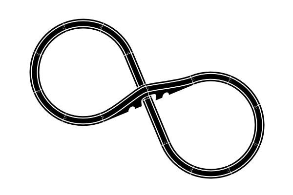
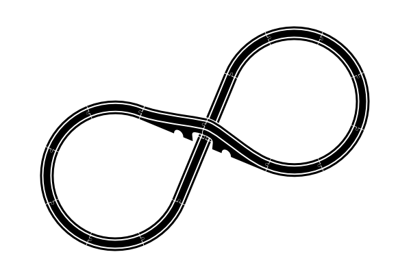
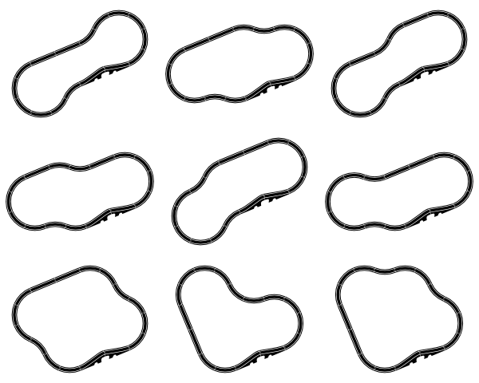
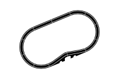
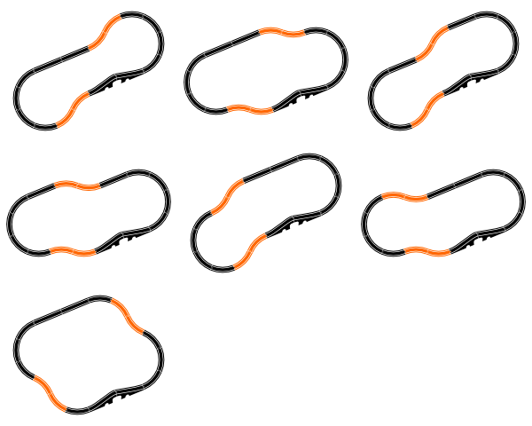
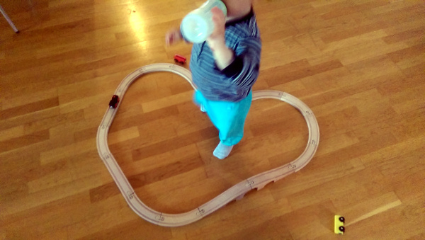
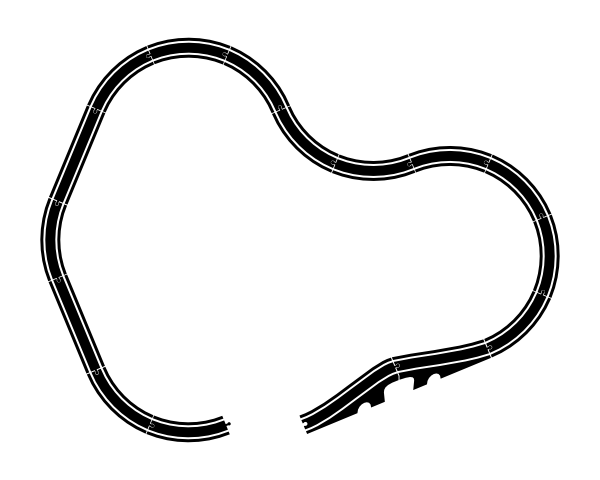
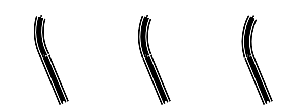
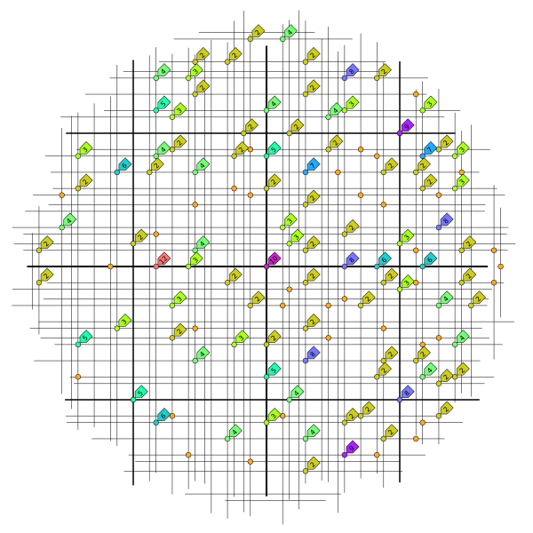

# Train tracks
    
*Originally published on [18 June 2016](http://strangelyconsistent.org/blog/train-tracks) by Carl Mäsak.*

> I don't know anything, but I do know that everything is interesting if you go into it deeply enough.

&mdash; Richard Feynman

Someone gives you a box with these pieces of train track:

It's possible you quickly spot the one obvious way to put these pieces into one single train track:

But... if you're like me, you might stop and wonder:
  
> Is that the only possible track? Or is there some equally possible track one could build?

I don't just mean the mirror image of the track, which is obviously a possibility but which I consider equivalent:

I will also not be interested in complete tracks that fail to use all of the pieces:

I would also reject all tracks that are physically impossible because of two pieces needing to occupy the same points in space. The only pieces which allow intersections even in 2D are the two bridge pieces, which allow something to pass under them.

I haven't done the search yet. I'm writing these words without first having written the search algorithm. My squishy, unreliable wetware is pretty certain that the obvious solution is the only one. I would love to be surprised by a solution I didn't think of!

Here goes.

Yep, I was surprised. By no less than nine other solutions, in fact. Here they are.

I really should have foreseen most of those solutions. Here's why. Already above the fold I had identified what we could call the "standard loop":

This one is missing four curve pieces:

But we can place them in a zig-zag configuration...

...which work a little bit like straight pieces in that they don't alter the angle. And they only cause a little sideways displacement. Better yet, they can be inserted into the standard loop so they cancel each other out. This accounts for seven solutions:

If we combine two zig-zag pieces in the following way:

...we get a piece which can exactly cancel out two orthogonal sets of straight pieces:

This, in retrospect, is the key to the final two solutions, which can now be extended from the small round track:

If I had *required* that the track pass under the bridge, then we are indeed back to only the one solution:

(But I didn't require that, so I accept that there are 10 solutions, according to my original search parameters.)

But then [reality ensued](https://tvtropes.org/pmwiki/pmwiki.php/Main/RealityEnsues), and took over my blog post. Ack!

For fun, I just randomly built a wooden train track, to see if it was on the list of ten solutions. It wasn't.

When I put this through my train track renderer, it comes up with a track that doesn't quite meet up with itself:

But *it works with the wooden pieces*. Clearly, there is some factor here that we're not really accounting for.

That factor turns out to be *wiggle*, the small amounts that two pieces can shift and rotate around the little connector that joins them:

Since there are sixteen pieces, there are sixteen connection points where wiggle can occur. All that wiggle adds up, which explains how the misrendered tack above can be made to cleanly meet up with itself.

Think of the gap in the misrendered track as a 2D vector (x, y). What was special about the ten solutions above is that they had a displacement of (0, 0). But there are clearly other small but non-zero displacements that wiggle can compensate for, leading to more working solutions.

How many working solutions? Well, armed with the new understanding of displacements-as-vectors, we can widen the search to tolerate small displacements, and then plot the results in the plane:

That's 380 solutions. Now, I hasten to add that not *all* of those are possible. At least one solution that I tried actually building turned out to be impossible because the track tried to run into itself in an unfixable way.

With yet another 8-shaped solution, I had given up trying to make it work because it seemed there was too much displacement. Then my wife stopped by, adjusted some things, and voilà! &mdash; it worked. (She had the idea to run the track through one of the *small* side-tunnels under the bridge; something that hadn't occurred to me at all. There's no way to run a wooden train through that small tunnel, but that *also* wasn't something I restricted up front. Clearly the track itself is possible.)

Anyway, I really enjoyed how this problem turned out to have a completely solvable constraint-programming core of 10 solutions, but then also a complete fauna &mdash; as yet largely unclassified &mdash; of approximate, more-or-less buildable solutions around it. All my searching and drawing can be found in [this Github repository](https://github.com/masak/tracks) &mdash; others who wish to experiment may want to start from the ideas in there, rather than from scratch.

*Essentially, all models are wrong, but some are useful.* &mdash; George E. P. Box
