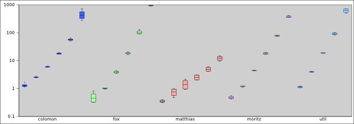

# p5: Find the longest common substring
    
*Originally published on [8 March 2011](http://strangelyconsistent.org/blog/p5-find-the-longest-common-substring) by Carl Mäsak.*

*With another Yapsi release behind me, I now turn back to the last and much-awaited post to publish and summarize the solutions of the [Raku coding contest](http://strangelyconsistent.org/blog/masaks-perl-6-coding-contest).*

**(Also, see the update near the end of the post. New findings have come in
since it was originally written.)**
```
<masak> colomon: from my perspective, just looking at the statistics,
        it's clear who "won" p5.
<masak> I think you'll agree.
* moritz_ agrees
<colomon> but you're not going to tell us yet?
<masak> colomon: look at the statistics :)
<masak> [https://gist.github.com/853570](https://gist.github.com/853570)
<colomon> !!!!!!!!```
```
Oh man.

p5 didn't *look* hard to judge, not like p4. But after having gone through
all the preparation for this post, I'd say it's just about comparable. Sorry
for delaying this post; it turns out I needed a several-day hackathon to even
find the time to write it. But here we go.

Here's the problem description for p5:

## Find the longest common substring among two long strings

The two strings "otherworldlinesses" and "physiotherapy" have many substrings
in common, for example "s", "ot", and "ther", but only "other" is a longest
common substring of the two strings.

Your goal is to find a longest common substring of two long strings. You
only need to find one; if there should be several longest common substrings,
stopping after finding the first one is fine.

Note that as the length of both strings grows, a naive algorithm will perform
very badly. Pretend that the use case for this problem is something that
would benefit from a fast solution, such as identifying common regions between
two long DNA sequences.
```

Leafing through the solutions, we see that they fall into three classes:

- Brute-force

The algorithm loops through every possible combination of positions in
the two strings, checking the length of the two common substrings
starting from those positions.

- DP/table-driven

The algorithm keeps a table of the lengths we've seen so far, building
new rows of the table from old rows.

- Suffix tree
The algorithm concatenates the two strings, builds a suffix tree in
linear time from the concatenated string, and then uses the scary
voodoo of suffix trees to just pluck out the LCS in linear time.

matthias does the brute-force one. fox, moritz_, and Util do a table-driven
thing with varying degrees of additional tricks applied. colomon goes all-out
with the suffix tree.

Now let's get one thing clear. The brute-force algorithm is bad, basically
cubic in time complexity because there is one nested loop per string, and then
one more for iterating through the common substring. The table-algorithm is
quadratic, because... well, because it's a two-dimensional table. The suffix
tree solution is linear. So it should be clear that colomon won this one
based on algorithmic niceness.

And then we turn to [the statistics](https://gist.github.com/853570). Oh man.

The three columns respectively contain the string lengths tested, whether there
was a common substring, and the time in seconds the algorithm took. Let's
summarize what the statistics tell us.

- fox and Util's algorithms end up being the slowest ones. Expected, since they're cubic.
- moritz's algorithm is doing quite well against colomon's, which is a surprise. Two factors seem to play out here: for smaller values, moritz's algorithm has less setup to do. And then for larger values, colomon's algorithm is quite GC heavy. Somewhere in the middle, colomon's algorithm wins.
- matthias's algorithm just blows all the others out of the water.

Here, I made a graph to show the general trends:



Reading this graph, keep in mind that the Y axis is logarithmic, so straight
line trends in the graph translate into exponential trends in the data. (Which
is kinda what we expect, since the strings keep doubling in length, and we
don't expect to get off cheaper than linear.) But having trends as approximate
lines allows us to estimate the time complexity of each algorithm by looking at
the slope of the lines.

Doing that, we observe a couple of things:

- fox, moritz, and util seem to have about the same slope. This conforms
to theory.
- colomon's trend starts higher up, but is less steep. It looks a wee bit
bent, which is either an illusion or due to the weight of the objects
created.
- matthias's algorithm just blows all the others out of the water.

I'd summarize things like this: colomon wins the moral victory in formulating
the most scalable algorithm on paper. matthias, however, puts the fastest
algorithm on the table.

I'm loath to let the moral of this be "ignore theory". I think under some
circumstances, colomon's algorithm would overtake matthias's. I'm not sure
those circumstances can be acheived on Rakudo, though. Already in preparing
these statistics, I started hitting upon the limits of what Rakudo can handle.

Maybe the message should instead be that while *`O`* is a fine tool, those
little constants that the notation abstracts away really do matter when it
comes to the practical application of algorithms. And that settling on an
algorithm before benchmarking for those little constants counts as premature
optimization.

**Update: Seems I was using terribly one-sided data. *colomon*++ has the scoop
[here](https://justrakudoit.wordpress.com/2011/03/09/benchmarking-p5/) and
[here](https://justrakudoit.wordpress.com/2011/03/09/more-on-masaks-p5/) &mdash;
essentially, the landscape is much more detailed than the above statistics
reveal. I expect to be doing a followup post myself, if for no other reason
than to make a new diagram and to re-assess people's algorithms.**

I'll leave it at that. Please also see [my
reviews](http://strangelyconsistent.org/p6cc2010) of the solutions.

I'm supposing you're all expecting a winner at this point. I'll give it a
day or two of deep thought (and preparation), and then I'll post an
announcement.
