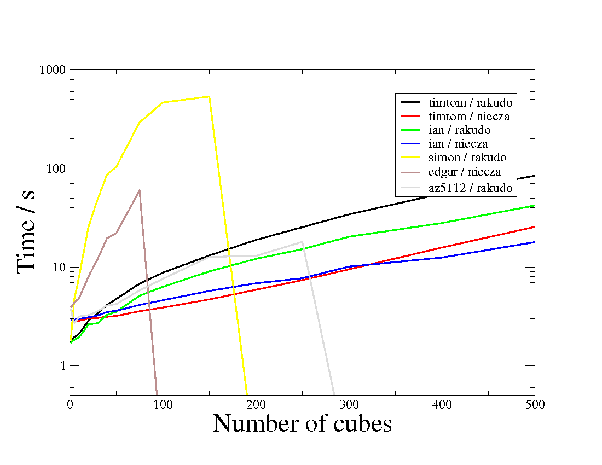
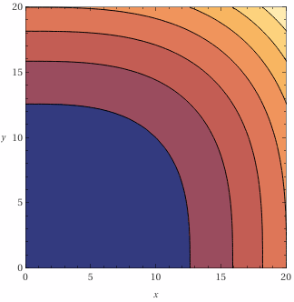

# t2: Sums of cubes
    
*Originally published on [12 February 2012](http://strangelyconsistent.org/blog/t2-sums-of-cubes) by Carl Mäsak.*

*(Guest post by Moritz Lenz.)*

The second task from [the Raku Coding Contest 2011](The-2011-raku-coding-contest.html) needs data structures not available in core Raku to be solved efficiently.

But I'm getting ahead of myself here. First, let's recall the task description:

```
Some natural numbers can be as the sum of two positive cubes of natural
numbers. For example, 1729 is 12 cubed plus 1 cubed. Some natural numbers
can even be expressed as more than one such sum. For example, 1729 can
also be expressed as 10 cubed plus 9 cubed.
Just for clarity's sake, the sum with the two terms reversed is the
same sum, not a new one. Thus, 91 is 3 cubed plus 4 cubed, but
finding "4 cubed plus 3 cubed" does not count as a distinct sum.
Write a program that accepts an integer N on the command line, and
prints out the first N of these numbers in increasing order. For each
number found, print it out, as well as the sums of cubes that yield that
number.
For example:
    1729 = 12 ** 3 + 1 ** 3 = 10 ** 3 + 9 ** 3
```

As always, the devil is in the details. Let me add some emphasis:

"For each number found, print it out, as well as **the** sums of cubes that
yield that number." The sums, not both sums.

The 455th of such sums of cubes can be written in three different ways, not
just two:

```raku
87539319 = 423 ** 3 + 228 ** 3 = 414 ** 3 + 255 ** 3 = 436 ** 3 + 167 ** 3
```

If advanced number theory offers a direct way to come up with such numbers, we
are not aware of it. That leaves the search through the pairs of positive
integers as a viable solution.

Now there are basically two approaches to searching that vast space of number
pairs. The first is to queue up all such pairs in the order that they produce
the cubes, and then iterate them all, looking for double (or triple)
consecutive elements.

The second is to iterate the pairs in some simpler way,
and keep all sums of cubes in a hash, looking for solutions. Since this can
produce the searched numbers out of order, a queue is needed here as well, but
on the output end this time. It also helps to have some condition for when one
is sure that no numbers smaller than some limit will be found, so that one can
safely print out the values already found.

The first one sounds more elegant *a priori*, and implictly avoids having
non-collected garbage in the data structures, but in practice the second one is
much faster, because it keeps orders of magnitudes less data in its queue.

All solutions we have seen or written so far check or enqueue the numbers by
grazing half of a quadrant of the number plane in a triangular fashion,
that is they have a slowly growing first index `x`, and a fast second index
`y` that runs from 1 to `x` for each value of `x`.

[Here you'll find people's solutions](http://strangelyconsistent.org/p6cc2011/).

The following chart illustrates the run time of the solutions
we have received, as a function of how many target numbers they
should find. A drop to zero indicates that the solution threw an
error before printing out all requested numbers (limited to 1
GB virtual memory)



One can see that the solutions all scale roughly exponentially
(that is, a straight line in the logarithmic plot), and that there
are two clusterings: one with steep slopes of slow solutions that
enqueue all sums of cubes, and one of milder slopes of fast solutions
that filter by hash first.

It might be possible to come up with a cleverer strategy for producing
these index pairs, one that is more closely aligned to the contour lines of
x ** 3 + y ** 3.



Such a scheme would reduce memory usage, and maybe even run time.
If you have a nice idea for such an algorithm, please contact us. `:-)```

It is possible to walk each possible integer contour line `l`, and for each
smaller integer cube `i = x ** 3` check if the third root of `l - i` is
integral. Such an algorithm has the advantage of using up nearly no memory,
but it is ridiculously slow in comparison to the other approaches we have
discussed so far. But maybe there is a way to combine the advantages of all
these approaches?
