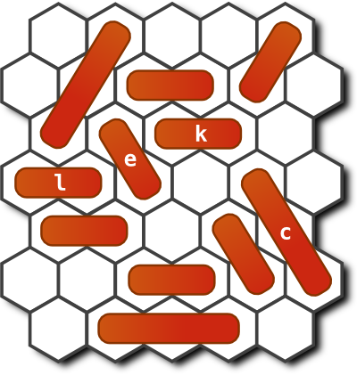

# t4: Hex puzzle
    
*Originally published on [16 May 2012](http://strangelyconsistent.org/blog/t4-hex-puzzle) by Carl Mäsak.*

Despite a rather long absence from such matters, we haven't forgotten that
we're still in the midst of reviewing [Raku Coding Contest
2011](The-2011-raku-coding-contest.html) code
submissions. The t4 task was of the puzzle kind. See the post about [counting
t4 configurations](Counting-t4-configurations.html)
for some overview of the static parts of the problem.

In this post, it's time to get dynamic and look at how to solve actual hex
puzzles. The rest of the problem went like this:

```
A valid playing move on this board consists of sliding a piece along
its groove, either forwards or backwards. There are a few things which
are *not* allowed:
* Two pieces may never overlap and occupy the same location. (Note that
  the above three representations of the board actually denote the same
  board; the three sets of grooves intersect each other.)
* A piece may not "push" another piece as it slides; it is simply locked
  in by that other piece.
* A piece may not "jump" over another piece as it slides; it is restricted
  in its movement by the current positions of the other pieces.
* A piece may not rotate, move sideways, or otherwise leave its groove.
It's perfectly valid for a groove to contain more than one piece (as
long as they don't overlap).
For this problem, we will restrict ourselves to initial board configurations
with a piece at l1 and l2 (written as "l12"). We call this piece the "bullet".
The goal is to slide the bullet to l56, through a valid sequence of moves.
Thus, other pieces may have to be moved in order to get the bullet to l56.
                ..  ..  ..  ..  ..
              ..  ..  ..  ..  ..  ..
                ..  ..  ..  ..  ..
    start --> l1  l2  ..  ..  l5  l6 <-- goal
                ..  ..  ..  ..  ..
              ..  ..  ..  ..  ..  ..
                ..  ..  ..  ..  ..
Some initial configurations won't have a solution at all. (For example, the
bullet will never get through if there are other pieces in its groove.)
Write a program that accepts an initial board configuration on standard input.
The format looks as follows:
    d67
    i12
    l12
    u345
    v34
The program should reject any initial board configuration that has illegal
piece specifications, contains overlapping pieces, or lacks the bullet at
l12.
If there is possible solution, the program should output
    No solution.
Otherwise it should output one solution as a sequence of valid moves on
this format:
    u[345 -> 456]
    d[67 -> 23]
    u[456 -> 123]
    v[34 -> 23]
    l[12 -> 56]
A solution doesn't have to be minimal in the number of moves, but it may
count in your favor if it is. Even more so if it's minimal in the total
distance the pieces were moved. Arriving at a solution quickly is an
even more important success metric than minimal solutions.
```

I strongly encourage you to try a few problems; they're often quite exquisite.
Each puzzle instance requires you to move the bullet from one side of the board
to the other, but in order to do so, you must move aside other pieces, and in
order to do *that*, you must move yet other pieces. Everyone who has ever tried
their hand at [Sokoban](https://en.wikipedia.org/wiki/Sokoban) knows that this
quickly grows non-trivial. (The problem of solving Sokoban puzzles has been
proven to be NP-hard. I know of no such result for this hex puzzle, but let's
just say it wouldn't surprise me.)

The necessity of moving pieces aside forms an implicit dependency tree. If that
were all, these puzzles would be merely mechanical and boring. But what often
happens is that *the dependencies are not cleanly separated*, and you have the
additional problem of not tripping over your own pieces. Here's an example:



We trivially notice that in order to get the bullet (the `l` piece) across, we
need to move aside the `e` piece and the `c` piece. But in the starting
configuration, both of these pieces are blocked by other pieces. So we must move
them first. And so on.

Reasoning about this kind of board takes place in a backwards manner. We figure
out which pieces we have to move out of the way to be able to move the pieces we
are really interested in. We follow the dependencies backwards until we bottom
out.

In this particular problem, it's a bit worse than that: the two subproblems of
"move aside the `e` piece" and "move aside the `c` piece" interact. Why?
Because the `c` piece is blocked by the `k` piece, which is blocked by the `e```
piece. So we can't just solve the subproblems in any order we like, we have to
find a way to solve them that works.  The whole thing has a feel of people
attempting to execute a ballet number in a crowded elevator. It's exquisite.
It's frustrating.

So, people solve this problem by reasoning backwards. This is the only working
approach I've seen, and I've talked to quite a few people about this problem.
How should a machine solve it?

Well, there's always the brute force approach. Try all possible moves from the
starting configuration, and all moves from the configurations that result, and
so on until you either (a) run out of new configurations to try, or (b) solve
the problem. If you do this in a breadth-first way, i.e. you examine the new
configurations in a first-in-first-out manner, you're also guaranteed to find
a shortest possible solution first. (Shortest in terms of moves required.)

This is fine. It's slow, but it's fine. What some of our contestants ended up
doing was to improve on this by using [A*
search](https://en.wikipedia.org/wiki/A*_search_algorithm) to guide the search.
A perfect fit, it seems, for this kind of problem. The extra complexity from
upgrading from BFS to A* is paid back in spades by the problems being solved
faster. A success story.

The other possible approach, which none of the submitted entries attempted,
is to do the reasoning about blocking dependencies much in the way humans do.
Though such a solution is certainly possible, I have a creeping suspicion that
it would be far more complex than the A* approach. It's unclear how many
special cases it would need to contain in order to work out all the
dependencies. One gets a bit of extra respect at the pattern-matching and
hypothetical-future algorithms in one's own brain when trying to code up the
same things as a program.

Be that as it may. [Have a look at people's
solutions](http://strangelyconsistent.org/p6cc2011/). Admire people's ingenuity
on this one. Even though virtually everyone solves the problem in the same way,
there's no end to how differently they factor their solutions.
