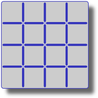
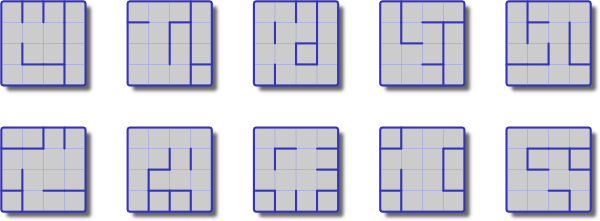
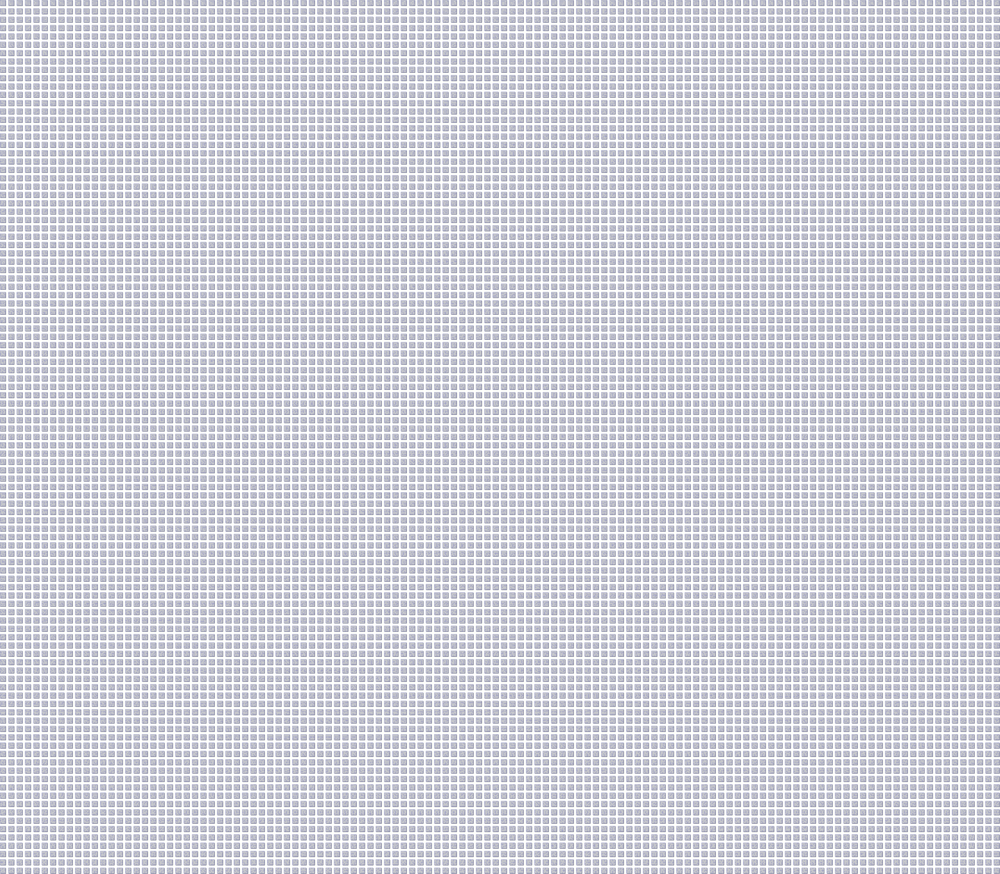

It started with a mini-challenge on the #perl6 channel.

    <masak> today's mini-challenge: a 4x4 grid has 24 internal walls. in the
            power set of these, some of the members are "mazes", by definition
            grids with a unique path between every two squares. how many mazes
            exist?

For example, here are four randomly selected solution mazes:


I have a hidden reason for posing this problem, but that's the subject of a future blog post. But for now, let me clarify by saying that I'm not just interested in *counting* the number of such mazes, I actually want to *enumerate* them &mdash; that is, I need to know what each maze looks like.

I have [previous experience with building mazes](http://strangelyconsistent.org/blog/an-introduction-to-mazemaking-in-literate-perl-6), and I think it's a really fun domain. But the skills from that post teach us how to make a nice *random* maze. Here we want to make all mazes. Maybe the knowledge carries over somehow, but it's not clear to me how.

## Upper bound

Instead, let's start over. The problem specification talks about a "power set" of 24 internal walls.



We could think of each internal wall being controlled by a bit of storage somewhere, a `0` indicating the absence of a wall and a `1` its presence. Together these 24 bits can be thought of as making up a bit string that completely determines the maze.

...which also means that we have an upper bound on the number of mazes, because there are only so many length-24 bit strings!

```` raku
> 2 ** 24
16777216
> sub triples { $^s.flip.comb(/. ** 1..3/).flip }; Nil
> triples 2 ** 24
16 777 216
````

Wherever we are going with this, we won't exceed 16.8 million! Phew!

## Nice

But we already know that this upper bound is not attained; the bit string of all `1`s (illustrated above) fails the "unique path between every two squares" criterion of the problem statement.

In fact, here, let me generate 10 random 24-bit strings and draw them out in grid form:


These *all* fail the "unique path" criterion!

Fortunately for us, the number of "nice" mazes is rather smaller than `2 ** 24`. Since I know what the number is, I would expect there to be one correct maze, on average, for every 167 randomly generated grids. (I just tested this experimentally. In a sequence of randomly generated grids, the first correct maze was number 111.)

Ok, at this point in our investigations, we are at the "I don't know what a correct maze is, but I know one when I see one!" stage. It's a nice stage to be in. So many unexplored avenues! Our ignorance is like a fog, surrounding us, waiting for our sharp observational skills to dispel it! Let's dig beneath the surface.

Why do the above mazes fail the "unique path" criterion? Perhaps if we can describe the vices they commit, we can start laying down the law about how a maze must look to be a member of our club. I see two such vices:

* **Too many walls**. When you start filling up the grid with walls, soon enough you're going to section it off into two parts with no path between them. You can't have a unique path if you don't have any path. It's a very common vice; all of the ten above mazes fall prey to it.

* **Too few walls**. When you start removing enough walls, soon enough there will be two or more paths between some points in the grid. More than one path: no unique path. All of the above ten grids except grid 2 and 6 fall prey to that one.

## Goldilocks

We might be tempted to conclude from the above that there is a certain Goldilocks number of internal walls that a grid *must* have in order to be a correct maze.

...and, in fact, there is! It must have 9 walls. As weak evidence of this, here are the four random mazes again. Yep, they all have 9 internal walls.


This is because a correct maze induces a [spanning tree](https://en.wikipedia.org/wiki/Spanning_tree) on the graph of the grid &mdash; and vice versa. The spanning tree is simply our branching structure of corridors that form between our walls.


Our whole problem can now be restated as "enumerate all possible spanning trees on a 4x4 grid". But Wikipedia also informs us that "for a connected graph with *V* vertices, any spanning tree will have *V − 1* edges". We have 16 vertices, so 15 edges. But "edge" here is "edge in the spanning tree", which corresponds to "no wall" for us. So out of 24 possible walls, our mazes must have 24 - 15 = 9.

This also means that, thanks to [the binomial theorem](https://en.wikipedia.org/wiki/Binomial_theorem), we've lowered our upper bound to 1.3 million.

```` raku
> sub postfix:<!>($n) { [*] 2..$n }; Nil
> sub choose($n, $k) { $n! / ($k! * ($n - $k)!) }; Nil
> choose(24, 9)
1307504
> triples choose(24, 9)
1 307 504
````

While 9 walls is a necessary criterion, it's not a sufficient one. Here are 10 random grids with 9 walls:



Of these, only the upper right one is a correct maze. It's not just how many walls you have, it's how you use them, too!

(If we generate a random 9-walled grid, we're now down to a 1-in-13 chance that the grid is also accidentally a well-formed maze.)

At least we can be a bit clever when searching for bit strings. Instead of iterating through all 16.7 million of them, we can iterate through only the 1.3 million with nine `1`s in them. Order-of-magnitude speedup? Yes, please! The below code for doing so is inspired by MJD's post, from nine years ago, about [enumerating strings of things](http://blog.plover.com/CS/parentheses.html).

```` raku
my $s = "0" x 15 ~ "1" x 9;
say $s;

repeat until $s eq "1" x 9 ~ "0" x 15 {
    $s ~~ s[ .* <( 01 (.*) ] = "10" ~ $0.comb.sort.join;
    # possibly do other things to verify that it's a maze
    say $s;
}
````

## One

It was somewhere around here that I got a promising insight, and thought I had solved the whole problem when I really hadn't.

Here was my (wrong) idea: in every correct maze, the walls form chains which protrude from the outer wall, and then just end. If we could take such a maze and start to "unravel" it at the fringes, peeling away walls which are at the end of such chains, and we do this over and over, eventually we'll be left with a grid with no inner walls.

Here, an example with a correct maze:


But in a grid with cycles, the process of unraveling would eventually stabilize with internal walls still remaining:


The (wrong) way I used to decide whether an edge was at the fringe of an edge was to ask whether it had less than two edges neighboring it. In a cycle, edges would constantly protect each other by being surrounded on two sides by a neighbor edge. But fringe edges would unravel and eventually we'd be left with nothing. (This way of thinking assumed that the big outer edge was a single edge in terms of being able to neighbor other edges. Except that it never gets removed.)

[Here](https://gist.github.com/masak/db655cb7ab27454cf15c) is my first attempt. I've lightly sprinkled comments around the source; hopefully enough. The first script finds all the mazes. The second one removes duplicates in terms of rotation and reflection symmetries. The third one draws the mazes.

As you can see, it took more than two and a half hours to find all the solutions using this script. Which would be more acceptable if it didn't also arrive at the wrong answer.

## Two

After a day or so of these ideas sloshing around in my head, I came up with a better, faster algorithm: if we can find the correctness of the mazes by unraveling them back to the empty grid, we could also run this process in reverse, successively growing all correct mazes in generations from 1..9 (walls), each new generation adding all correct walls to all the mazes of the previous generation.

[Here](https://gist.github.com/masak/6f1c0ba393fe5eb508b1) is the script to do that. It basically scavenges the old script for ideas. Because it would be much slower not to, this script now removes symmetric duplicates as part of generating the mazes. The idea of what constitutes a "correct" addition of a wall is exactly the same as before: a wall can be added if that spot has one neighboring wall.

I also uncovered [a string-handling bug](https://github.com/Raku/old-issue-tracker/issues/3646) in MoarVM as part of writing this. Under certain circumstances, `substr` on a string built using `x` gives the wrong answer. Internally, MoarVM uses something called [ropes](https://en.wikipedia.org/wiki/Rope_(data_structure\)) to represent strings. Among other things, MoarVM ropes can encode repetitions such as the ones `x` creates, to reduce memory footprint and computation. But something throws `substr` off the scent in this particular case. And my toy problem helped discover it. ♥

*Update*: [Bug was finally fixed](https://github.com/Raku/old-issue-tracker/issues/3646) by jnthn++ in July 2016.

    <jnthn> Too bad it gets the wrong answer, rather than getting into an
            infinite loop
    <jnthn> Then we coulda said it had enough rope to hang itself...

I didn't see the error of my ways until [Mouq++ actually dug up](http://irclog.perlgeek.de/perl6/2015-01-15#i_9947670) a few mazes that my algorithm didn't produce. Common to all these mazes was that they had "corners" in the maze: points where a single wall chain branched out in two different directions. Here, have a few examples.


My algorithm would fail to produce any of these, for the simple reason that my 1-neighbor criterion was flawed.

Einstein has been remembered for the quote "Everything should be made as simple as possible, but no simpler." Actually, what he really said was "The supreme goal of all theory is to make the irreducible basic elements as simple and as few as possible without having to surrender the adequate representation of a single datum of experience." (See [Wikiquote](https://en.wikiquote.org/wiki/Albert_Einstein#1930s).) But history seems to have applied the spirit of his own words to his quote and produced the former soundbite from Einstein's longer version.

    <masak> oh, it's lovely to be wrong :>

It says something about my TV habits that I can't really think of the quote nowadays without [Jesse Pinkman](https://en.wikipedia.org/wiki/Jesse_Pinkman) appearing in my mind and appending "...bitch" to the quote. (Either the long one or the short one.) *Especially* when I commit a modeling error like the one with the mazes.

## Three

When I arrived at my first two solutions, I was kind of relieved that I could phrase it only in terms of the internal walls of the maze. I didn't have to deal in the nine vertices between the walls &mdash; or so I thought. It turns out that this simplification was of the kind that made the solution a bit simpler than possible. (Bitch.)

(I'm sure this isn't the first time I make this exact mistake. I come back to thinking about mazes and maze generation every few years, and I recognize this failure mode in previous code I've written. This is the first time I've taken the time to analyze it, though.)

So my [third solution](https://gist.github.com/masak/eb8e9a370300c666a0ec) introduces the notion of *points* joining together the walls. The algorithm now turns into this: for an empty grid, all nine internal points are *active*. As we fill out the grid, one by one these points will toggle from active to inactive by having a wall touch the point. We still proceed in generations from an empty grid to a completed maze. But now, the criterion for where we may put a new wall is this: a wall goes between an inactive point (that already touches a wall) and an active point (that doesn't). (Again, the outer wall is treated a bit specially, this time as a tenth "point" that's always active no matter how many walls attach to it.)

Viewed a bit differently, the algorithm does a [breadth-first search](https://en.wikipedia.org/wiki/Breadth-first_search) on the graph induced by the points (including the outer wall) and the internal walls. But it does the breadth-first search non-deterministically, in all possible ways. Each time it "finds a neighbor point" it hasn't visited yet, it leaves a wall between the old point and the new. Each maze ends up representing one possible BFS with the outer wall as starting point.

The resulting algorithm runs in little under 15 minutes. Which is quite an improvement in running time - besides being correct, I mean.

Kudos go to [moritz++](http://irclog.perlgeek.de/perl6/2015-01-15#i_9948369) for realizing that the whole thing runs faster if the [qw lists of numbers](https://gist.github.com/masak/eb8e9a370300c666a0ec/download#file-points-p6-L28-L34) are hyper-numified instead of being implicitly cast each time they're used.

## Answer

So... how many correct 4x4 mazes are there? The short answer is 12600.

I don't know about you, but I didn't expect there to be that many. Yes, that's *after* removing rotation and reflection duplicates. For comparison, there's only one maze of size 1x1, only one maze of size 2x2, and only 28 mazes of size 3x3.


But apparently there's a lot of new wiggle room for the walls once you increase it to 4x4.

I rendered an image of all 12600 4x4 mazes, but it would be foolish to try to put it here in the blog post. But I can . (Warning: 1.6 MB `.png` file. nemo++ for helping shrink it from 3.7 MB.)

Of the 12600 mazes, 112 have a reflectional symmetry. Which means that if we count all reflections and rotations as distinct, we have (12600 - 112) * 8 + 112 * 4 = 100352 mazes. ([Here's the script](https://gist.github.com/masak/0779367baae65e9ac26b) that finds the symmetries.)

## Epilogue

It seems that more and more often, I encounter these kinds of problems where the problem domain is essentially a "space" of objects, and any algorithm has to loop over the objects in some intelligent manner. The last time this happened to me in a toy problem setting, I was [counting configurations on a hex cell board](http://strangelyconsistent.org/blog/counting-t4-configurations). But I find it increasingly happen to me in less hobby-oriented domains, too. Often enough, the challenge is being able to navigate a giant code base or data model, or to extract some subset of it, or to classify parts of it on the fly. My brain, perhaps addled by category theory at this point, increasingly thinks about these problems as happening in a "phase space", each point representing some object of interest.

I wonder if I could go back and describe to my 15-year-old self what it's like to discover and explore these spaces. I wonder if he'd understand and be as hooked on it as I am. The thrilling aspects are really in finding appropriate names for new entities and relationships in the artificial universe, and then building an understanding out of these named concepts, constructing ever-higher towers of composite concepts to explain ever-larger clusters of relations. I am Adam, my artificial universe is the garden of Eden, and the objects are species to be tagged and classified.

And here I could wax poetic about the suggestive power of language, and [the importance of actually evolving a language for your domain](https://en.wikipedia.org/wiki/Domain-driven_design), both nouns and verbs. But we'll save that too for some other post.

## Cycles

The solution I ended up with avoids cycles using "positive" filtering, creating partial results without cycles until we arrive at full mazes. It is possible to use "negative" filtering too, by first building a list of all the "fundamental cycles" in 4x4-space, and then finding all (9-wall) grids that *don't* contain one of the fundamental cycles. The promising thing about this is that the question "does it contain this cycle?" can be formulated as a bitwise `+&` and the maze bit vectors (and fundamental cycle bit masks) can be represented as native ints, making this potentially quite fast.

How can we build a list of fundamental cycles? Basically by doing one [depth-first search](https://en.wikipedia.org/wiki/Depth-first_search) at every internal point (and once for the outer wall), backtracking each time we find a cycle. I'm intrigued that it turns out that when we're looking for (cycle-free) mazes we need to use BFS, but when we're looking for cycles we end up with DFS. I wonder if there's some really deep duality that can explain why that is. (If you know, get in touch.) [There are 627 fundamental cycles](https://gist.github.com/masak/66735ee4c40a5d5c2eee) on a 4x4 grid. (Here's another [image that doesn't fit](http://strangelyconsistent.org/blog/images/fundamental-cycles.png).)

Unfortunately, the fun ended there. Rakudo doesn't support native arrays yet, so I have nowhere fast to put my 627 native ints. Right now [the algorithm](https://gist.github.com/masak/81409152053431cac80b) runs in 38 minutes, which is not an improvement on the 14 minutes of solution three. We'll see if that balance changes once we get native arrays.

And now, I will consider mazes as being flushed out of my system, for now. Hopefully I'll be able to get back to blogging about macros.
