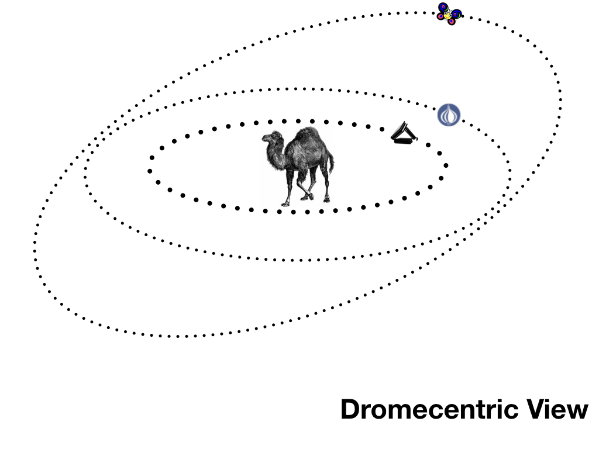
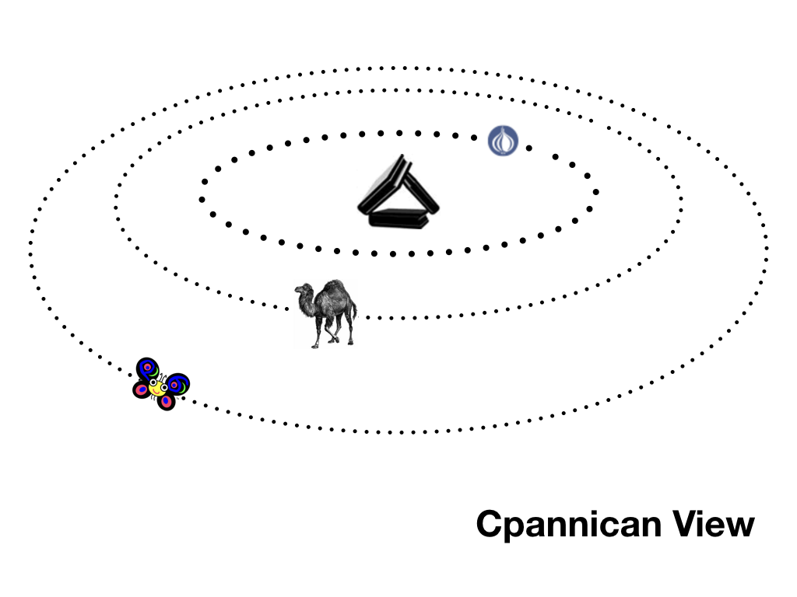

Migrating Perl code to Raku
===========================

*Originally published on [1 August 2018](https://opensource.com/article/18/8/migrating-perl-5-perl-6) by Elizabeth Mattijsen.*
  
Whether you are a programmer who is taking the first steps to convert your Perl code to Raku and encountering some issues or you're just interested in learning about what might happen if you try to port Perl programs to Raku, this article should answer your questions.

The [Raku documentation](https://docs.raku.org) already contains most (if not all) the [documentation you need](https://docs.raku.org/language/5to6-overview) to deal with the issues you will confront in migrating Perl code to Raku.  But, as documentation goes, the focus is on the factual differences. I will try to go a little more in-depth about specific issues and provide a little more hands-on information based on my experience porting quite a lot of Perl code to Raku.

How is Raku anyway?
-------------------

Very well, thank you! Since its first official release in December 2015, Raku has seen an order of magnitude of improvement and quite a few bug fixes (more than 14,000 commits in total). Seven books about Raku have been published so far. [Learning Raku](https://www.learningraku.com) by brian d foy will soon be published by O'Reilly, having been re-worked from the seminal [Learning Perl](http://shop.oreilly.com/product/0636920049517.do) (aka "The Llama Book") that many people have come to know and love.

The user distribution [Rakudo Star](https://rakudo.org/files) is on a three-month release cycle, and more than 1,100 modules are available in the [Raku ecosystem](https://modules.raku.org). The Rakudo Compiler Release is on a monthly release cycle and typically contains contributions by more than 30 people. Raku modules are uploaded to the Perl programming Authors Upload Server ([PAUSE](https://pause.perl.org/pause/query?ACTION=pause_04about)) and distributed all over the world using the Comprehensive Perl Archive Network ([CPAN](ttps://www.cpan.org)).

The online [Raku Introduction](https://raku.guide) document has been translated into 12 languages, teaching over 3 billion people about Raku in their native language. The most recent incarnation of [Rakudo Weekly News](https://rakudoweekly.blog) has been reporting on all things Raku every week since February 2014.

[Cro](https://cro.services), a microservices framework, uses all of Raku's features from the ground up, providing HTTP 1.1 persistent connections, HTTP 2.0 with request multiplexing, and HTTPS with optional certificate authority out of the box.  And a Raku IDE is now in (paid) beta (think of it as a Kickstarter with immediate deliverables).

Using Perl features in Raku
---------------------------

Perl code can be seamlessly integrated with Raku by installing the [`Inline::Perl5`](http://modules.raku.org/dist/Inline::Perl5) module, making *all* of [CPAN](https://metacpan.org) available to any Raku program. This could be considered cheating, as it will embed a Perl interpreter and therefore continues to have a dependency on the `perl` (5) runtime. But it *does* make it easy to get your Raku code running (if you need access to modules that have not yet been ported) simply by adding `:from<Perl5>` to your `use` statement, like `use DBI:from<Perl5>;`.

In January 2018, I proposed a [CPAN Butterfly Plan](https://www.perl.com/article/an-open-letter-to-the-perl-community/) to convert Perl functionality to Raku as closely as possible to the original API.  I stated this as a goal because Perl (as a programming language) is so much more than syntax alone.  Ask anyone what Perl's unique selling point is, and they will most likely tell you it is CPAN.  Therefore, I think it's time to move from this view of the Perl universe:

to a more modern view:

In other words: put CPAN, as the most important element of Perl, in the center.

Converting semantics
--------------------

To run Perl code natively in Raku, you also need a lot of Perl semantics.  Having (optional) support for Perl semantics available in Raku lowers the conceptual threshold that Perl programmers perceive when trying to program in Raku. It's easier to feel at home!

Since the publication of the CPAN Butterfly Plan, more than 100 built-in Perl functions are now supported in Raku with the same API. Many functions already exist in Raku but have slightly different semantics, e.g., `shift` in Perl magically shifts from `@_` (or `@ARGV`) if no parameter is specified; in Raku the parameter is obligatory.

More than 50 Perl CPAN distributions have also been ported to Raku while adhering to the original Perl API. These include core modules such as [Scalar::Util](https://modules.raku.org/dist/Scalar::Util) and [List::Util](https://modules.raku.org/dist/List::Util), but also non-core modules such as [Text::CSV](https://modules.raku.org/dist/Text::CSV) and [Memoize](https://modules.raku.org/dist/Memoize). Distributions that are upstream on the [River of CPAN](https://neilb.org/2015/04/20/river-of-cpan.html) are targeted to have as much effect on the ecosystem as possible.

Summary
-------

Raku has matured in such a way that using Raku is now a viable approach to creating new, interactive projects.  Being able to use reliable and proven Perl language components aids in lowering the threshold for developers to use Raku, and it builds towards a situation where the sum of Perl and Raku becomes greater than its parts.

*Update February 2021*
====================
Since 1 August 2018, more than 7000 additional commits have been done to the Rakudo code base, about 600 module distributions have been added to the ecosystem, and another 3 books have been published.  [Comma, the Raku IDE](https://commaide.com) is now maturely available in a free Community Edition with a 3-month update cycle, as well as a subscription service with additional features in monthly updates.
