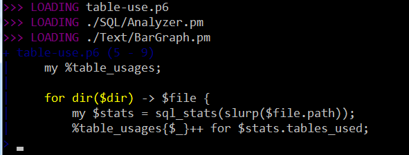
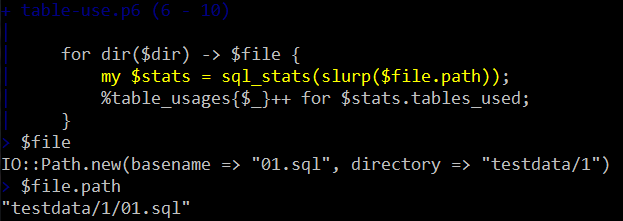
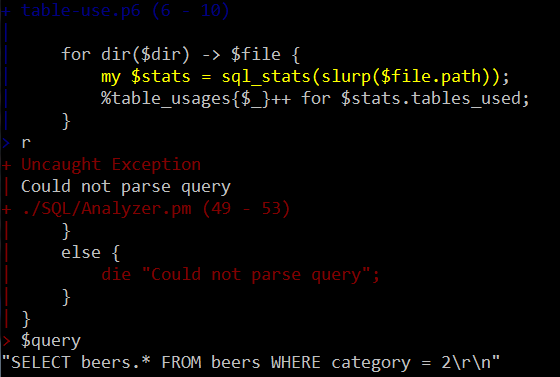
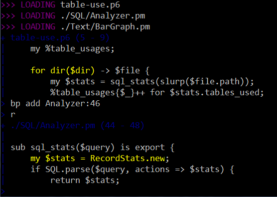
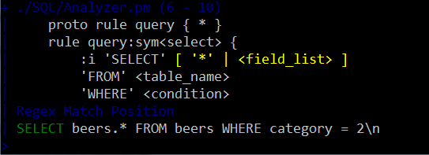
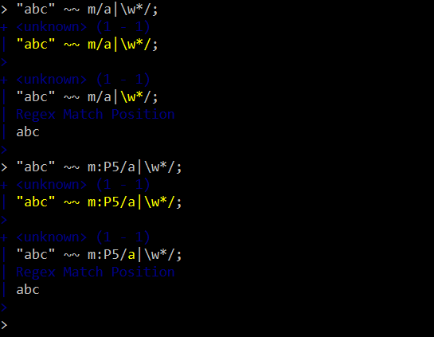
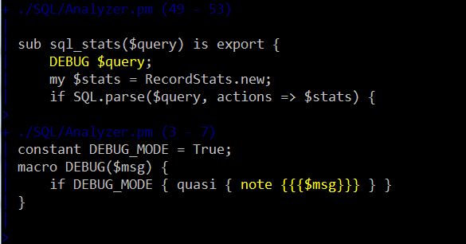

# A Raku Debugger
    
*Originally published on [5 December 2012](https://perl6advent.wordpress.com/2012/12/05/a-perl-6-debugger/) by Jonathan Worthington.*

There’s much more to the developer experience of a language than its design, features and implementations. While the language and its implementations are perhaps the thing developers will spend most time with, the overall experience will also involve interaction with the community, reading documentation, using modules and employing various development tools. Thus, it’s important that Raku make progress on these fronts too. Over the past year, we’ve taken some good steps forward in these areas; there’s now [doc.raku.org](http://doc.raku.org/), the module ecosystem has grown, and the module installation tooling has improved. Another big step forward with regards to tooling – and the topic of this post – is that an interactive Raku debugger is now available.

### Running With The Debugger

The debugger has been included with the last few Rakudo * releases. If you have one of those, you’re all set. Just run `raku-debug` instead of `raku`. It takes the same set of options, so if your normal invocation involves, for example, using the `-I` flag to set the include path for modules, it’ll Just Work Like Usual. Of course, what happens next is entirely different. The debugger will show you each module it is loading, followed by placing you at the first interesting statement of the program, highlighted in yellow.

Note how it takes care to put you on the first line that actually does something, skipping the my statement above it (it’s getting increasingly smart about this).

### The Basics

Hitting enter allows you to single-step through the program. At any point, you can look at variables, call methods on variables, or even evaluate expressions.

If you want to move statement by statement, but never descend into a function call or method call, type an `s`, followed by enter. To step out of the current sub (that is, run until it returns then break in its caller), use `so` to step out. To run the program until it hits an exception, just use `r`. Even at the point you get an exception, you can still access variables to try and dissect what went wrong.

One final variant, `rt`, will run until an exception is thrown, but handled. You’ll break at the point of the throw. This means you’re not disadvantaged in the debugger if you took care to handle exceptions well in your program; you can still break when they are thrown and use the debugger to help understand why. :-)

### Breakpoints

Sometimes, you know exactly where the juicy stuff happens in your program that you wish to debug. If only you could just run until you got there. Turns out you can – that’s what breakpoints are for. We can add one, use `r` to run, and it will stop where we placed the breakpoint.

Note that you don’t have to type out the full name of the file you want to put the breakpoint in; any unambiguous substring of the name of a file that is loaded will be sufficient.

I won’t cover them here, but there are also tracepoints, which instead of breaking will log the value of an expression each time a certain place in the program is hit. Later, you can display the log. It’s like adding print statements, but without the print statement going in your code, removing the risk of them accidentally making it into a commit (‘cus we’ve all done that one, right? :-))

### Regex and Grammar Debugging

When the debugger detects you are in a regex or grammar, it offers a little extra help. As well as allowing you to single-step your way through the regex, atom by atom, it also displays the match text, indicating what has been matched so far.

Here, you can see that the pattern already successfully matched SELECT, and is now looking for a literal * or will try to call the field list rule. If in a regex, which may backtrack, the match position  jumps backwards when backtracking happens, so you can understand the backtracking behavior of the pattern.

### Yes, Perl Regexes Too!

Rakudo has some support for the :Perl adverb on regexes, which allows use of the Perl regex syntax. Here the debugger is used in REPL mode (where you enter an expression, then can immediately debug it) to explore the difference between alternations in Perl and Raku (in Perl they go left to right, in Raku they have longest token matching semantics, such that it tries the thing that will match most characters first).

The debugger in REPL mode is great for exploring and understanding how things will execute (and as such can serve as a learning or teaching aid). Another use is for debugging modules without having to write a test script; just write a `use` statement in the debugger or you can even supply the module using the `-M` command line flag and the debugger will load it!

### What About Funky Stuff, Like Macros?

That is, macros, `BEGIN` time, `eval`, and those other things where your Raku program does the time warp again, doing a bit of runtime at compile time or compiling some more stuff at runtime. The debugger is built for it. If a macro is applied, the debugger will place you in it. Notice below how we’re still in the process of loading the second file, and did not get to the third yet – we really are debugging at `BEGIN` time!

Any lines of code that are stripped out by the macro are simply never hit at runtime. And what about statements in quasi blocks? The debugger will take you there, so you not only know what macro was applied, but can dig into exactly what it does too.

Just as bits of runtime happening at compile time work out fine, any code that gets `eval`‘d at runtime is also compiled with debug hooks, meaning that you can step straight into it and debug the evaluated code.

### Written in Raku and NQP!

You might think that writing a debugger must involve all kinds of low-level hackery. In fact, that’s not the case. The debug hooks mechanism is [written in NQP](https://github.com/jnthn/rakudo-debugger/blob/master/bin/rakuebug.nqp), and the command line user interface is [written in Raku](https://github.com/jnthn/rakudo-debugger/blob/master/lib/Debugger/UI/CommandLine.pm). This is significant from a couple of angles. The first is the fact that we can write something like this without breaking the encapsulation of the compiler, but instead just by subclassing the `Grammar`, `Actions` and `Compiler` objects and twiddling with the AST. In fact, the debugger was built without any changes being required to Rakudo as it already existed. This provides important feedback on our compiler architecture – this time, very positive feedback. Things are extensible in the ways they were designed to be. The second is that writing so much of it in Raku is a healthy bit of dogfooding – using the product in order to build further products. My hope is that, since most of what people would want to change is actually written in the Raku part, it will feel quite hackable by the community at large.

### And What Of Future Plans?

Various features are still to come: conditional breakpoints, dumping tracepoint output to a file, showing the path taken through a grammar to get to the current point, and various bits of configurability. The command line interface is nice, but of course having some extra options would be even nicer. I’m interested in a web-based interface, but also in integration with tools like Padre. There’s some work afoot on a [common protocol](https://github.com/kevindawson/Bullwinkle/wiki) for these things, which could make such integration possible without having to re-invent too many wheels. In the meantime, having an interactive debugger which is aware of and works well with a wide range of Raku language features is a solid step forward. Happy debugging, and feature ideas (or patches ;-)) are welcome; here’s the [GitHub repo](https://github.com/jnthn/rakudo-debugger)!
