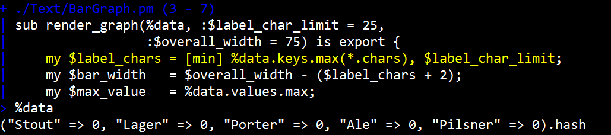
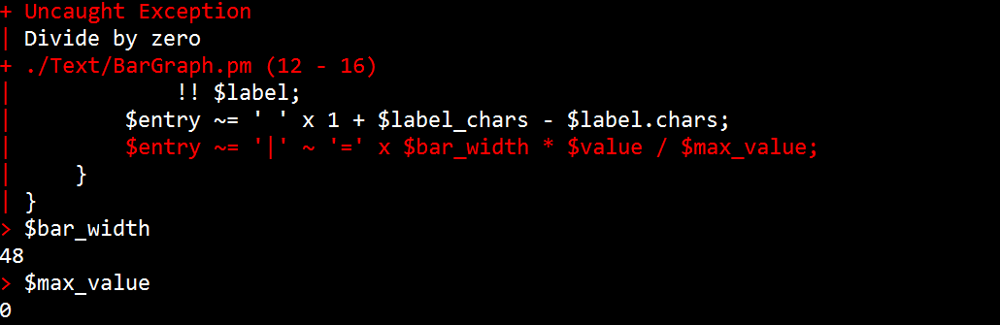
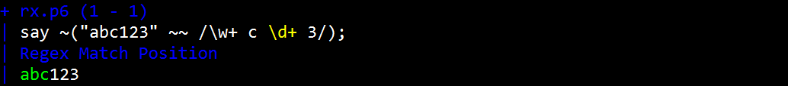
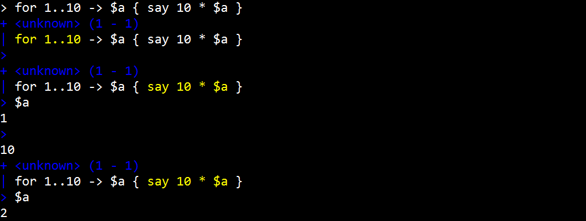

# A Rakudo Debugger
    
*Originally published on [2012-08-28](https://6guts.wordpress.com/2012/08/28/a-rakudo-debugger/) by Jonathan Worthington.*

I’m currently in the midst of a 2-week chunk of time focused on Perl stuff. It started with the Perl Reunification Summit, which I’ll write more about in a future post, and was followed by YAPC::Europe in Frankfurt. After about 36 hours at home after YAPC, I was on my way to Norway for the Moving To Moose Hackathon, organized by the industrious Oslo.pm. And that’s where I am now!

At YAPC::Europe I presented a project I’d been quietly working on in the couple of weeks running up to YAPC: building [a debugger for Rakudo](https://github.com/jnthn/rakudo-debugger/). Nobody there knew I’d been working on it, so it was a nice little surprise for everyone. :-) Happily, it got a very positive reception, and Pm is currently working on the next Rakudo Star build, which will include it.

Let’s take a very quick look at it. When you enter the debugger, it takes you to the first non-declarative line of code that is to be executed (which may be in a BEGIN block or a macro body). It highlights it in yellow and shows some context. In the screenshot below, we’re some way into a program, about to execute the first line of a subroutine. We can enter the name of a variable to introspect its content.

It is also possible to eval code in the current context, or evaluate complex expressions. Another use of the debugger is to understand what went wrong when an exception occurs.

Here, we can see what went wrong, and have been able to introspect the variables at the point where the exception was thrown.

The debugger is also able to single-step through regexes. It also recognizes when it is in a regex (it works for rules and tokens in grammars too) and shows what part of the string has been matched so far.

Here, the yellow indicates the next regex atom to try and match, and the green shows the portion of the string matched so far.

Other features include debugging inside of eval’d code, breakpoints and breaking whenever an exception is thrown. Last bot not least, there’s a REPL mode that works much like the normal Rakudo REPL, apart from it lets you step through the expression you entered:

I have plans for more features in the future, including trace points (so you can log the result of evaluating an expression every time a certain place in the code is hit). If you find bugs or have ideas, just file a GitHub issue…or submit a patch. Much of the code is, after all, written in Raku (the rest is in NQP).

Enjoy!
