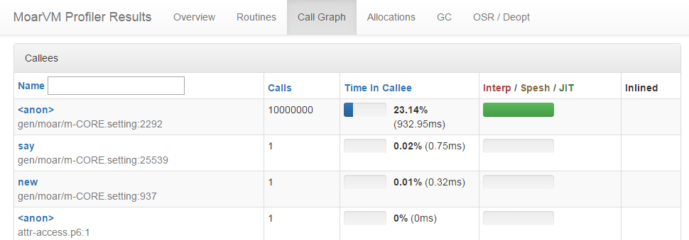

# Digging into the performance/reliability work
    
*Originally published on [2016-03-06](https://6guts.wordpress.com/2016/03/06/digging-into-the-performancereliability-work/) by Jonathan Worthington.*

This week, I finally started digging into Rakudo and MoarVM things again, as part of my [performance and reliability grant](http://news.perlfoundation.org/2016/02/grant-proposal-perl-6-performa.html). Here’s what I got up to.

### Faster accessors and an inlining fix

Making object accessors and object construction faster was one of the bullet points on the grant, and I decided to start out with accessors – largely because I’d already figured out pretty much exactly what I wanted to do with them. Here’s a small microbenchmark:

```` raku
class A {
    has $.x;
}
my $a = A.new(x => 42);
my $y;
loop (my int $i = 0; $i < 10000000; $*i*++) {
    $y = $a.x;
}
say $y;
````

The hot loop is just calling an accessor method ten million times and assigning the result. Before I started with any improvements, this code took 3.34s to run, including startup/compilation time. That was around 0.15s (measured by the time to do one iteration of the loop), so let’s call it 3.2s for the iterations themselves. That makes for about 0.32 microseconds per iteration. Being under a millionth of a second might not seem something to complain about, but it’s actually a little shy of a *thousand* CPU clock cycles on a 3 GHz CPU. Not cheap, for something you would expect to be very cheap indeed!

So, where is the cost? Here’s a bit of the profile output:



That **<anon>** is the accessor, which is called ten million times. It’s been JIT-compiled (the green), which is good. The column on the right, however, tells a less happy story: the accessor method was not inlined. Inlining is an optimization that involves taking the body of a called method and splicing it into the callee, such that you completely eliminate the dispatch and calling overhead. One other point on my grant is to look into decreasing call overhead, which really wants to be lower, but being able to inline and get rid of it altogether is still preferable. And accessor methods are tiny, so should be great inlining candidates. So what gives?

Well, at the heart of it was the way that we’d implemented accessor methods. Down in the metamodel code, we did something like this (simplified):

```` raku
$package.^add_method($accessor-name, method () {
    nqp::getattr(self, $package, $attr-name)
});
````

The method being added there is a closure. It closes over the package the attribute is from and the name of the attribute, which together are used in the lookup. MoarVM’s inliner can not inline things that access lexicals from the surrounding scope, because then you actually need a callframe with a correctly bound outer frame to resolve them. There’s a further cost, though. If we write an accessor method by hand:

```` raku
method x { $!x }
````

Then we look at the generated code, we see these two instructions:

````
wval r4(3), liti16(0), liti16(12)
getattr_o r5(1), r0(1), r4(3), lits($!x), liti16(0)
````

The wval is just grabbing a constant symbol, and the name of the attribute is a literal string. Since all those things are known, the MoarVM code specializer is able to re-write those two into:

````
sp_p6ogetvc_o r5(1), r0(1), liti16(8), sslot(3)
````

This is known as a “spesh op”, which only the optimizer is allowed to emit. The 8 there is an offset from the start of the object’s memory in bytes, and this op is interpreted by taking the object in register 0, adding 8 bytes to its address, and deferencing – without having to do much in the way of “safety checks”. This JIT compiles into machine code rather cheaply also.

But when we have a late-bound package and attribute name, this optimization cannot happen. So not only are we not getting inlining to take place, we’re also losing out by having the code for accessors that we generate not being so good as the code you’d get if you wrote them all by hand.

So, what to do? Well, since most of the time the MOP is invoked by the compiler, and the compiler’s job is code generation, the neat solution is to have it provide a compiler services object to the MOP. It can use this to generate the accessor methods. When there’s no compiler services object supplied, it falls back to the existing way (for example, this would happen when you’re doing dynamic generation of classes). So, that’s what I [implemented](https://github.com/rakudo/rakudo/commit/fdd37a9e0bef16eb3e4bb24ddd59247e379b5038).

The result? 2.43s, or about 2.3s with startup time removed. So, it now was running in 72% of the time it did before. That’s an improvement, but not what I was looking for. Disappointed, I looked at the new profiling data and found that we *still* weren’t actually inlining the accessor methods. Looking at their code, they were free of outer lexical references and otherwise really simple. So what was going on?

It turned out to be an inlining bug that was also leading to many more missed opportunities. I’d heard from other folks looking at profiles that they were surprised certain things didn’t get inlined, but in the push to get things to work before Christmas, rather than to get them fast, I didn’t look into it. Now I have chance to take care of such things, and so investigated. It turned out to be an unfortunate accident that occurred when teaching inlining about multiple dispatch, so it could inline multi subs and methods. It led to us, oddly, being pretty good at inlining multi-dispatch calls, but missing out on lots of (supposedly easier) single-dispatch calls. Once I figured out what was going on, [the patch](https://github.com/MoarVM/MoarVM/commit/2e6a1dd4e7940fb86e8c3034027764626339b1d3) was short and simple. This should have much wider benefits than just for accessors.

But, back to accessors. With inlining of various single-dispatch things fixed up, the benchmark now ran in 0.63s, so let’s call it around 0.5s once startup time is removed. That’s 0.05 microseconds per iteration of the loop, or around 150 CPU cycles per loop. That’s still too high, but running that loop in 15% of the time we used to is a nice step forward.

Just to put that figure on the map a little, I wrote the following Perl program, which I hope is reasonably equivalent:

```` raku
package A;
use Moo;
has x => ( is => 'ro' ); 

package Main;
my $a = A->new(x => 42);
my $y;
for (my $i = 0; $i < 10000000; $*i*++) {
    $y = $a->x; 
}
say $y;
````

This ran in 5.12 seconds, with 0.08s startup/compilation time, so let’s call it 5 seconds for the iterations, or around 0.5 microseconds, or 1500 CPU cycles on our over-idealized 3GHz CPU. (For those wondering why I didn’t stick **use integer** into the Perl benchmark to reflect the native int I used in the loop of the Raku one: I tried, and on my box that made things slower.)

There was another small benefit: CORE.setting got a bit smaller. While we’re producing a bit more bytecode now, we’re serializing less closures, and it turns out that the bytecode approach weighs a little less. My guess going into this was that I’d about break even, so coming out with a 130KB lighter CORE.setting was very nice. That means a smaller resident memory size also.

### A big leak

Away from performance work, I spent some time hunting down a reported memory leak. Tracing things back from the valgrind output I was sent, I recreated a one-liner to reproduce it. The leak needed certain combinations of features to be used; there were various paths to trigger it, though my reproduction of it involved a multiple dispatch sub with a where constraint, called with flattening arguments. If such situations happened a lot, we could leak rather heavily. It’s [gone now](https://github.com/MoarVM/MoarVM/commit/a8beba24b9fdbb827246254e882d2b5abf50c44f).

The analysis of this issue was helped by my having spent some time in the run-up to this grant clearing up MoarVM’s –full-cleanup mode. Usually we don’t waste time neatly clearing everything up at exit, because the OS can do it way faster (yes, I measured). However, MoarVM invoked with the –full-cleanup flag will try to do such cleanup, freeing everything it allocated. This is useful because it makes actual leaks, not just incomplete cleanup, clear to see. I’m not all the way there with this work yet, however NQP and most of its test suite are already valgrind-clean. I’ll be continuing to pick off the missing bits of cleanup over the course of the grant, and at some point want to set up a spectest run with valgrind + –full-cleanup to give ourselves a good chance of hunting all the leaks down.

### Work in process: lazy string heap decoding

A decent chunk of the CORE.setting compiled output, along with various other bits of the compiler, is string literals. Of course, not all of them are equally used (think about the hundreds of error messages you never normally encounter). To date, we’ve always taken all of the strings and decoded them at bytecode load time, creating an NFG MVMString data structure (and so doing the bit of analysis needed to see if they need any synthetic codepoints generating). Looking at our memory use, it became clear there might be a win from deserializing them on-demand. The [patch doing so](https://github.com/MoarVM/MoarVM/commit/eff150add1bbb8a2acf0bb2094cb12f8b36cad44) isn’t quite ready for prime-time yet (though a [follow-up fix by Timo](https://github.com/MoarVM/MoarVM/commit/a501a41e37e403f2cec6229b75e5e18c48c75496) may have addressed the crash my initial patch produced in an NQP test), but it revealed that we can knock around 1.3MB off Rakudo’s base memory usage with such an approach. (Fun fact: with the patch, on my box NQP running **while 1 { }** uses 1.8MB less memory than the JVM running the equivalent Java program – except NQP actually has the NQP compiler in memory and compiled the script too!) Anyways, expect this improvement to land in the next couple of days.

### What next?

There’s so much to do! One task will be applying the same approach I took for accessors to object construction, so see how far that helps. Our object construction speed is a known bottleneck, and a simple benchmark against Perl + Moo shows Rakudo being a disappointing 7 times slower. So, some work will be needed for us to reach towards parity, then get ahead, there. And on the reliability track, I’ll be picking out some bugs, leaks, etc. to squish too.
