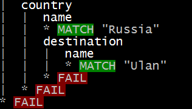

# Grammar::Tracer and Grammar::Debugger
    
*Originally published on [2 December 2011](https://perl6advent.wordpress.com/2011/12/02/grammartracer-and-grammardebugger/) by Jonathan Worthington.*

Grammars are, for many people, one of the most exciting features of Raku. They unify parsing with object orientation, with each production rule in your grammar being represented by a method. These methods are a little special: they are declared using the keywords `regex`, `rule` or `token`, each of which gives you different defaults on backtracking and whitespace handling. In common is that they lead to the body of the method being parsed using the Raku rule syntax. Under the hood, however, they really are just methods, and production rules that refer to others are really just method calls.

Raku grammars also give you a seamless way to combine declarative and imperative parsing. This means efficient mechanisms, such as NFAs and DFAs, may be used to handle the declarative parts – the things that your tokens tend to be made up of – while a more imperative mechanism drives the parsing of larger structures. This in turn means that you don’t need to write a tokenizer; it can be derived from the rules that you write in the grammar.

So what is the result of parsing some text with a grammar? Well, provided it’s able to match your input, you get back a parse tree. This data structure – made up of Match objects – captures the structure of the input. You can treat each `Match` node a little bit like a hash, indexing in to it to look at the values that its production rules matched. While you can build up your own tree or other data structure while parsing, sometimes the `Match` tree you get back by default will be convenient enough to extract the information you need.

That’s wonderful, but there was a key clause in all of this: “provided it’s able to match”. In the case that the grammar fails to match your input, then it tells you so – by giving back an empty `Match` object that, in boolean context, is false. It’s at this point that many people stop feeling the wonder of grammars and start feeling the pain of trying to figure out why on earth their seemingly fine grammar did not accept the input they gave it. Often, it’s something silly – but in a grammar of dozens of production rules – or sometimes even just ten – the place where things go wrong can be elusive.

Thankfully, help is now at hand, in the form of two modules: `Grammar::Tracer`, which gives you a tree-like trace output of your grammar, and `Grammar::Debugger`, which gives the same trace output but also enables you to set breakpoints and single step through the grammar.

A picture is worth a thousand words, so here’s how `Grammar::Tracer` looks in action!


What we’re seeing here is a tree representation of the production rules that were called, starting at `TOP`, next trying to parse a production rule called `country`, which in turn wants to parse a name, two “num”s and an “integer”. The green indicates a successful match, and next to it we see the snippet of text that was captured.

So what happens when things go wrong? In that case, we see something like this:



Here, we see that something happened during the parse that caused a cascade of failures all the way back up to the “TOP” production rule, which meant that the parse failed overall. Happily, though, we now have a really good clue where to look. Here is the text my grammar was trying to match at the time:

```` raku
Russia
	Ulan Ude : 51.833333,107.600000 : 1
	Moscow : 55.75000,37.616667 : 4
````

Looking at this, we see that the `name` rule appears to have picked up “Ulan”, but actually the place in question is “Ulan Ude”. This leads us directly to the name production in our grammar:


```` raku
token name { \w+ }
````

Just a smattering of regex fu is enough to spot the problem here: we don’t parse names that happen to have spaces in them. Happily, that’s an easy fix.


```` raku
token name { \w+ [\h+ \w+]* }
````

So how do we turn on the tracing? Actually, that’s easy: just take the file containing the grammar you wish to trace, and add at the top:


```` raku
use Grammar::Tracer;
````

And that’s it; now whenever you use the grammar, it will be traced. Note that this statement has lexical effect, so if you’re using modules that also happen to have grammars – which you likely don’t care about – they will not end up getting the tracing behavior.

You can also do this:

```` raku
use Grammar::Debugger;
````

The debugger is the tracer’s big sister, and knows a few more tricks. Here’s an example of it in action.


Instead of getting the full trace, now as soon as we hit the `TOP` production rule the program execution breaks and we get a prompt. Pressing enter allows you to step rule by rule through the parse. For some people, this may be preferable; others prefer to get the full trace output and analyze it. However, there are a few more tricks. In the example above, I added a breakpoint on the `name` rule. Using “r” informs the debugger to keep running through the production rules until it hits one called `name`, at which point it breaks. It is also possible to add breakpoints in code, for more extended debugging sessions with many runs. There’s one additional feature in code, which is to set a conditional breakpoint.

Sound interesting? You can get modules [from GitHub](https://github.com/jnthn/grammar-debugger), and if you want to see a live demo of a grammar being debugged using it, then there is a [video of my Debugging Raku Grammars talk](http://yapc.tv/2011/ye/jonathan-rakugrammars/) from YAPC::Europe 2011; [slides](http://jnthn.net/papers/2011-yapceu-grammars.pdf) are also available to make the sample code more clear than it is on the video. Note that the modules need one of the compiler releases from the Rakudo “nom” development branch; we’ll be making a distribution release later this month based on that, though, and these modules will come with it.

You may also be thinking: I bet these are complex modules doing lots of guts stuff! In fact, they are 44 lines (`Grammar::Tracer`) and 171 lines (`Grammar::Debugger`), and written in Raku. They are built using the meta-programming support we’ve been working on in the Rakudo Raku compiler during the course of the last year – and if you want to know more about that, be sure to check out my meta-programming post coming up later on in this year’s advent calendar.
