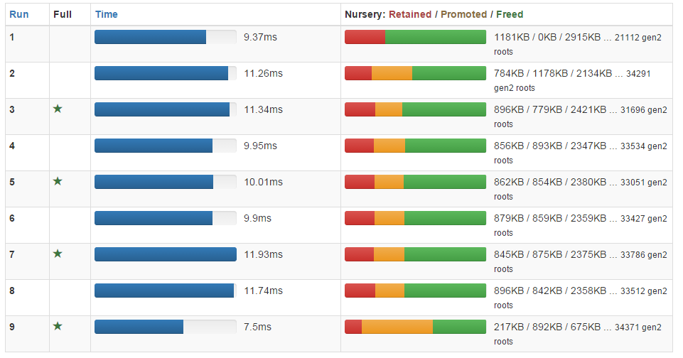

# Heap heap hooray!
    
*Originally published on [2016-04-15](https://6guts.wordpress.com/2016/04/15/heap-heap-hooray/) by Jonathan Worthington.*

Last week, I finally hunted down and fixed the `EVAL` memory leak, with the help of the heap snapshot analyzer I [wrote about recently](https://6guts.wordpress.com/2016/03/27/happy-heapster/). I also hunted down a hang in parallel runs of the Raku specification test suite that showed up recently – but only on Windows – and fixed that too.

### Before we begin: a generational GC primer

A [few posts ago](https://6guts.wordpress.com/2016/03/21/a-whole-heap-of-work/) I talked a bit about how MoarVM’s garbage collector works – and hand-waved on just about all of the interesting details. Some folks on IRC expressed a bit of curiosity about those details, so I figured I’d explain some of them as they come up in my performance/reliability work. In this post I’ll talk about generational collection, because it plays a part in the `EVAL` leak story.

Recall that the essence of a tracing garbage collector is that we start with a set of roots: global symbols, the current call frame that each thread is executing, thread-local symbols, and so forth. We “mark” each object we find in these roots as “alive”, and stick them onto a todo list. We work our way through this todo list, asking each object what it references and putting those onto the todo list also. With a little care to never revisit objects we already considered, we terminate having marked all reachable objects alive. The memory associated with unmarked objects can then be freed.

You might worry that if we have millions of objects in memory, this could be a rather time-consuming process to do again and again. You’d be right. Worse, memory access performance depends heavily on the CPU caches getting high hit rates. When we need to walk huge numbers of objects, we end up getting loads of CPU cache misses, and have to spend time fetching objects from main memory. (To give you an idea of the numbers: a level 1 cache hit means memory access in several CPU cycles, while having to go to main memory can easily cost a couple of hundred cycles or worse).

So, how might we do better? The key insight behind generational GC, often known as the generational hypothesis, is that in most programs objects are either very short-lived (surviving zero or one garbage collections) or long-lived (perhaps staying around for the lifetime of the entire program). Therefore, it’s reasonable to assume that once an object survives a couple of collections, it will stay around for a good few more.

Generational collection works by dividing the heap – that is, the space where objects are allocated – into generations (typically two or three). In MoarVM we have two generations, which we tend to refer to in the code as “nursery” and “gen2”. The nursery, as the name suggests, is where objects begin their life. We allocate them cheaply there using a “bump-the-pointer” scheme. The nursery in MoarVM is a fixed-size chunk of memory, and after a while we fill it up. This is what triggers garbage collection.

In a 2-generation collector, there are two types of collection, which we know as nursery collection and full collection. In a full collection, we do exactly what I described earlier: visit all objects, marking them alive, and freeing up those that aren’t. A nursery collection is similar, except as soon as we see an object is not in the nursery, we don’t put it on the todo list. Instead, we simply ignore it. This greatly cuts down on the number of objects we need to consider, making nursery collections hugely cheaper.

There are two things we must do to make this really work. The first is ensure that we only free memory associated with objects living in the nursery, not the old generation, since we didn’t do the analysis needed to free anything there. That’s fine; most objects “die young” anyway. The second is more subtle. There may be objects in the nursery that are only alive because something in the old generation references them. However, since we’re not considering any old generation objects, we won’t discover this liveness and so wrongly free things. This is resolved by maintaining a set of objects that are in the old generation but pointing to objects in the nursery. Whenever we assign a reference from one object to another, we check if this would establish an old generation to nursery reference, and stick the old generation object into the set, ensuring we will visit it and mark the nursery object. This check is known as a “write barrier”.

So, back to the `EVAL` story…

### The EVAL leak

I reviewed, fixed up, and merged various patches from Timo to improve the heap snapshot data dumps by annotating them with more data. Then, I looked at a few paths to leaked objects (recall that I was using `EVAL 'my class ABC { }'` to demonstrate the leak). The paths looked something like this:

````
> path 38199
Root
    --[ Thread Roots ]-->
Thread Roots
    --[ Lexotic cache entry ]-->
Lexotic (Object)
    --[ Unknown ]-->
BOOTStaticFrame (Object)
    --[ Unknown ]-->
BOOTCompUnit (Object)
    --[ Index 81 ]-->
BOOTCode (Object)
    --[ Unknown ]-->
BOOTStaticFrame (Object)
    --[ Unknown ]-->
ABC (STable)
````

This shows the objects along the path, but those “unknowns” were hiding what I really wanted to know. So, I did some further patches, and got out a rather more useful result:

````
> path 6466
Root
    --[ Thread Roots ]-->
Thread Roots
    --[ Lexotic cache entry ]-->
Lexotic (Object)
    --[ Static Frame ]-->
BOOTStaticFrame (Object)
    --[ Compilation Unit ]-->
BOOTCompUnit (Object)
    --[ Code refs array entry ]-->
BOOTCode (Object)
    --[ Unknown ]-->
BOOTStaticFrame (Object)
    --[ Spesh guard match ]-->
ABC (STable)
````

So, here we see that it’s a type specializer guard that is keeping the object alive. “Wait…a what?!” MoarVM does a bunch of dynamic optimization, watching out for types that occur at runtime and generating specialized versions of the code by type. And, sometimes, we have an unfortunate situation where code is discovered “hot”, but the type it was invoked with is fairly transient. In this case, the specialization matching table will end up referring to that type, keeping it alive.

However, since for any given bit of code we only generate a handful of these specializations, eventually we’d saturate them and stop leaking memory. I looked at another path:

````
> path 10594
Root
    --[ Thread Roots ]-->
Thread Roots
    --[ Lexotic cache entry ]-->
Lexotic (Object)
    --[ Static Frame ]-->
BOOTStaticFrame (Object)
    --[ Compilation Unit ]-->
BOOTCompUnit (Object)
    --[ Code refs array entry ]-->
BOOTCode (Object)
    --[ Unknown ]-->
BOOTStaticFrame (Object)
    --[ Spesh log slots ]-->
QAST::CompUnit (Object)
    --[ Unknown ]-->
SCRef (Object)
    --[ STable root set ]-->
ABC (STable)
````

This is a case where the optimizer is tracing what objects show up. In fact, most of the paths looked this way. However, that should saturate at some point, yet I know that it goes on leaking. Finally, I found another path to a leak:

````
> path 59877
Root
    --[ Permanent Roots ]-->
Permanent roots
    --[ Boxed integer cache entry ]-->
Int (Object)
    --[ <SC> ]-->
SCRef (Object)
    --[ STable root set ]-->
ABC (STable)
````

However, 9 out of the 10 leaked objects were leaked because of the dynamic optimizer keeping things alive that it had seen while tracing. But that, while awkward, should eventually saturate – as should the integer cache issue. But the memory use grew forever, suggesting that things go on and on leaking. So, I tried a snapshot after disabling dynamic optimization. And:

````
> find stables type="ABC"
Object Id  Description
=========  ===========
368871     ABC
````

Just the one! 9 out of 10 objects were not on the heap. And yes, it was the integer box cache problem that kept the 1 alive:

````
> path 368871
Root
    --[ Permanent Roots ]-->
Permanent roots
    --[ Boxed integer cache entry ]-->
Int (Object)
    --[ <SC> ]-->
SCRef (Object)
    --[ STable root set ]-->
ABC (STable)
````

So in theory, with dynamic optimization disabled, this suggested that we did not leak any more, and all the blame was on the optimizer. To check that out, I tried a long-running `EVAL` loop and…it still leaked heavily. My theory that dynamic optimization couldn’t account for all of the leaking, just the first bit of it, seemed to hold up.

To investigate it further, I did a loop of 100 `EVAL`s, as opposed to the 10 I had used so far. This took a snapshot every GC run, plus one more that I forced at the end. So, how did the final snapshot look?

````
This file contains 9 heap snapshots. To select one to look
at, type something like `snapshot 1`.
Type `help` for available commands, or `exit` to exit.

> snapshot 8
Loading that snapshot. Carry on...
> summary
Wait a moment, while I finish loading the snapshot...

    Total heap size:              33,417,225 bytes

    Total objects:                369,541
    Total type objects:           1,960
    Total STables (type tables):  1,961
    Total frames:                 2,077
    Total references:             1,302,511

> find stables type="ABC"
Object Id  Description
=========  ===========
368872     ABC
````

Only the one. So, according to this, we’re not leaking. But that’s when the loop is over. What about a mid-loop GC? I switched to a snapshot in the middle, and:

````
> find stables type="ABC"
Object Id  Description
=========  ===========
130353     ABC
376552     ABC

> path 130353
Root
    --[ Permanent Roots ]-->
Permanent roots
    --[ Boxed integer cache entry ]-->
Int (Object)
    --[ <SC> ]-->
SCRef (Object)
    --[ STable root set ]-->
ABC (STable)

> path 376552
Root
    --[ Thread Roots ]-->
Thread Roots
    --[ Lexotic cache entry ]-->
Lexotic (Object)
    --[ Result ]-->
NQPMatch (Object)
    --[ Unknown ]-->
QAST::CompUnit (Object)
    --[ Unknown ]-->
SCRef (Object)
    --[ STable root set ]-->
ABC (STable)
````

OK, that’s reasonable too: it’s alive because it’s referred to by the compiler, which is run as part of `EVAL`ing the code. So what are we leaking? I tried this:

```` raku
> top objects by size
Name                                   Total Bytes
=====================================  ===============
NQPArray                               7,114,800 bytes
BOOTStaticFrame                        4,806,668 bytes
BOOTInt                                4,642,720 bytes
VMString                               2,859,188 bytes
BOOTHash                               2,253,016 bytes
SCRef                                  1,891,768 bytes
NFAType                                1,886,272 bytes
BOOTCode                               1,448,208 bytes
BOOTNum                                832,096 bytes
Parameter                              783,360 bytes
BOOTStr                                567,936 bytes
BOOTCompUnit                           513,149 bytes
Perl6::Metamodel::ContainerDescriptor  341,496 bytes
QAST::Op                               266,400 bytes
Signature                              208,440 bytes
````

Then compared with an earlier snapshot

```` raku
> snapshot 2
Loading that snapshot. Carry on...
> top objects by size
Name                                   Total Bytes
=====================================  ===============
NQPArray                               7,110,920 bytes
BOOTStaticFrame                        4,806,152 bytes
BOOTInt                                4,642,624 bytes
VMString                               2,858,472 bytes
BOOTHash                               2,241,320 bytes
SCRef                                  1,891,696 bytes
NFAType                                1,886,272 bytes
BOOTCode                               1,447,776 bytes
BOOTNum                                832,096 bytes
Parameter                              783,360 bytes
BOOTStr                                567,136 bytes
BOOTCompUnit                           513,149 bytes
Perl6::Metamodel::ContainerDescriptor  341,496 bytes
QAST::Op                               266,112 bytes
Signature                              208,296 bytes
````

Again, nothing very interesting to note. This highly suggested that either there was some missing information in the heap snapshot, or something else in the VM state – but that got cleaned up at exit – that was also getting leaked.

So I pondered a bit, and compared the GC marking code with the heap snapshot code. And…had an “aha!” moment. Remember I talked about the inter-generational root set that we keep thanks to generational collection? This was not being accounted for in heap snapshots. I [fixed it](https://github.com/MoarVM/MoarVM/commit/e016fefde4dfd3a9f73fdc5c109234d124b56c59), and the size of the resulting heap snapshot files was a dead giveaway that it made a huge difference:

````
04/06/2016  14:46       184,272,062 rak-heap-6
04/06/2016  15:21       262,846,653 rak-heap-7
````

And, back in the analyzer:

````
> snapshot 2
Loading that snapshot. Carry on...
> find stables type="ABC"
Wait a moment, while I finish loading the snapshot...

Object Id  Description
=========  ===========
21266      ABC
21312      ABC
22359      ABC
23317      ABC
24275      ABC
25233      ABC
26191      ABC
27149      ABC
28107      ABC
29065      ABC
30023      ABC
30981      ABC
361108     ABC
363007     ABC
364903     ABC
````

So, the objects were there, after all. I took a look at some of them:

````
> path 24275
Root
    --[ Inter-generational Roots ]-->
Inter-generational Roots
    --[ Index 24269 ]-->
ABC (STable)

> path 30981
Root
    --[ Inter-generational Roots ]-->
Inter-generational Roots
    --[ Index 30975 ]-->
ABC (STable)

> path 363007
Root
    --[ Inter-generational Roots ]-->
Inter-generational Roots
    --[ Index 21244 ]-->
BOOTCompUnit (Object)
    --[ Serialization context dependency ]-->
SCRef (Object)
    --[ STable root set ]-->
ABC (STable)
````

This would explain a prolonged lifetime, but not an unending leak. I found myself missing a count command so I could easily see how things varied between the snapshots. I [implemented it](https://github.com/jnthn/p6-app-moarvm-heapanalyzer/commit/9a1806ba6434380893de1006711151e7e424547c), then observed this:

````
> snapshot 2
Loading that snapshot. Carry on...
> count stables type="ABC"
34
> snapshot 5
Loading that snapshot. Carry on...
> count stables type="ABC"
72
> snapshot 7
Loading that snapshot. Carry on...
> count stables type="ABC"
97
> snapshot 8
Loading that snapshot. Carry on...
> count stables type="ABC"
100
````

The number of objects in the inter-generational set just kept on growing! So, either this workload was just not triggering a gen-2 collection, or there was a bug. How to find out? By doing a normal `--profile` on the same code, and looking at the output. The summary page stated:

> The profiled code did 9 garbage collections. There were 0 full collections involving the entire heap.

OK, so we really never did a full collection. That explains this particular snapshot, but not the leak over time, which surely would end up triggering a full collection at some point. To test that theory, I tweaked a MoarVM header to make full collections happen more often, to see it helped:

````
diff --git a/src/gc/collect.h b/src/gc/collect.h
index b31a112..af6c456 100644
--- a/src/gc/collect.h
+++ b/src/gc/collect.h
@@ -6,7 +6,7 @@
 /* How many bytes should have been promoted into gen2 before we decide to
  * do a full GC run? The numbers below are used as a base amount plus an
  * extra amount per extra thread we have running. */
-#define MVM_GC_GEN2_THRESHOLD_BASE      (30 * 1024 * 1024)
+#define MVM_GC_GEN2_THRESHOLD_BASE      (1 * 1024 * 1024)
 #define MVM_GC_GEN2_THRESHOLD_THREAD    (2 * 1024 * 1024)
````

This change made it do a full collection for every 1MB promoted, not every 30MB. Hopefully that would be enough to trigger an some runs. And it did:

> The profiled code did 9 garbage collections. There were 4 full collections involving the entire heap.

Much better. So, over in the heap profiler:

````
Considering the snapshot...looks reasonable!

This file contains 9 heap snapshots. To select one to look
at, type something like `snapshot 5`.
Type `help` for available commands, or `exit` to exit.

> snapshot 2
Loading that snapshot. Carry on...
> count stables type="ABC"
34
> snapshot 5
Loading that snapshot. Carry on...
> count stables type="ABC"
72
> snapshot 7
Loading that snapshot. Carry on...
> count stables type="ABC"
97
> snapshot 8
Loading that snapshot. Carry on...
> count stables type="ABC"
100
````

Well, ouch. That implies that the inter-generational root set keeps on growing and growing, for some reason. The profiler, which reports this number, agrees with this assessment (note the numbers of gen2 roots on the right):



So, how could this possibly be happening?

I like to rule out the really silly things first. Like, if the thing that cleans up the inter-generational roots list after a full collection is being called. How? With a `printf`, of course! :P

````
diff --git a/src/gc/roots.c b/src/gc/roots.c
index b771106..361b472 100644
--- a/src/gc/roots.c
+++ b/src/gc/roots.c
@@ -301,7 +301,7 @@ void MVM_gc_root_gen2_cleanup(MVMThreadContext *tc) {
     MVMuint32        num_roots    = tc->num_gen2roots;
     MVMuint32        i = 0;
     MVMuint32        cur_survivor;
-
+printf("cleaning up gen2 roots\n");
     /* Find the first collected object. */
     while (i < num_roots && gen2roots[i]->flags & MVM_CF_GEN2_LIVE)
         *i*++;
````

And…no output. I couldn’t quite belive it. So, I went to the place that this function is called, and noticed there was some logging I could switch on that describes all the ins and outs of a organizing a GC run. That produced plenty of output, and showed it was indeed not reaching the place where it would call the gen2 roots cleanup either.

After some hunting, I discovered that an addition a while ago that tracked the amount of data promoted to the old generation, and used it to decide whether to do a full collection, had resulted in a nasty accident. It did the calculation to check if a full collection was needed in two different places, and the answer could change between them. This led to us not going through all the steps that a full collection would need.

I [patched it](https://github.com/MoarVM/MoarVM/commit/7f2a6fa8416d824c5b66e31e90720c97913decf3) and…the leak was gone. Even with dynamic optimization re-enabled and full collections back to being run after every promoted 30MB, the ever-increasing memory use of `EVAL` in a loop was no more. It climbed for a short while, then flattened out.

This fix will likely help numerous longer-running programs that have medium-lifetime objects. It also shaved around 45MB off CORE.setting compilation memory use. Unfortunately, it also caused a 5% slowdown in the Rakudo build-time, presumably because we were now actually doing all the work we should be on full collections!

### A bit of tuning

With the leak out of the way – or at least, the big one – I wanted my 5% back. So I took a look at our logic for how we decide whether or not to do a full collection. The strategy so far had been to expect a fixed amount of memory to have been promoted to the old generation (with some additions per thread). However, this was lacking in a couple of ways.

For one, it only accounted for the direct size of objects, not any extra unmanaged memory they held. So, a compilation unit would not factor in the size of the compiled bytecode it held on to, and a dynamic array would not factor in the size of its storage. This was now an [easy enough fix](https://github.com/MoarVM/MoarVM/commit/e95ed884143295277fce3cce3a34cb3fc7048bb1) thanks to additions made while implementing heap snapshots.

For two, a fixed limit doesn’t behave too well with programs that really do build up a large heap over time. There, we can afford to promote a good bit more beforehand, and percentage wise it won’t make a lot of difference since they’re growing anyway. Building Rakudo’s CORE.setting is like this, as it builds up the program tree. So, I [switched to a percentage-based scheme with a minimum threshold](https://github.com/MoarVM/MoarVM/commit/6112aaa9f997fdc7b8188a27b2dcedf0ea3e14fd), which could afford to be a bit lower than the 30MB from before. These changes not only got Rakudo’s CORE.setting build time back down again (without having to give up much of the memory savings from before), but also had the `EVAL` loop example having a lower memory ceiling.

So, not only did I hunt down and fix the memory leak, I ended up tuning things to achieve a lower memory ceiling for applications whose memory footprint is fairly fixed over their life them, and less full GC runs for those growing over time.

### Hunting down a parallel spectest hang

On Windows, a parallel spectest of high enough degree could cause hangs. I use `TEST_JOBS=12`, a number I picked after some measuring in the past. In the last couple of weeks, I started seeing hangs – and they went away if I cut down `TEST_JOBS `to just running 2 or 3 in parallel.

Eventually, helped by `make localtest` (where you can specify a file listing the tests to run), I managed to get it down to just 2 tests that, when run together, would reliably hang. It turned out one of them spawned another Rakudo process as part of the test, so there were 3 processes involved. Attaching the debugger to each in turn, I saw one was hung on getting a file lock, one was hung waiting for process termination (and was waiting on the process that was blocked on a file lock), and the other was blocked trying to write the `STDOUT`.

I don’t know *for sure*, but so far as I can tell, the way the test harness does parallel testing on Windows involves running batches of tests and reading a bit of TAP from them one at a time. The process blocked writing to `STDOUT` was also the one holding the file lock, but the test harness was, I presume, waiting to read output from the process blocked waiting for the process that was in turn waiting for the file lock. So, a nice circular wait involving 4 processes, one of them being the test harness! Typical darn Friday bug hunting… :-)

This also explained nicely why the issue didn’t crop up away from Windows: parallel spectest works differently (read: better) on other platforms. :-) While we will at some point switch to using a Raku test harness for running the spectests that hopefully behaves consistently everywhre, I figured that Rakudo was probably doing something wrong with regard to the file lock.

File locks are used in only one place in Rakudo: managing pre-compilations. A little instrumentation of the lock/unlock code later, I saw a mis-match. A dump of the stack trace at each place we did a lock/unlock eventually led me to the problem, which I was able [to fix](https://github.com/rakudo/rakudo/commit/a93edd9f0196dc79444b6180fe27a598558b105d). This bug likely didn’t just affect spectest on Windows; I suspect I could construct various hangs on other platforms too from it. So, a good fix to have in there.

As a side-note, the reason this bug was both likely to happen and hard to identify was because the lock and unlock were not placed on the same code-path. This is a good idea for any kind of locking. Locks are horrible to work with anyway; putting lock/unlock far apart in the code is just asking for problems (and this is far from the first problem I’ve hunted down in code with such a structure). So, I’ve asked *nine*++, as part of his great work to keep improving our installation and precomp handling, to look into addressing this, so we’re structurally in a better place to not have such bugs.

And, for all of you out there using Rakudo’s `Lock` class: first, don’t, and second, if you must use it, always prefer the `$lock.protect({ ... })` form over manual `lock`/`unlock` method calls.

### Two icky problems less…

So, not a bad last week’s Raku work – though it took me all of this week to get around to writing it up. Maybe I’ll be a little faster writing up this week’s happenings. :-)
