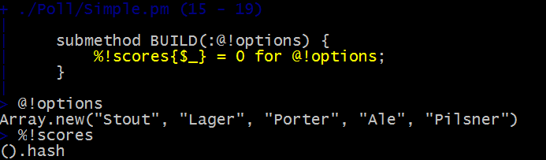

# Rakudo Debugger Updates
    
*Originally published on [2012-10-24](https://6guts.wordpress.com/2012/10/24/rakudo-debugger-updates/) by Jonathan Worthington.*

A while ago I wrote about Rakudo getting an [interactive debugger](https://6guts.wordpress.com/2012/08/28/a-rakudo-debugger/). The feedback I’ve got has been a happy mixture of “this is useful” and “I’d really like it to X” – so I’ve been working on some improvements. I showed them off at my [Nordic Perl Workshop](http://act.yapc.eu/npw2012/) talk the weekend before last, in a fun session where I used the debugger to hunt down some problems in a small tool that had a couple of modules. It was nice not only to demonstrate the debugger itself, but also because I could show some neat Raku code along the way.

So, what new things can you expect from the debugger that will be bundled in the Rakudo Star release that will be emerging in the next few days? Here’s a quick rundown.

Attributes that are in scope can now be introspected, just by typing their name. Additionally, the self keyword is recognized as a variable name by the debugger, meaning you can look at it directly (just type “self” and press enter) or even to look at public attributes (“self.name”).

Before, if you were on a line of code that was going to make a call, you would always step in to the callee on pressing enter. Now, if you type “s” and press enter, you will **s**tep over the call. Got bored of debugging the current routine and want to let it run its course, and break on the next statement after it returns? Just type “so” and press enter, and you will **s**tep **o**ut of the current routine.

Trace points are perhaps the most powerful of the new features. They enable you to add print statements to your code, without actually adding print statements to your code. A trace point is like a break point, but instead of breaking, it just evaluates an expression and logs it. Later on, you can view the log.

To go with Rakudo’s improving support for the Perl adverb on regexes, which allows the use of Perl regex syntax from within Raku, the debugger now also supports single-stepping through those Perl regexes.

There are also a range of small fixes and tweaks that avoid some of the noise you could get before. For example, fails no longer count as exception throws that cause a rt (run until throw) to break, and sigspace in rules is no longer single-stepped, just jumping straight to the next interesting atom.

What of plans for the future? There are some other ideas already in the issues queue. Beyond those, I’m planning to make a web-based API frontend to the debugger, to go alongside the command line one. This should allow a browser-based debugging interface to be built, but should also enable tools like Padre to integrate with the Rakudo Debugger.

Enjoy the updates!
