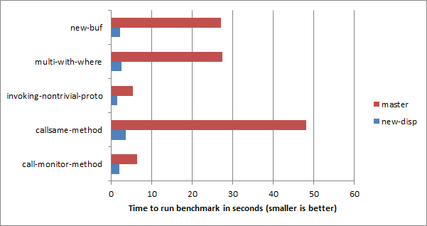
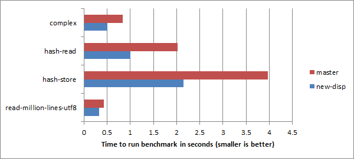

# The new MoarVM dispatch mechanism is here!

Around 18 months ago, I set about working on the largest set of architectural
changes that Raku runtime MoarVM has seen since its inception. The work was
most directly triggered by the realization that we had no good way to fix a
certain semantic bug in dispatch without either causing huge performance
impacts across the board *or* increasingly complexity even further in
optimizations that were already riding their luck. However, the need for
something like this had been apparent for a while: a persistent struggle to
optimize certain Raku language features, the pain of a bunch of performance
mechanisms that were all solving the same kind of problem but each for a
specific situation, and a sense that, with everything learned since I founded
MoarVM, it was possible to do better.

The result is the development of a new generalized dispatch mechanism. An
overview can be found in my Raku Conference talk about it ([slides](https://jnthn.net/papers/2021-trc-dispatch.pdf), [video](https://www.youtube.com/watch?v=yRFyGDVHl0E));
in short, it gives us a far more uniform architecture for all kinds of
dispatch, allowing us to deliver better performance on a range of language
features that have thus far been glacial, as well as opening up opportunities
for new optimizations.

Today, this work has been merged, along with the matching changes in NQP (the Raku
subset we use for bootstrapping and to implement the compiler) and Rakudo
(the full Raku compiler and standard library implementation). This means that
it will ship in the October 2021 releases.

In this post, I'll give an overview of what you can expect to observe right
away, and what you might expect in the future as we continue to build upon
the possibilities that the new dispatch architecture has to offer.

### The big wins

The biggest improvements involve language features that we'd really not had
the architecture to do better on before. They involved dispatch - that is,
getting a call linked to a destination efficiently - but the runtime didn't
provide us with a way to "explain" to it that it was looking at a dispatch,
let alone with the information needed to have a shot at optimizing it.

The following graph captures a number of these cases, and shows the level
of improvement, ranging from a factor of 3.3 to 13.3 times faster.



Let's take a quick look at each of these. The first, `new-buf`, asks how
quickly we can allocate `Buf`s.

```raku
for ^10_000_000 {
    Buf.new
}
```

Why is this a dispatch benchmark? Because `Buf` is not a class, but rather a
role. When we try to make an instance of a role, it is "punned" into a class.
Up until now, it works as follows:

1. We look up the `new` method
2. The `find_method` method would, if needed, create a pun of the role and
  cache it
3. It would return a forwarding closure that takes the arguments and gives
  them to the same method called on the punned class, or spelt in Raku code,
  `-> $role-discarded, |args { $pun."$name"(|args) }`
4. This closure would be invoked with the arguments

This had a number of undesirable consequences:

1. While the pun was cached, we still had a bit of overhead to check if we'd
   made it already
2. The arguments got slurped and flattened, which costs something, and...
3. ...the loss of callsite shape meant we couldn't look up a type
   specialization of the method, and thus lost a chance to inline it too

With the new dispatch mechanism, we have a means to cache constants at a
given program location *and* to replace arguments. So the first time we
encounter the call, we:

1. Get the role pun produced if needed
2. Resolve the `new` method on the class punned from the role
3. Produce a dispatch program that caches this resolved method and also
   replaces the role argument with the pun

For the next thousands of calls, we interpret this dispatch program. It's
still some cost, but the method we're calling is already resolved, and the
argument list rewriting is fairly cheap. Meanwhile, after we get into some
hundreds of iterations, on a background thread, the optimizer gets to
work. The argument re-ordering cost goes away completely at this point, and
`new` is so small it gets inlined - at which point the buffer allocation is
determined dead and so goes away too. Some remaining missed opportunities
mean we still are left with a loop that's not quite empty: it busies itself
making sure it's really OK to do nothing, rather than just doing nothing.

Next up, multiple dispatch with `where` clauses.

```raku
multi fac($n where $n <= 1) { 1 }
multi fac($n) { $n * fac($n - 1) }
for ^1_000_000 {
    fac(5)
}
```

These were really slow before, since:

1. We couldn't apply the multi-dispatch caching mechanism *at all* as soon as
   we had a `where` clause involved
2. We would run `where` clauses twice in the event the candidate was chosen:
   once to see if we should choose that multi candidate, and once again when
   we entered it

With the new mechanism, we:

1. On the first call, calculate a multiple dispatch plan: a linked list of
   candidates to work through
2. Invoke the one with the `where` clause, in a mode whereby if the signature
   fails to bind, it triggers a dispatch resumption. (If it does bind, it
   runs to completion)
3. In the event of a bind failure, the dispatch resumption triggers, and we
   attempt the next candidate

Once again, after the setup phase, we interpret the dispatch programs. In
fact, that's as far as we get with running this faster for now, because the
specializer doesn't yet know how to translate and further optimize this kind
of dispatch program. (That's how I know it currently stands no chance of turning
this whole thing into another empty loop!) So there's more to be had here also; in
the meantime, I'm afraid you'll just have to settle for a factor of ten speedup.

Here's the next one:

```raku
proto with-proto(Int $n) { 2 * {*} }
multi with-proto(Int $n) { $n + 1 }
sub invoking-nontrivial-proto() {
    for ^10_000_000 {
        with-proto(20)
    }
}
```

Again, on top form, we'd turn this into an empty loop too, but we don't quite
get there yet. This case wasn't so terrible before: we did get to use the
multiple dispatch cache, however to do that we also ended up having to allocate
an argument capture. The need for this also blocked any chance of inlining the
`proto` into the caller. Now that is possible. Since we cannot yet translate
dispatch programs that resume an in-progress dispatch, we don't yet get to
further inline the called `multi` candidate into the `proto`. However, we now
have a design that will let us implement that.

This whole notion of a dispatch resumption - where we start doing a dispatch,
and later need to access arguments or other pre-calculated data in order to
do a next step of it - has turned out to be a great unification. The initial
idea for it came from considering things like `callsame`:

```raku
class Parent {
    method m() { 1 }
}
class Child is Parent {
    method m() { 1 + callsame }
}
for ^10_000_000 {
    Child.m;
}
```

Once I started looking at this, and then considering that a complex `proto`
also wants to continue with a dispatch at the `{*}`, and in the case a
`where` clauses fails in a `multi` it *also* wants to continue with a
dispatch, I realized this was going to be useful for quite a lot of things.
It will be a bit of a headache to teach the optimizer and JIT to do nice
things with resumes - but a great relief that doing that once will benefit
multiple language features!

Anyway, back to the benchmark. This is another "if we were smart, it'd be
an empty loop" one. Previously, `callsame` was very costly, because each
time we invoked it, it would have to calculate what kind of dispatch we
were resuming and the set of methods to call. We also had to be able to
locate the arguments. Dynamic variables were involved, which cost a bit
to look up too, and - despite being an implementation details - these also
leaked out in introspection, which wasn't ideal. The new dispatch mechanism
makes this all rather more efficient: we can cache the calculated set of
methods (or wrappers and multi candidates, depending on the context) and
then walk through it, and there's no dynamic variables involved (and thus
no leakage of them). This sees the biggest speedup of the lot - and since
we cannot yet inline away the `callsame`, it's (for now) measuring the
speedup one might expect on using this language feature. In the future,
it's destined to optimize away to an empty loop.

A module that makes use of `callsame` on a relatively hot path is
`OO::Monitors,`, so I figured it would be interesting to see if there
is a speedup there also.

```raku
use OO::Monitors;
monitor TestMonitor {
    method m() { 1 }
}
my $mon = TestMonitor.new;
for ^1_000_000 {
    $mon.m();
}
```

A `monitor` is a class that acquires a lock around each method call. The
module provides a custom meta-class that adds a lock attribute to the
class and then wraps each method such that it acquires the lock. There are
certainly costly things in there besides the involvement of `callsame`, but
the improvement to `callsame` is already enough to see a 3.3x speedup in this
benchmark. Since `OO::Monitors` is used in quite a few applications and
modules (for example, Cro uses it), this is welcome (and yes, a larger
improvement will be possible here too).

### Caller side decontainerization

I've seen some less impressive, but still welcome, improvements across a good
number of other microbenchmarks. Even a basic multi dispatch on the `+` op:

```raku
my $i = 0;
for ^10_000_000 {
    $i = $i + $_;
}
```

Comes out with a factor of 1.6x speedup, thanks primarily to us producing far
tighter code with fewer guards. Previously, we ended up with duplicate guards
in this seemingly straightforward case. The `infix:<+>` multi candidate would
be specialized for the case of its first argument being an `Int` in a `Scalar`
container and its second argument being an immutable `Int`. Since a `Scalar`
is mutable, the specialization would need to read it and then guard the value
read before proceeding, otherwise it may change, and we'd risk memory safety.
When we wanted to inline this candidate, we'd also want to do a check that
the candidate really applies, and so also would deference the `Scalar` and
guard its content to do that. We can and do eliminate duplicate guards - but
these guards are on two distinct reads of the value, so that wouldn't help.

Since in the new dispatch mechanism we can rewrite arguments, we can now quite
easily do caller-side removal of `Scalar` containers around values. So easily,
in fact, that the change to do it took me just a couple of hours. This gives a
lot of benefits. Since dispatch programs automatically eliminate duplicate reads
and guards, the read and guard by the multi-dispatcher and the read in order to
pass the decontainerized value are coalesced. This means less repeated work prior
to specialization and JIT compilation, and also only a single read and guard in
the specialized code after it. With the value to be passed already guarded, we
can trivially select a candidate taking two bare `Int` values, which means
there's no further reads and guards needed in the callee either.

A less obvious benefit, but one that will become important with planned future
work, is that this means `Scalar` containers escape to callees far less often.
This creates further opportunities for escape analysis. While the MoarVM escape
analyzer and scalar replacer is currently quite limited, I hope to return to
working on it in the near future, and expect it will be able to give us even
more value now than it would have been able to before.

### Further results

The benchmarks shown earlier are mostly of the "how close are we to realizing
that we've got an empty loop" nature, which is interesting for assessing how
well the optimizer can "see through" dispatches. Here are a few further results
on more "traditional" microbenchmarks:



The complex number benchmark is as follows:

```raku
my $total-re = 0e0;
for ^2_000_000 {
    my $x = 5 + 2i;
    my $y = 10 + 3i;
    my $z = $x * $x + $y;
    $total-re = $total-re + $z.re
}
say $total-re;
```

That is, just a bunch of operators (multi dispatch) and method calls, where we
really do use the result. For now, we're tied with Python and a little behind
Ruby on this benchmark (and a surprising 48 times faster than the same thing
done with Perl's `Math::Complex`), but this is also a case that stands to see
a huge benefit from escape analysis and scalar replacement in the future.

The hash read benchmark is:

```raku
my %h = a => 10, b => 12;
my $total = 0;
for ^10_000_000 {
    $total = $total + %h<a> + %h<b>;
}
```

And the hash store one is:

```raku
my @keys = 'a'..'z';
for ^500_000 {
    my %h;
    for @keys {
        %h{$_} = 42;
    }
}
```

The improvements are nothing whatsoever to do with hashing itself, but instead
look to be mostly thanks to much tighter code all around due to caller-side
decontainerization. That can have a secondary effect of bringing things under
the size limit for inlining, which is also a big help. Speedup factors of 2x
and 1.85x are welcome, although we could really do with the same level of
improvement again for me to be reasonably happy with our results.

The line-reading benchmark is:

```raku
my $fh = open "longfile";
my $chars = 0;
for $fh.lines { $chars = $chars + .chars };
$fh.close;
say $chars
```

Again, nothing specific to I/O got faster, but when dispatch - the glue that
puts together all the pieces - gets a boost, it helps all over the place.
(We are also decently competitive on this benchmark, although tend to be
slower the moment the UTF-8 decoder can't take it's "NFG can't possibly
apply" fast path.)

### And in less micro things...

I've also started looking at larger programs, and hearing results from others
about theirs. It's mostly encouraging:

* The long-standing `Text::CSV` benchmark `test-t` has seen roughly 20%
  improvement (thanks to lizmat for measuring)
* A simple `Cro::HTTP` test application gets through about 10% more requests
  per second
* MoarVM contributor dogbert did comparative timings of a number of scripts;
  the most significant improvement saw a drop from 25s to 7s, most are 10%-30%
  faster, some without change, and only one that slowed down.
* There's around 2.5% improvement on compilation of `CORE.setting`, the
  standard library. However, a big pinch of salt is needed here: the compiler
  itself has changed in a number of places as part of the work, and there
  were a couple of things tweaked based on looking at profiles that aren't
  really related to dispatch.
* Agrammon, an application calculating farming emissions, has seen a slowdown
  of around 9%. I didn't get to look at it closely yet, although glancing at
  profiling output the number of deoptimizations is relatively high, which
  suggests we're making some poor optimization decisions somewhere.

### Smaller profiler output

One unpredicted (by me), but also welcome, improvement is that profiler
output has become significantly smaller. Likely reasons for this include:

1. The dispatch mechanism supports producing value results (either from
   constants, input arguments, or attributes read from input arguments).
   It entirely replaces an earlier mechanism, "specializer plugins",
   which could map guards to a target to invoke, but always required a
   call to something - even if that something was the identity function.
   The logic was that this didn't matter for any really hot code, since
   the identity function will trivially be inlined away. However, since
   profile size of the instrumenting profiler is a function of the number
   of paths through the call tree, trimming loads of calls to the identity
   function out of the tree makes it much smaller.
2. We used to make lots of calls to the `sink` method when a value was in
   sink context. Now, if we see that the type simply inherits that method
   from `Mu`, we elide the call entirely (again, it would inline away, but
   a smaller call graph is a smaller profile).
3. Multiple dispatch caching would previously always call the `proto` when
   the cache was missed, but would then not call an onlystar `proto` again
   when it got cache hits in the future. This meant the call tree under
   many multiple dispatches was duplicated in the profile. This wasn't just
   a size issue; it was a bit annoying to have this effect show up in the
   profile reports too.

To give an example of the difference, I took profiles from Agrammon to study
why it might have become slower. The one from before the dispatcher work weighed
in at 87MB; the one with the new dispatch mechanism is under 30MB. That means
less memory used while profiling, less time to write the profile out to disk
afterwards, and less time for tools to load the profiler output. So now it's
faster to work out how to make things faster.

### Is there any bad news?

I'm afraid so. Startup time has suffered. While the new dispatch mechanism
is more powerful, pushes more complexity out of the VM into high level code,
and is more conducive to reaching higher peak performance, it also has a
higher warmup time. At the time of writing, the impact on startup time seems
to be around 25%. I expect we can claw some of that back ahead of the October
release.

### What will be broken?

Changes of this scale always come with an amount of risk. We're merging this
some weeks ahead of the next scheduled monthly release in order to have time
for more testing, and to address any regressions that get reported. However,
even before reaching the point of merging it, we have:

* Ensured it passes the specification test suite, both in normal circumstances,
  but also under optimizer stressing (where we force it to prematurely optimize
  everything, so that we tease out optimizer bugs and - given how many poor
  decisions we force it to make - deoptimization bugs too)
* Used `blin` to run the tests of ecosystem modules. This is a standard step
  when preparing Rakudo releases, but in this case we've aimed it at the
  `new-disp` branches. This found a number of regressions caused by the
  switch to the new dispatch mechanism, which have been addressed.
* Patched or sent pull requests to a number of modules that were relying on
  unsupported internal APIs that have now gone away or changed, or on other
  implementation details. There were relatively few of these, and happily,
  many of them were fixed up by migrating to supported APIs (which likely
  didn't exist at the time the modules were written).

### What happens next?

As I've alluded to in a number of places in this post, while there are
improvements to be enjoyed right away, there are also new opportunities for
further improvement. Some things that are on my mind include:

* Reworking callframe entry and exit. These are still decidedly too costly.
  Various changes that have taken place while working on the new dispatch
  mechanism have opened up new opportunities for improvement in this area.
* Avoiding megamorphic pile-ups. Micro-benchmarks are great at hiding these.
  In fact, the `callsame` one here is a perfect example! The point we do the
  resumption of a dispatch is inside `callsame`, so all the inline cache
  entries of resumptions throughout the program stack up in one place. What
  we'd like is to have them attached a level down the callstack instead.
  Otherwise, the level of `callsame` improvement seen in micro-benchmarks
  will not be enjoyed in larger applications. This applies in a number of
  other situations too.
* Applying the new dispatch mechanism to optimize further constructs. For
  example, a method call that results in invoking the special `FALLBACK`
  method could have its callsite easily rewritten to do that, opening
  the way to inlining.
* Further tuning the code we produce after optimization. There is an amount
  of waste that should be relatively straightforward to eliminate, and some
  opportunities to tweak deoptimization such that we're able to delete more
  instructions and still retain the ability to deoptimize.
* Continuing with the escape analysis work I was doing before, which should
  now be rather more valuable. The more flexible callstack/frame handling in
  place should also unblock my work on scalar replacement of `Int`s (which
  needs a great deal of care in memory management, as they may box a big
  integer, not just a native integer).
* Implementing specialization, JIT, and inlining of dispatch resumptions.

### Thank you

I would like to thank [TPF](https://www.perlfoundation.org/) and their donors
for providing the funding that has made it possible for me to spend a good
amount of my working time on this effort.

While I'm to blame for the overall design and much of the implementation of
the new dispatch mechanism, plenty of work has also been put in by other
MoarVM and Rakudo contributors - especially over the last few months as the
final pieces fell into place, and we turned our attention to getting it
production ready. I'm thankful to them not only for the code and debugging
contributions, but also much support and encouragement along the way. It
feels good to have this merged, and I look forward to building upon it in
the months and years to come.
