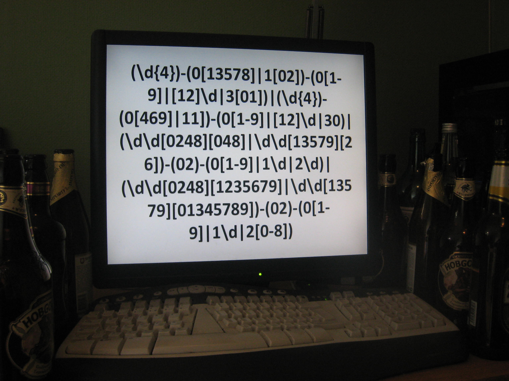

# :st(1) Post
    
*Originally published on [2010-07-08](https://6guts.wordpress.com/2010/07/09/st1-post/) by Jonathan Worthington.*

So, welcome. This is where I’ll be writing about my Raku hacking now, instead of on my [use.perl.org journal](https://use-perl.github.io/user/JonathanWorthington/). I very much enjoyed using WordPress when we did the Raku advent calendar, and figure that if I have something I like using, then I’m likely to enjoy blogging more and thus do more of it. So, I made the leap.

Having the blog here also gives me a few more possibilities. I’ll probably add some various other pages here at some point soon (e.g. listing interesting papers I read in the course of doing Raku implementation work). Ooh, and I can even post exciting images. Like this one of my desk.

Well, it’s not like that every day. :-) Anyways, with this meta-post over, I’ll try and have something actually interesting up here in a little while.
