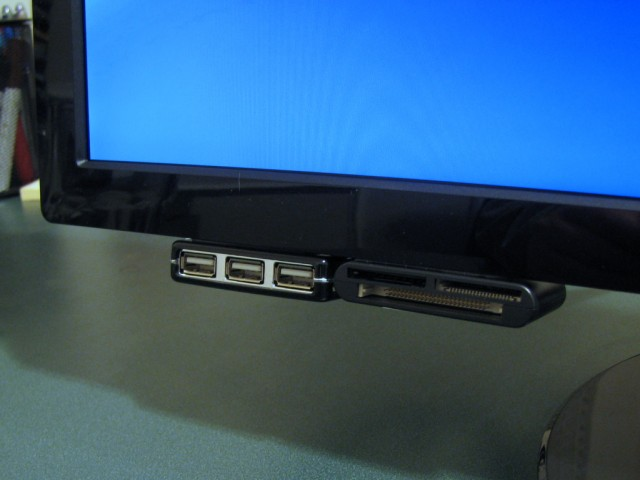
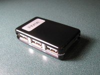
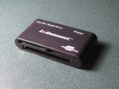
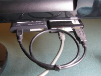

# Adding USB ports to my monitor
    
*Originally published on [4 February 2011](https://pmthium.com/2011/02/adding-usb-ports-to-my-monitor-2/) by Patrick Michaud.*

The USB ports built into my monitor died a few years ago, forcing me to start using the USB ports on my desktop tower (which is often much less convenient to reach than the monitor).  I looked for replacement monitors with USB ports, but they weren’t in my price range or didn’t have as good a video quality as the monitor I had.

Then one day it occurred to me: Just buy a small USB hub and stick it directly to the monitor.  This is probably obvious to many people reading this, but I never saw anything like it on the web (and wished I had), so maybe this article will help someone else.  Here’s what I ended up with:

All I did was get an inexpensive 4-port USB hub (around $10 at Fry’s), use a 3M Command Poster Strip to attach it to the bottom corner of the monitor, and voila — handy USB ports again!  The particular hub I chose has one of the USB ports at the back, so I also got a 1-foot USB cable and stuck a USB multicard reader next to it as well.

When I was shopping for a new widescreen monitor last month, I didn’t have to look for USB ports builtin to the monitor, since I knew I could always pop the hub off my old monitor and stick it on the new one.  Again, this is nothing particularly clever, but it has turned out to be a real convenience for me.
