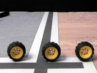
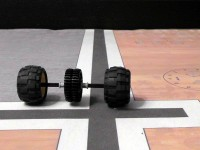
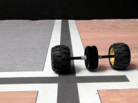
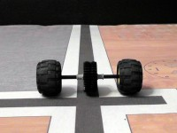

# FLL: Matching LEGO wheels
    
*Originally published on [10 February 2012](https://pmthium.com/2012/02/wheels/) by Patrick Michaud.*

This last fall my wife and I sponsored and coached a FIRST LEGO League robotics team that competed in the North Texas FLL Regional Tournament. We all had a great time and learned a lot.  In the process we also discovered many helpful tips and ideas, but some of them weren’t available on the web or were difficult to locate.  I’ve decided to collect and publish some of the ideas here so that (1) we’ll remember them for next year and (2) others can possibly benefit.

One of the things we discovered is the importance of matching wheels when building the robot.  Intuitively one expects all LEGO wheels of the same type to be exactly the same size (i.e., have the same circumference).  We found the reality to be quite different; two otherwise identical-looking wheels can in fact have substantially different circumferences in use.  If the wheel circumferences are different, it’s harder to get the robot to reliably go straight.

(We got this wheel matching trick from an excellent YouTube video titled “[ow to make your FLL robot go straight](http://www.youtube.com/watch?v=OlAO9Ho-N58)“.  The video goes through a lot more details than just wheel matching; I’d seen most of the video’s other tips elsewhere but not the wheel matching one, which is why I’m highlighting it here.)

So, given a set of identical-looking wheels, how do we find a pair that is “matched”?  This turns out to be really simple:  Place two wheels on a common axle and roll the axle forward.  If the assembly curves left or right, then one of the wheels is larger than the other and will result in the robot also curving left or right when it’s otherwise told to “go straight”.  For the wheels our team chose for this year’s robot, we found pairs of wheels in our inventory that resulted in deviations of 10% or more.

To put 10% deviation in perspective, it means that for every meter of forward travel the robot would curve away from “straight” by 10cm.  Or if you prefer feet/inches, it’s about an inch off “straight” for every forward foot of travel.

For our tests, we placed pairs of wheels onto a 12M axle with a pair of 36-tooth beveled gears in the middle.  The gears serve as a sort of flywheel to smooth out the motion, provide a convenient place to push the assembly, and help to visually identify small deviations from straight.  We then tested the pair of wheels by rolling the axle assembly along a straight line on the field mat, observing if it curved left or right.

Wheel on left is smaller.  In the image, we started the wheels against the back wall with the gears centered over the black line, then pushed the wheels towards the camera.  The wheels curved to the viewer’s left, indicating that the wheel on the left side is smaller than the one on the right.

Wheel on right is smaller.  In this image, we’ve flipped the wheels around so that the smaller wheel is on the viewer’s right.  Now the pair of wheels curve to that side, confirming the mismatch in size for this pair of wheels.  This is not a pair of wheels we want to use on a robot, as they will cause the robot to veer to the side instead of going straight.

Wheels are same size. A pair of matched wheels will roll straight, leaving the gears over the black line.

In this manner we could determine whether a given pair of wheels would be likely to cause our robot to curve left or right.  By repeating the test among many pairs of wheels we had available, we were able to “sort” our collection from smallest to largest, and then choose adjacent pairs that were evenly matched.  Once we started matching our wheels, our robot navigation became a lot straighter and more reliable.
