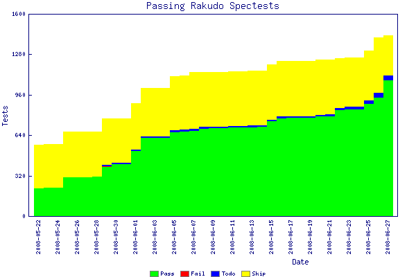

# Rakudo (Raku on Parrot) progress report
    
*Originally published on [1 July 2008](https://use-perl.github.io/user/pmichaud/journal/36826/) by Patrick Michaud.*

This is the third "monthly" report for my development grant from
the Mozilla Foundation and The Perl Foundation.  As regular readers
will have surmised by now, the definition of "month" has been stretched
a bit for a variety of reasons, but as this report and the other
reports will show, it's not been a hindrance to our progress.

To review, the primary goals of this grant are:
- To have a Raku on Parrot implementation that supports commonly-used Raku constructs;
- Improvements to the Raku test suite;
- To substantially complete the Parrot Compiler Toolkit, including documentation;
- Increased community participation in Raku and Parrot development, including development efforts on other languages utilizing Parrot and the Parrot Compiler Toolkit.

It's now clear that the work under this grant has been (or otherwise
shortly will be) successful in meeting all of the above goals.  As before,
in this report I'll highlight the major events and milestones that
have been reached since the previous report, and let my other
article postings provide increased details.

## Progress, April 2008 to June 2008

* Of course, one of the biggest news items is that in May 2008 The Perl Foundation received a $200,000 [philanthropic donation](https://news.perlfoundation.org/2008/05/tpf_receives_large_donation_in.html) from Ian Hague, roughly half of which will be used to support further development of Raku and to build upon the work performed under this grant.

* In addition, Jonathan Worthington received [a grant from Vienna.pm](../Jonathan Worthington/Rakudo-gets-a-new-thread-pool.md) to continue his work on developing Rakudo; this grant led to implementations of type checking, multimethod dispatch, regex and grammar support, public and private methods, Ranges, scalar variables, runtime role composition, enums, and a lot more.

* During this period we continued to improve the documentation for the Rakudo (Raku on Parrot) compiler, although more focus in this area is definitely needed.  In April we published a list of Rakudo milestones as a basic "road map" to guide continued development.  We also generated numerous articles and blog postings that describe the various features of the compiler and how it's all being put together.

* In May we started measuring progress on Rakudo by the number of passing tests from the official test suite.  As of June 30, Rakudo Perl is passing 1126 tests from the official test suite, and we're averaging 100 new passing tests per week.  I'm hoping this trend will continue.

* To facilitate development Moritz Lenz and Jerry Gay refactored the test harness to provide a "make spectest_regression" target.  Now Rakudo developers can verify that changes to the compiler are not breaking any tests that were previously passing.  Based on this we're able to to maintain a spectest-progress file, and Moritz created an excellent utility to display the  progress as a graph:

* Work on refactoring, improving, and updating the Raku test suite is being handled by Adrian Kreher, Moritz Lenz, and Jerry Gay under a Google Summer of Code grant, along with test contributions and suggestions from many others.  We now have a better process in place for reviewing and updating tests; this has enabled progress in other areas to also proceed more rapidly.

* Many of the basic Raku statement types and constructs are now in place -- the primary notable exception being list assignment and lazy list operations.  Implementing list assignment properly will require some modifications to the underlying grammar engine -- that work is expected to occur later this summer.  Lazy lists and operators are awaiting some improvements to Parrot's exception subsystem (expected in early July).

* The Parrot Compiler Toolkit (PCT) and Not Quite Perl (NQP) tools developed in the first months of this grant continues to demonstrate its power and effectiveness.  Most of the HLL translators for Parrot have either adopted or are planning to using PCT/NQP for their underlying code generation.  In particular, both the Ruby and PHP implementations (Cardinal and Plumhead) have made significant progress by using the Parrot compiler tools.  PCT now has support for basic "return" control exceptions -- other types of control exceptions will be added shortly.

* We continue to gather more active contributors to Parrot and Rakudo Perl.  There has been a substantial increase in patch submissions -- so much so that we've held discussions about how we might improve our ability to respond to code contributions more quickly.  I've given presentations about the recent improvements at [FOSDEM 2008](https://www.fosdem.org/2008), The Texas Open Source Symposium, DFW Perl Mongers, and YAPC::NA 2008.  Each of these presentations have increased participation and enthusiasm about Rakudo and Parrot.  More presentations about the project will be made at OSCON 2008 and YAPC::Europe 2008.

* At YAPC::NA 2008 Jim Keenan, Will Coleda, and others on the Parrot team organized a "Raku and Parrot Workshop", in which we helped approximately 20 people download and build Parrot and Rakudo Perl and run through the basic test suite.  This has further increased interest in the project; indeed, some of the participants came across some bugs (and filed bug reports and/or patches), and many are planning to hold similar workshops in their local user groups.  We plan to repeat the workshop at other venues, including the Pittsburgh Perl Workshop, YAPC::EU, and likely other workshops and user groups.

* All of the "specific tasks" targeted in the end of the last grant report have been achieved.

## Where things are headed next

The goal for the next few weeks will be to continue (and perhaps improve) the excellent development momentum achieved during the past couple of months.   In particular, we will continue improving the test suite and Rakudo's ability to pass tests from the suite.  In addition, as some new Parrot features become available (e.g., improved exception and lexical variable handling) we will be able to take advantage of them in the compilers and compiler toolkits.  We will also begin identifying the specific individuals and tasks to be engaged under grants from the Ian Hague donation.

Specific tasks for the remainder of this grant:

- Continue improving the official test suite
- Develop a more complete implementation of Raku's exception model
- Implement basic lazy lists and operators
- More refactoring of basic operators, functions, and classes according to recent changes in the language specification
- Allow compiler and builtin library components to be written in Raku
- Continue convergence efforts with other Raku implementations
- Write the final grant report, documenting the work performed, quantifying results achieved, and outlining the next phases of development

As things stand today, I expect to publish the final report for this grant
sometime around OSCON 2008 (July 2008).  Of course, I will continue to post articles at use perl;, rakudo.org, and parrotblog.org.

Thanks for reading!
