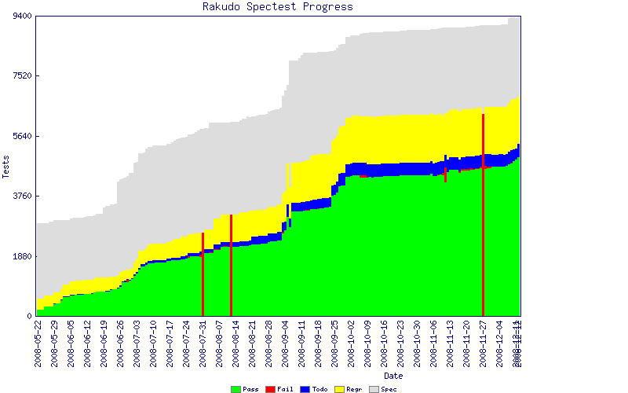

# Rakudo now passing over 5,000 spectests
    
*Originally published on [12 December 2008](https://use-perl.github.io/user/pmichaud/journal/38083/) by Patrick Michaud.*

I'm pleased to announce that as of yesterday Rakudo Perl is now passing
over 5,000 tests in the "official test suite" (spectests).  You can see
the current state of things in the graph:



Earlier in the week Adam Kennedy mentioned that it seems a bit sneaky to talk simply about the growth in pass rate without giving a basis for the number [(1)(https://irclogs.raku.org/parrot/2008-12-10.html#00:22)>.  This is a very reasonable question that comes up from time to time  and in July I wrote a longish answer explaining why (2).  The short answer is that the official test suite is itself a rapidly moving target  so the percentages don't really say all that much.

The graph above tells the story -- but I've never really explained in a posting how we read this.  The top of the grey area indicates the total number of tests in the spectest suite -- as of today (00:00 CST) there are 9,356 tests in the official test suite.  If that number seems low to you, well, you're right.  That's why were frequently asking for people to help flesh out the test suite -- more on this in a bit.

The top of the green area indicates the number of spectests that Rakudo is currently passing -- 5,004 as of today.  So Rakudo is passing a little over half (53.5%) of the available spectests.

Within the "official test suite" there is a subset of test files that we designate as the "Rakudo regression tests".  We maintain this list of subset files because there's little point in running Rakudo on a test file where we expect all of the tests to fail -- it just makes the testing take longer.  So  the top of the yellow area is the number of tests currently in the "Rakudo regression list" -- around 6,895 as of today.  The blue area is thus the tests we can parse but not pass ("todo"), and the yellow area is those tests we can't parse but are part of the regression suite.  Red of course is used to indicate failing tests, and we hope we don't see much of that.  The tall red lines you see in the graph are places where the Parrot or Rakudo build was broken as of 00:00 CST on that day (and thus we were failing all tests).

So  this graph indicates:

- the growth and rate of growth of the spectest suite (top of grey area) 
- the growth and rate of growth in Rakudo's passing tests (top of green area) 
- the ratio of Rakudo's passing tests to the overall suite (top of green versus top of grey), and
- the number of tests included in the Rakudo regression suite (top of yellow area).

You can of course determine other things from the graph -- these are the things I tend to be interested in.

The graph also makes it clear why knowing the pass percentage rate by itself can be misleading.  Toward the end of June we were passing 25% of the tests (1080/4311) and today we're passing 50.3% of the tests.  However, today's 50% is from a much bigger testing suite than what we were using in June.

There's also an issue of "what are the spectests actually covering?"  For some insight to that, here are the current test results on a per-synopsis basis:

```
Synopsis	       Spectests         Rakudo
------------------   ---------      -------------
S02 - bits              1858         814  (43.8%)
S03 - operators         1946        1156  (59.4%)
S04 - control            654         287  (43.9%)
S05 - regex             1536         848  (55.2%)
S06 - routines           525         204  (38.9%)
S09 - data                62          16  (25.8%)
S10 - packages            49           0  ( 0.0%)
S11 - modules             53          30  (56.6%)
S12 - objects            591         289  (48.9%)
S13 - overloading         51           0  ( 0.0%)
S16 - io                 238          27  (11.3%)
S17 - concurrency         28           0  ( 0.0%)
S29 - functions         1750        1309  (74.8%)
integrated tests          15          24  (60.0%)

total                   9356        5004  (53.5%)
````

Here I've listed only those synopses for which we currently
have tests -- the other sections don't have any spectests yet.
As you can see, there are many areas of the Raku
specification that are undertested, and thus adding tests for
those areas means our base "spectest" value will continue to grow.

So, ultimately my primary measurement of progress continues to be
"how many tests are we passing", although through the graphs I do 
keep an eye on the percentage of spectests we're passing.  For
long term planning, I think that a really good milestone will be 
when we're passing ~15,000 tests; then I think we'll be able to
say that we have good coverage of the Raku language spec.
(15,000 is just a best guess, the actual number may turn out to be
significantly more or less than that.  Only time and work will tell.)

Of course, for those who are primarily interested in playing
or using Raku, as opposed to the question of "when will it be
released", the primary metric is whether Rakudo implements the
features needed for their primary application(s).  We're gaining
ground on that every day, and now that we have some of the key
core features in place (list assignment, slices, working lexical 
vars, etc.) I expect to see a jump in our momentum.  And our
experience with the November wiki and mod_parrot has been that
real applications find the most useful bugs to fix and push us 
along quickest towards running code.  To me, "running code" is 
the real measure of success or failure here.

As you can see, we still need test developers and reviewers.
New tests need to be written for under-tested areas of the spec,
and we're still in the process of
migrating tests from the old pugs test directory into the 
"official spectest" location.  Generally this just a little
more than moving a file -- we also want to review the tests for
accuracy and put "fudge" markers in place so Rakudo's test harnesses know 
when to skip/todo individual tests.  Fortunately, Rakudo now has far fewer
instances of "we can't test that because some other unrelated 
feature is missing".  There's also a growing pool of people who
can help shepherd newcomers along through the test building process.
It's not at all hard, it just takes some orientation.

Anyway, I'm really glad we've reached the 5k milestone for Rakudo, and I'm looking forward to rapidly reaching the next.
