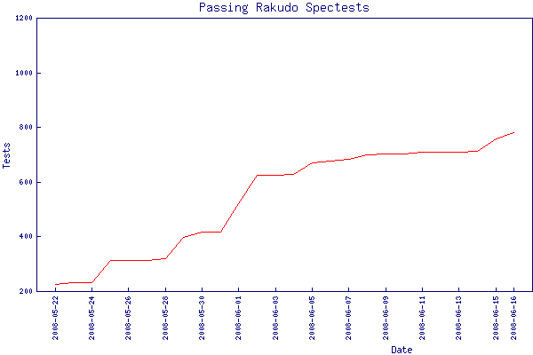

# Rakudo test suite progress
    
*Originally published on [16 June 2008](https://use-perl.github.io/user/pmichaud/journal/36695/) by Patrick Michaud.*

[Rakudo spec regression status: 64 files, 779 tests]

In my previous posts I reported on Rakudo's progress in passing the
test suite.  For those I had been using the output of Test::Harness
to estimate the number of passing tests, but ultimately decided that
it wasn't really giving me the information I want in the form I want
it.  So I wrote a custom test summarizer for Rakudo to make it
easier to measure our test passing rate in the spectest suite.

Here's how things have been progressing over the last three weeks:
```
          Rakudo spectest regression daily results
                          files test pass fail todo skip
2008-05-22 00:00             31  564  223    0    0  341
2008-05-23 00:00             32  569  228    0    0  341
2008-05-24 00:00             32  569  228    0    0  341
2008-05-25 00:00             39  666  310    0    0  356
2008-05-26 00:00             39  666  310    0    0  356
2008-05-27 00:00             39  666  310    0    0  356
2008-05-28 00:00             39  666  317    0    0  349
2008-05-29 00:00             43  774  394    4   15  361
2008-05-30 00:00             43  775  415    0   15  345
2008-05-31 00:00             43  775  415    0   15  345
2008-06-01 00:00             52  892  518    0   15  359
2008-06-02 00:00             55 1012  623    0   15  374
2008-06-03 00:00             55 1012  623    0   15  374
2008-06-04 00:00             55 1012  624    0   14  374
2008-06-05 00:00             58 1107  668    0   15  424
2008-06-06 00:00             58 1110  674    0   14  422
2008-06-07 00:00             59 1139  682    0   16  441
2008-06-08 00:00             59 1139  697    0   17  425
2008-06-09 00:00             59 1139  699    0   15  425
2008-06-10 00:00             59 1139  699    0   15  425
2008-06-11 00:00             59 1145  705    0   15  425
2008-06-12 00:00             59 1145  705    0   15  425
2008-06-13 00:00             60 1148  707    0   15  426
2008-06-14 00:00             60 1148  711    0   15  422
2008-06-15 00:00             63 1201  754    0   15  432
2008-06-16 00:00             64 1226  779    0   15  432
````

The 00:00 in the above table represents midnight U.S. Central
Time.  The 'test' column indicates the number of tests run,
and the 'pass' column shows how many tests were passing
(excluding 'todo' and 'skip').  So, as of June 16 Rakudo is
passing 779 tests in its spectest_regression suite.

In order to get a feel for our overall trend, I like to
look at week-over-week progress instead of just the daily
numbers.  So, in the week from June 9 to June 16 we added
779 - 699 = 80 new passing tests.  We'll see how things go
in the future -- it will all depend on a combination of how
quickly spectests can be reviewed and features added to
Rakudo.

At the top of my future posts I plan to include a one-line
summary of Rakudo's passing rate so that people can continually
monitor our ongoing progress without having to scan the
article (see the top of this post for an example).

**Update:**  Moritz has generated a PNG graph of the above data, and is updating the script to take advantage of the of the data that we'll be maintaining in the repository.  (I don't know how often the graph will be updated yet.)


