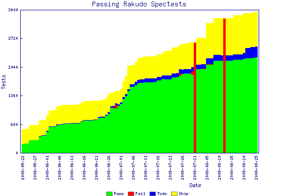

# Recent rakudo news
    
*Originally published on [25 August 2008](https://use-perl.github.io/user/pmichaud/journal/37270/) by Patrick Michaud.*

Given that most of July and August for me was spent attending conferences, 
travel, vacation, and periods of limited network connectivity, it's been
a while since I've been able to update Rakudo progress.  So, this is
a very brief update, to be followed by a longer post in a day or so.

First, we continue to make progress on passing more spectests.  As
of this writing Rakudo is passing 2278 spectests.  A graph of our
progress is available:

Much of the credit for passing tests over the past few weeks goes
to Jonathan Worthington, Moritz Lenz, and Carl M&auml;sak (again, 
apologies if I've overlooked anyone).  It's really good to see 
progress coming from so many sources.

OSCON and YAPC::EU were both excellent conferences, my compliments
to the organizers of each of those.  In particular, Jonathan, Allison,
and I were able to use our time together at YAPC::EU to discuss and
map out many of the outstanding issues for Parrot and Rakudo, which
we can now begin documenting and implementing over the next few
weeks and months.  These include things like code initialization,
handling Raku parameter passing and signatures, MMD, strings,
and many other issues.

One of the outcomes of this was that early last week I finally
got the code in 
place to enable pre-compiled Raku modules to function properly.
At the moment this has a quite dramatic effect on running the
spectest regression suite, because we aren't having to parse and
recompile Test.pm
on each test file execution (and parsing is still our biggest
bottleneck).  So, running the regression suite dropped from twelve 
minutes to under four minutes on my system, which isn't quite so
interminable.

Of course, the next step will be to enable Rakudo to compiler
Raku programs into standalone PIR or PBC files that can
automatically load the Raku runtime.  I expect to accomplish
this sometime this week -- at present we need some refactors
to the signature generation code that is blocking this from
happening.

We're also working on enabling parts of the standard runtime
library ("Prelude") to be written in Raku and precompiled by
Rakudo, instead of having it all written in PIR.  As part of this
we may implement a Raku-with-inline-PIR capability to help
with the builtins, to make it easier to attach MMD signatures
to the builtin functions and make sure they're exported properly.

We also have more of the interface for loading external modules
(written in PIR or otherwise) specified, and will be working
on that over the next couple of weeks.

At the YAPC::EU hackathon, Jesse Vincent and I also spent some
time updating the Rakudo ROADMAP
document.  This newer version of the ROADMAP identifies some
of the specific components that are left to be developed, along
with estimates of their complexity and dependencies.  If you
look at the document you'll see some notations about how long
it will take to develop each feature; these estimates are all in
"idealized programmer units".  An "idealized programmer unit"
here assumes that the people involved have no interruptions or
distractions, has all of the needed prerequisites in place, 
is mentally charged and ready for programming, doesn't have to
wait to coordinate questions or answers with others, etc.  As
such, the times given should be taken only as relative estimates
of task difficulty, and not how long a particular task will
take in real-world time units.

The major subsystem redesign coming up for Rakudo will be
changes to the parser and grammar engine to support
protoregexes and longest token matching.  This will enable us
to support even more of the STD.pm "standard grammar".
I expect much of this work to take place over the next four
calendar months, as many elements are likely to require some
intensive and sustained design and development effort (while
trying to maintain progress in other areas).  More on this as it
progresses.
