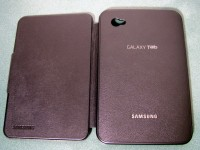
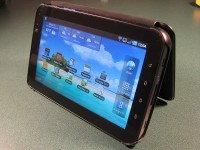
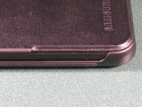
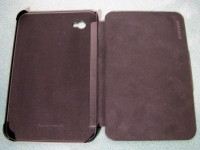
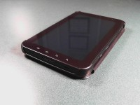

# Review: Samsung Galaxy Tab Leather Notebook Case
    
*Originally published on [28 February 2011](https://pmthium.com/2011/02/review-samsung-galaxy-tab-leather-notebook-case/) by Patrick Michaud.*

For weeks after purchasing my Samsung Galaxy Tab I had been looking for a good case for it (ideally leather).  None of the cases I found seemed worth buying — either the customer reviews indicated the case was of poor quality, or it had obvious shortcomings.  For example, I want a case that is thin and opens from the left side of the Tab, so it can double as a stand.

Recently I came across the Galaxy Tab Leather Notebook Case in Samsung’s Marketplace and purchased one for the Tab.  I like it a lot.  This case seems surprisingly difficult to find on the web — few online stores carry it and even the Samsung marketplace doesn’t make it easy to find.  Since I haven’t seen many other reviews or mention of this case, I figured I’d write one on my own experiences.

At $49.99 in the Samsung Marketplace, this case is definitely more expensive than many other leather cases that are available. And although it’s a “Leather Notebook Case”, in fact only the outside of the front cover is leather–the back cover is plastic.  I knew when I purchased the case that there was a plastic shell involved to snap on the Tab and protect the corners, but I expected the entire outside of the case to be covered in leather and was disappointed that it doesn’t.  For fifty bucks I really expected something a bit more upscale than a back of exposed plastic.

Samsung also seems to want to put their name all over the case- each surface, both inside and out, has the word “Samsung” on it somewhere.

But other than the exposed plastic and the high price, I really like the case much better than any other cases I’ve yet come across for the Tab.  The case itself is very thin, so it doesn’t add a lot of bulk or thickness to the Tab.  The plastic back cover snaps on quite securely, yet doesn’t interfere at all with the display surface.  While using the Tab I don’t even notice the case is there unless I stop to think about it.

An important feature for me is that unlike many other cases I’ve seen, this case opens from the left and thus can be used as a stand for the Tab while leaving all of the buttons in the correct orientation.  Many cases I’ve seen open from the right, which puts the power and volume buttons on the bottom and the android buttons to the left of the display, which is completely wrong to me.  Thankfully this case gets it right — power and volume on top, android buttons to the right.

I was surprised (and pleased) to discover that the case has small rubber pads on its edges that keep the Tab from sliding on a smooth surface when used as a vertical stand.  These pads are much stronger than they appear; I initially expected the Tab to have a tendency to slide away from me while using the touch screen, but unless I push really forcefully it doesn’t move at all.  This often comes in handy for reading ebooks or using the Tab for games; I can set it upright on the table in front of me and reduce strain on my neck and arms.

>The interior of the case is lined with velvet or something similar, good protection for the Tab’s screen and back when the case is closed.  There aren’t any pockets or anything like that — it’s just a good, slim sturdy case.

Overall the case makes me feel much more comfortable about transporting the Tab from place to place without getting dinged or scratched, and it doesn’t add a lot of bulk or weight. Given the lack of leather on the back I think this case really ought to be priced around $35 instead of $50, but overall I’m quite happy with my purchase.  I definitely recommend it to others who might be looking for a case for the Galaxy Tab.

 *Update 2011-04-15*:  Robert asks in the comments if the cover folds back flush with the case when open.  It folds back very nicely, as you can see in the photo at right.  It’s not perfectly “flush” because the back has a slight curve to it, but I certainly don’t find the cover to be at all in the way when it’s folded back like this.
