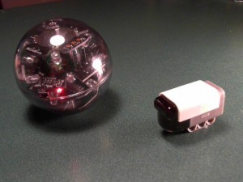

# Roborama 2012a
    
*Originally published on [28 May 2012](https://pmthium.com/2012/05/roborama-2012a/) by Patrick Michaud.*

A couple of weeks ago I entered the Dallas Personal Robotics Group Roborama 2012a competition, and managed to come away with first place in the RoboColumbus event and Line Following event (Senior Level).  For my robot I used one of the LEGO Mindstorms sets that we’ve been acquiring for use by our First Lego League team, along with various 3rd party sensors.

The goal of the RoboColumbus event was to build a robot that could navigate from a starting point to an ending point placed as far apart as possible; robots are scored on distance to the target when the robot stops.  If multiple robots touch the finish marker (i.e., distance zero), then the time needed to complete the course determines the rankings.   This year’s event was in a long hall with the target marked by an orange traffic cone.

HiTechnic IR ball and IRSeeker sensor

Contestants are allowed to make minor modifications to the course to aid navigation, so I equipped my robot with a HiTechnic IRSeeker sensor and put an infrared (IR) electronic ball on top of the traffic cone.  The IRSeeker sensor reports the relative direction to the ball (in multiples of 30 degrees), so the robot simply traveled forward until the sensor picked up the IR signal, then used the IR to home in on the traffic cone.  You can see the results of the [winning run](https://www.youtube.com/watch?v=x1GvpYAArfY) in the video, especially around the 0:33 mark when the robot makes its first significant IR correction.

My first two runs of RoboColumbus didn’t do nearly as well; the robot kept curving to the right for a variety of reasons, and so it never got a lock on the IR ball.  Some quick program changes at the contest and adjustments to the starting direction finally made for the winning run.

For the Line Following contest, the course consisted of white vinyl tiles with electrical tape in various patterns, including line gaps and sharp angles.  I used a LineLeader sensor from mindsensors.com for basic line following, with some heuristics for handling the gap conditions.  The robot performed fine on my test tiles at home, but had difficulty with the “gap S curve” tiles used at the contest.  However, my robot was the only one that [successfully navigated](https://www.youtube.com/watch?v=BF1ElplYi74) the right angle turns, so I still ended up with first place.  🙂

Matthew and Anthony from our FLL robotics team also won other events in the contest, and there are more [videos](https://www.youtube.com/playlist?list=PL50F30261D8CDCAC5) and [photos](https://www.flickr.com/photos/steevithak/sets/72157629871605390/) available.  The contest was a huge amount of fun and I’m already working on new robot designs for the next competition.

Many thanks to DPRG and the contest sponsors for putting on a great competition!
