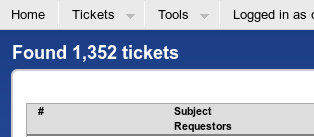
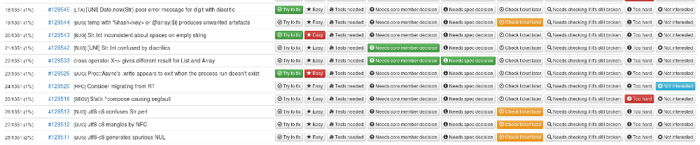
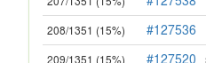

# A Date With The Bug Queue or Let Me Help You Help Me Help You
    
*Originally published on [10 July 2016](https://perl6.party//post/A-Date-With-The-Bug-Queue-or-Let-Me-Help-You-Help-Me-Help-You) by Zoffix Znet.*

Recently, I decided to undertake a quick little journey down to the [Raku's Bug Queue](https://rt.perl.org/). A quest for fame and profit—some easy game to hunt for sport. There's plenty of tickets, so how hard can it be? The quick little journey turned out to be long and large, but I've learned a lot of good lessons in the process.



## PART I: The Newbie Contributor

Right away, I hit a snag. Some tickets looked hard. On some, it wasn't clear what the correct goal was. And some looked easy, but I wasn't sure whether I wanted to work on them just yet. While the ticket queue has the tag system, I needed some personal tags. Something special just for me....

### The Ticket Trakr

So I wrote a [nice little helper app—Ticket Trakr](https://github.com/zoffixznet/rakuicket-Trakr). It fetches all the tickets from the bug queue onto one page and lets me tag each of them with any combination of:

- Try to fix
- Easy
- Tests needed
- Needs core member decision
- Needs spec decision
- Check ticket later
- Needs checking if it's still broken
- Too hard
- Not interested



The app worked great! I quickly started going through the queue, looking over the tickets, testing if the bugs were still there, and estimating whether I could and wanted to fix them. And after a full weekend of clicking, tagging, testing, closing, taking an occasional break to [hunt bears with a mortar](https://www.youtube.com/watch?v=VEsP7XR4EDA), more closing, testing, tagging, and clicking, I... was through just 200 tickets, which is only 15% of the queue:



And so I've learned the first lesson.

### LESSON 1: Going Through Bug Reports is a Full Time Job

Whenever I see someone ask how they can contribute, the basket of offers they receive generally contains: docs, marketing, modules and libraries, or bug fixing. Going through the ticket queue doesn't seem to be considered a task on itself. The ticket queue is just a place where you find the bugs to fix, right?

What may not be obvious is the bug queue contains an extraordinary amount of work that can be performed by less skilled contributors to *make it easier for highly-skilled—and by extension much scarcer—contributors to fix bugs.* Let's see what those are:

#### Deciding On Whether The Report Should Be Accepted

Just because you have 1,000 tickets in your bug queue doesn't mean you have 1,000 bugs. Here are some things that might end up as a ticket and how you can help:

- **Poor bug reports:** you should reply, asking for a decent test case or the missing information
- **Bug reports for an unrelated project:** move them (or, for the lazy, just close with explanation)
- **Feature proposals:** ping core members and users for discussion
- **A feature confused for a bug:** explain the confusion; *add to the documentation if this confusion happens often*
- **Incorrectly used code that was never meant to work:** offer a correct example; improve documentation, if needed
- **People asking for help with their code:** redirect to appropriate help channels; improve documentation, if this happens often
- **Patches for other bugs:** apply the patches, move them to the appropriate
ticket, or make them easier to merge (e.g. make a Pull Request)
- **Duplicate bug reports:** point out the dupe and close the report
- **Spam:** grab some white bread and have a lunch break

This is a lot of work, but this is just the basics. What else can a person new to the project can contribute?

### Debugging

So we've cleaned up our queue and now we have a few reports that appear to have at least some sort of a [six-legged](https://www.google.com/search?q=how+many+legs+do+bugs+have) quality to them. Sure, we're new to the project and don't even know where to begin fixing them, but that doesn't mean we can't play around with code to narrow down the problem.

#### Reproduce the bug

Merely being able to reproduce the bug shows it's likely *is* indeed a bug and not just a quirk of the reporter's system. Speaking of systems: test the bug on several, especially if you have access to esoteric ones.

Test different versions of the project to see where the bug appeared. If possible, try to narrow down the commit that introduced the bug. For Rakudo Raku compiler, you can use `bisectable` bot on IRC:

```` raku
<Zoffix> bisect: say ^10 .grep: { last if * > 2 }
<bisectable> Zoffix: exit code is 0 on both starting points, bisecting by using the output
<bisectable> Zoffix: (2016-03-18) https://github.com/rakudo/rakudo/commit/6d120ca
````

Even if you can't fix the bug, all this extra information can help a more knowledgeable contributor. Especially if they are the author of the commit that introduced the bug.

#### Reduce the amount of code reproducing the bug

I've seen a disturbing amount of people playing [code golf](https://en.wikipedia.org/wiki/Code_golf). Here is the perfect place to put those skills to good use: reproduce the bug with less code. This narrows down the areas where the bug is hiding.

For example, here's the original [actual] reported code, along with
the bug report title:

````
# You can't catch Proc::Async failing because the external program
# doesn't exist if you open it for writing:
raku -e 'my $p; try {$p = Proc::Async.new(:w, "asdfcat"); CATCH {die "in new"}}; my $pr; try {$pr = $p.start; CATCH {die "in start"}}; try {await($p.write("hi\n".encode)); CATCH {die "in write"}}; try {$p.close-stdin; CATCH {die "in close"}}; try {await($pr); CATCH {die "in await"}}'
````

That code is a bitch to read, let's pop open an editor and format it properly:

```` raku
my ( $p, $pr );
try { CATCH { die "in new"   }; $p  = Proc::Async.new: :w, "asdfcat" }
try { CATCH { die "in start" }; $pr = $p.start                       }
try { CATCH { die "in write" }; await $p.write: "hi\n".encode        }
try { CATCH { die "in close" }; $p.close-stdin                       }
try { CATCH { die "in await" }; await $pr                            }
# Outputs nothing when run
````

That's *much* better! So the report claims we can't catch things and we've got *five* `try` blocks and no output. Hmmm... Let's get rid of all the tries and catching and see what error the write throws:

```` raku
given Proc::Async.new: :w, "asdfcat" {
    .start;
    await .write: "hi\n".encode;
}
# Outputs nothing when run
````

And the error is... nothing?! There's no output from the program, so maybe it "succeeds" in writing things and there's nothing to throw? Let's toss in a couple of `say` calls:

```` raku
given Proc::Async.new: :w, "asdfcat" {
    say 'Starting';
    .start;
    say 'Writing';
    await .write: "hi\n".encode;
    say 'Wrote';
}
# OUTPUT:
# Starting
# Writing
````

The `Wrote` is missing from the output. The original report is incorrect in its assumptions that the issue is with the `CATCH` block! There's nothing to catch in the first place and the `.write` [Promise](https://docs.raku.org/type/Promise) seems to exit the program.

Perhaps, `CATCH` blocks were scary to you, but fixing a bug in a `.write` call is less so. And there you go: we found a contributor to fix the bug!

#### Write Tests For The Bug

So you've found out that it is a bug for sure and you've played around with code and maybe even found the commit that broke it. You don't know how to fix the bug, so are we done with this ticket then? How about we write tests!

After the bug is fixed, the project's test suite should contain a test checking regression of that bug. Perl's Test Anything Protocol (TAP) supports TODO and SKIP features. TODO expects the test to fail and will alert you when it starts to pass. SKIP marks the needed number of tests as skipped and your test logic can avoid running them. So even if the bug is not yet fixed, we can still add tests for it—we'll just TODO or SKIP them, depending on how severe the bug is.

[Raku's test suite](https://github.com/raku/roast/) has a fudging mechanism that lets you mark tests as skip or todo, depending on the compiler and virtual machine being tested:

```` raku
#?rakudo.moar 2 todo 'Waiting fix for RT128526'
ok $fixed,      'stuff is fixed';
ok $also-fixed, 'other stuff is also fixed';
````

The test suite will expect the above two tests to fail for Rakudo compiler running on the MoarVM virtual machine and it will complain when they start to pass. If someone fixed the bug and wasn't aware of the open ticket, running the test suite alerts them of the ticket automatically. Magic!

As a bonus, the tests are the best *description* of the bug and they also can expose alternate failure modes that aren't apparent from the bug report itself:

```` raku
<lizmat> .tell Zoffix the tests you added to S29-os/system.t yesterday hang on OSX  :-(
````

---

There's lots to do in the bug queue, but it's not as dull and boring at it appears at the first sight. And so, the bug queue taught me another lesson...

### LESSON 2: The Bug Queue Is Not Thankless Labour

If you're a new contributor and you want to get up to speed, the bug queue isn't a bad place to start your learning. And there's a lot to learn from it!

#### Real-World Usage

You get to see real world code that uses the project you want to learn. Not the out-of-context code in the documentation. Not the polished code in the pre-made examples, but real-life, less-than-perfect, hacked-from-the-hip code.  You also get to see code from multiple, vastly different people who use different style guidelines. Being able to easily read code regardless of the style used is a valuable skill.

#### Esoteric Features and Constructs

Everyone and their brother knows about `and` and what it's for, but did you know about `andthen`? I get [flashbacks](https://www.youtube.com/watch?v=GKNX6dieVcc) whenever I see it, but it's a [useful chaining operator](https://docs.raku.org/routine/andthen) in Raku! And I learned about it from a bug report.

You can get very far with language primitives, but knowing more powerful and more appropriate contructs and features will let you write more concise and eloquent code. The bug queue can teach them to you.

#### Learning The Language

Writing tests can teach you the language you're writing them in. Writing tests for the Raku compiler can teach you Perl 6. How much will you need to think when writing a program that runs a piece of code *that might hang* and in a set amount of time tells you whether the code resulted in success and kills the thread if it hung? I can do it with my eyes closed now.

Writing tests is a skill in itself and the bug queue gives you lots of opportunity for practice.

#### Getting To Know People

Going through the bug queue has a large social aspect to it as well:

- Communicating with core members to find out whether and how a ticket should be resolved
- Communicating with ticket creators (members of the community)
- Having (hopefully amicable) discussions about features
- Steering an overly-heated discussion to a more peaceful direction—bugs are annoying, and it's not uncommon for tickets to be written by pissed off people

Also, going through the ticket queue is not the favourite of the people, and the person who does it isn't exactly hated.

## Conclusion

The bug queue is a much more complex beast than people may suspect. It has a lot to offer and a lot to teach. From language use, to the quirks of squishy humans. Today, we've examined the vast potential for contribution the ticket queue offers to people new to the project. Helping [sift out actual bugs](https://rt.perl.org/) from false reports. Helping with debugging.  Helping [with tests](https://github.com/raku/roast/).

That's not the only thing the bug queue has on the menu. In the next post, we'll examine what it has to teach more experienced regulars and core members of the project! How can you get more bugs fixed? Maybe the bug queue knows the answer.

## Part 2

[Part 2](http://raku.party/post/A-Date-With-The-Bug-Queue-or-Let-Me-Help-You-Help-Me-Help-You--Part-2) is now available!
