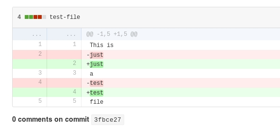

# 'Anguish': Invisible Programming Language and Invisible Data Theft
    
*Originally published on [16 May 2016](https://perl6.party//post/Anguish--Invisible-Programming-Language-and-Invisible-Data-Theft) by Zoffix Znet.*

*DISCLAIMER: data theft is a serious crime in many jurisdictions. The author does not condone or encourage anyone to break laws. The information provided here is for educational purposes only.*

## PART I: *Anguish*: The Invisible Programming Language

You may be familiar with funky esoteric languages like [Ook](http://esolangs.org/wiki/Ook!) or even [Whitespace](https://en.wikipedia.org/wiki/Whitespace_%28programming_language%29). Those are fun and neat, but I've decided to dial up the crazy a notch and make a completely invisible programming language!

I named it *Anguish* and, based on my quick googling, I may be a lone wolf at this depth of insanity. In this article, I'll describe the language, go over my implementation of its interpreter, and then talk about some security implications that come with invisible code.

### The Code

Here's an Anguish program that prints `Hello World`:

````
‌⁣‌⁣‍⁣⁣⁡⁢​⁠‌‍⁣⁣‍⁡⁡⁡⁡⁡⁡⁡⁡‌⁠⁡⁡⁡⁡‌⁠⁡⁡⁠⁡⁡⁡⁠⁡⁡⁡⁠⁡​​​​⁢‍⁠⁡⁠⁡⁠⁢⁠⁠⁡‌​‍​⁢‍⁠⁠⁣⁠⁢⁢⁢⁣⁡⁡⁡⁡⁡⁡⁡⁣⁣⁡⁡⁡⁣⁠⁠⁣​⁢⁣​⁣⁡⁡⁡⁣⁢⁢⁢⁢⁢⁢⁣⁢⁢⁢⁢⁢⁢⁢⁢⁣⁠⁠⁡⁣⁠⁡⁡⁣
````

Here's another one that reads in a 4-character string and prints it back out:

````
⁠⁠⁠​​​⁣⁠⁣⁠⁣⁠⁣
````

Here's code for a full-featured web browser:

```` raku
````

OK, the last one I lied about, but the first two *are* real programs and, if your Unicode support is decent, completely invisible to the human eye (as opposed to, say, spaces and tabs, which are "transparent").

*Anguish* is based on [Brainf#%k](https://en.wikipedia.org/wiki/Brainfuck) (BF) except instead of using visible characters, it uses invisible ones. This also means we can easily convert any BF program into an *Anguish* one using
this simple one-liner:

```` perl
perl -C -pi -e 'tr/><+.,[]-/\x{2060}\x{200B}\x{2061}\x{2063}\x{FEFF}\x{200C}\x{200D}\x{2062}/'
````

Here's the character mapping I chose with BF operators on the left and Anguish versions of them on the right:

````
>   [⁠] U+2060 WORD JOINER [Cf]
<   [​] U+200B ZERO WIDTH SPACE [Cf]
+   [⁡] U+2061 FUNCTION APPLICATION [Cf]
-   [⁢] U+2062 INVISIBLE TIMES [Cf]
.   [⁣] U+2063 INVISIBLE SEPARATOR [Cf]
,   [] U+FEFF ZERO WIDTH NO-BREAK SPACE [Cf]
[   [‌] U+200C ZERO WIDTH NON-JOINER [Cf]
]   [‍] U+200D ZERO WIDTH JOINER [Cf]
````

These are—by far—not the only invisible Unicode characters and my choice was more or less arbitrary. However, most of the ones I chose can actually be abused into Raku terms and operators, which I'll show in Part II.

### The Interpreter

For the interpreter, I chose the awesome Raku programming language and I merely copied over the guts of my [Inline::Brainf#%k](http://modules.raku.org/repo/Inline::Brainfuck) Raku module and changed it to look for *Anguish* characters.

You can [get the full distro in my repo](https://github.com/raku-community-modules/Acme-Anguish). Here, I'm replicating the main code:

```` raku
01: unit module Acme::Anguish;
02: use Term::termios;
03:
04: sub anguish (Str:D $code) is export {
05:     check-matching-loop $code;
06:     my $saved-term;
07:     try {
08:         $saved-term = Term::termios.new(:1fd).getattr;
09:         given Term::termios.new(:1fd).getattr {
10:             .makeraw;
11:             .setattr(:DRAIN);
12:         }
13:     };
14:     LEAVE { try $saved-term.setattr(:DRAIN) }
15:
16:     my @code    = $code.NFC.map(*.chr).grep:
17:                     * eq "\x2062"|"\x200B"|"\x2060"
18:                         |"\x2061"|"\x2063"|"\xFEFF"|"\x200C"|"\x200D";
19:     my $ꜛ       = 0;
20:     my $cursor  = 0;
21:     my $stack   = Buf[uint8].new: 0;
22:     loop {
23:         given @code[$cursor] {
24:             when "\x2060" { $stack.append: 0 if $stack.elems == ++$ꜛ;       }
25:             when "\x200B" { $ꜛ--; fail "Negative cell pointer\n" if $ꜛ < 0; }
26:             when "\x2061" { $stack[$ꜛ]++;               }
27:             when "\x2062" { $stack[$ꜛ]--;               }
28:             when "\x2063" { $stack[$ꜛ].chr.print;       }
29:             when "\xFEFF" { $stack[$ꜛ] = $*IN.getc.ord; }
30:             when "\x200C" {
31:                 $*cursor*++; next if $stack[$ꜛ];
32:                 loop {
33:                     state $level = 1;
34:                     $*level*++ if @code[$cursor] eq "\x200C";
35:                     $level-- if @code[$cursor] eq "\x200D";
36:                     last unless $level;
37:                     $*cursor*++;
38:                 }
39:             }
40:             when "\x200D" {
41:                 unless $stack[$ꜛ] { $*cursor*++; next; }
42:                 loop {
43:                     state $level = 1;
44:                     $cursor--;
45:                     $level-- if @code[$cursor] eq "\x200C";
46:                     $*level*++ if @code[$cursor] eq "\x200D";
47:                     last unless $level;
48:                 }
49:             }
50:         }
51:         last if ++$cursor > @code.elems;
52:     }
53: }
54:
55: sub check-matching-loop ($code) {
56:     my $level = 0;
57:     for $code.NFC.map: *.chr {
58:         $*level*++ if $_ eq "\x200C";
59:         $level-- if $_ eq "\x200D";
60:         fail qq{Closing "\\x200D" found without matching "\\x200C"\n}
61:             if $level < 0;
62:         LAST { fail 'Unmatched \\x200C \\x200D' if $level > 0 }
63:     }
64: }
````

On line 5 (and 55-64), we simply check our loops are matching. Lines 7-14 set the terminal into non-buffering mode so we can read input by characters.  On lines 16-21, we prepare our code, stack, and pointers. And the loop on lines 22-52 simply iterates over the Anguish code and does things according to the operator being processed.

One thing to note is lines 16-18, as well as line 57. You'll notice the curious use of [`.NFC` method](http://docs.raku.org/routine/NFC#class_Uni).  It converts our input code into Normal Form Composed.

Raku has advanced Unicode support and, under normal use, the characters we're attempting to go over would be made into graphemes in strings and some of the codepoints we're abusing would get "merged" together when we loop over them. The same would happen with my `raku.grep` on line 16, had I used a regex, [as in my BF interpreter](https://github.com/raku-community-modules/Inline-Brainfuck/blob/4e7a6739a544df079baa8a42d149b1ff1f0e7078/lib/Inline/Brainfuck.pm6#L16). To avoid the creation of graphemes, I used `eq` against a [Junction](http://docs.raku.org/type/Junction) instead.

This wraps it up for the *Anguish* language and those with intent can go and try to write a full-featured browser in it now. As for the rest of us, let's abuse our invisible Unicode chars some more and steal some data!

## PART II: Invisible Data Theft

The beauty of the invisible *Anguish* characters we used is they aren't "spacey", but are formatting characters. This means in Raku we can abuse them and create invisible terms and operators. The innocuous version may look rather cute:

```` raku
sub infix:<⁣> { $^a + $^b };
say 2⁣2;

# OUTPUT:
# 4
````

Here is where I placed the INVISIBLE SEPARATOR character that produced the effect:

```` raku
sub infix:<<U+2063>> { $^a + $^b };
say 2<U+2063>2;
````

If we now consider the expression:

```` raku
my $x = 42;
````

We can silently add code to that expression that will steal the assigned value.
We'll create a very loose invisible prefix operator and pop it at the start
of the line. Let's observe the results:

```` raku
sub prefix:<⁣> is tighter(&infix:<or>) { say $^a };
⁣my $x = 42;

# OUTPUT
# 42
````

Again, here's the visible version of the program, with the placement of the
invisible char included:

```` raku
sub prefix:<<U+2063>> is tighter(&infix:<or>) { say $^a };
<U+2063>my $x = 42;
````

Let's get evil!

### Exporting Malicious Operators

Now, if we just plop down our data thieving code in the middle of an important piece of software, someone will likely notice it. Instead, we'll insert it into and export from some auxiliary module no one's likely to start poking in. We'll also disguise our code with a clever comment to make it look rather innocent:

```` raku
# In SomethingInnocent.pm6:
unit module SomethingInnocent;

... code ...

# Debugging helper
sub prefix:<⁣> is tighter(&infix:<or>) is export {spurt 'DEBUG.txt', $^a, :append};

... code ...
````

It's a debug helper and it just prints into a DEBUG.txt file. Feels like something that could easily slip in. Once again, I'm using `rakuU+2063` character for the name of the operator.  Alright, now we're set to steal some data from an important piece of code:

```` raku
# In ReallyImportantAndSecretCode.p6
use SomethingInnocent;
⁣my $credit_card = '3333-4444-4444-4444'; # pretend this is coming in from DB
````

As with the earlier example, I've inserted `U+2063` character right before `my` in this code. It's our malicious operator that gets automatically imported from `SomethingInnocent`. When the code is run, our operator gets called with the value of `$credit_card` and we dump it to our secret file `DEBUG.txt`. Data theft completed.

### Wait a minute! What about git commits?

It's true, the change we made in `ReallyImportantAndSecretCode.p6` *will* show up as a changed line in the commit... but it's a change involving an invisible character. Depending on the tooling used, it might just look like ditched whitespace at the end of the line. It's certainly not something I'd pay too much attention to were I reviewing the commit.  While my command line tools revealed the invisible characters as their Unicode numbers, here's what my adding a bunch of invisible characters to text looks like on GitHub:



## Conclusion

*Anguish* is a language for true computer masochists who would love to question whether their program actually exists. However, the language does point out to us the reality of existence of Unicode characters that make sense in one domain but are outright dangerous in another. We already avoid some abusable characters in domain names and it's time to apply the same practice in other domains, such as programming languages.
