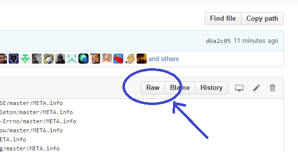

# How to Make a Raku Module (Bit Rot Thursday)
    
*Originally published on [4 February 2016](https://perl6.party//post/How-to-Make-a-Perl-6-Module--Bit-Rot-Thursday) by Zoffix Znet.*

Happy [Bit Rot Thursday](http://blogs.perl.org/users/zoffix_znet/2016/01/bit-rot-thursday.html)! This week I'm taking care of fixing minor issues with packaging of my Raku modules, and so, I'll talk about the general process of releasing a Raku module. Let's dive in!

## Prelude

Raku is a brand new language, so there's yet no well-established module system like what Perl has, but there is a work in progress. Thus, I'll first describe the process for our temporary GitHub-based system and then I'll talk about the PAUSE-based system that's being worked on.

There are some [tools and helpers available](http://doc.raku.org/language/modules-extra) to help with the process of module development, but they are beyond the scope of this post.

## Terms (and no conditions)

- **Ecosystem**—collection of Raku modules and scripts, viewable at [modules.raku.org](http://modules.raku.org/) with META-data listed in the [raku/ecosystem repo](https://github.com/raku/ecosystem/)
- [a Raku module installer](https://github.com/ugexe/zef)
- [**repo**](https://en.wikipedia.org/wiki/Software_repository)—the files of a project hosted somewhere, like on GitHub
- **PR**—abbreviation for "Pull Request"; a request on GitHub to apply a change to some files in a project

## So, you want to write a Raku module?

If so, awesome! Congratulations on your decision to become a member of the elite, exclusive, limited-time, offer-expires-soon team of about 130 developers who currently own the 549 modules that comprise the [Raku Ecosystem](http://modules.raku.org/).

There are plenty of things that need to be written and if you're still having trouble coming up with ideas for something to code, check out the [Most Wanted list](https://github.com/raku/rakuost-wanted/blob/master/most-wanted/modules.md).

You can publish Raku modules as well as scripts (executables).

## The Files

````
META6.json
README.md
.travis.yml
.gitignore
bin/baker.p6
lib/Bread/Baker.pm6
resources/recipe.txt
t/00-test-bake.t
xt/00-ensure-bread-is-tasty.t
````

The above shows the possible files and directories your distribution would have. The `bin/` directory is for executables, `lib/` is for modules, `resources/` is for additional resources, such as images or templates, `t/` is for tests to be run by the user, and `xt/` is for your author tests that are not run as part of the installation process. The documentation can be included in the same file as code in POD6 format, but since the current system uses GitHub, a README.md makes it much easier to read the docs.

Also, you are encouraged to enable [Travis](https://travis-ci.org/) testing, hence the included `.travis.yml` file. You can use either a [simple config file](https://docs.travis-ci.com/user/languages/raku) or [a more advanced version written by ugexe](https://github.com/ugexe/RakuTCI).

Most important of all is the `META6.json` file. It's a distribution metafile in JSON format that specifies what stuff your distro provides, as well as its prerequisites and authorship information. You can learn what all the keys are for in [S22 Speculation](http://design.raku.org/S22.html#META6.json) or look at [a sample META file](https://raw.githubusercontent.com/zoffixznet/rakuO-MiddleMan/master/META6.json). This is a place where many errors happen, so I encourage you to use [Test::META](http://modules.raku.org/dist/Test::META) that will spot all the common mistakes.  

Lastly, `.gitignore` is a file where you can list things for `git` to ignore and not include in your repo. For a start, you'll want to add single line `lib/.precomp` into it. This is the directory created by Rakudo to store precompiled files when you run your tests, for example, and you don't need to store it anywhere.

## Add to Ecosystem (The Now)

Currently, the authors host their modules as repos on [GitHub](https://github.com/), so place your files there. It'll require some understanding of [how to use git](http://www.learnenough.com/git-tutorial).

Grab a link to the **raw** view of your META file. You can get to it by clicking the `"Raw"` button in the top, right corner of the file view on GitHub. It'll be a link akin to `https://raw.githubusercontent.com/zoffixznet/rakuO-MiddleMan/master/META6.json`



Go to the [META.list file in raku/ecosystem repo](https://github.com/raku/ecosystem/blob/master/META.list). You can edit that file directly (and submit a PR) by clicking the pencil icon in top, right corner on GitHub, or fork the repo and submit a PR using other means. In that file, on a separate line, add the link to your dist's META file.

After 1-2 hours after your PR is merged, the build cron job will list your module on [modules.raku.org](http://modules.raku.org). If it's still missing, check the [build log](http://modules.raku.org/update.log) for any errors; you can just search the page for term `[error]````

## Add to Ecosystem (The Future)

Perl's model goes something like this: you upload stuff on PAUSE, it gets propagated to all sorts of mirrors (CPAN), you can search for things using [MetaCPAN](https://metacpan.org/), and you install those things from one of the mirrors using a CPAN client, like `cpanm`. Wouldn't it be sweet for Raku folks to get in on that action?

Well, you can! Unless you're reading this after the [world was destroyed by a nuclear catastrophe](https://www.youtube.com/watch?v=SZTKyOj8gjM), you can log in onto [PAUSE](http://pause.perl.org/) **right this second** and upload a Raku dist.

Providing your dist looks proper and contains `META6.json` file, all you need to do is choose `Perl6` as the `Target Directory` on the [dist upload page](https://pause.perl.org/pause/authenquery?ACTION=add_uri).

Now, just because you uploaded a Raku dist doesn't mean it'll show up on [MetaCPAN](https://metacpan.org/); it's the whole point of specifying the `Perl6` target dir. There will be a Raku version of the MetaCPAN hosted elsewhere. That MetaCPAN will be a modified version of the Perl's MetaCPAN under the hood.

Currently, that work is being done by brave pioneers like jdv79, ranguard, and anyone else who I left out due to my ignorance. Having more Volunteers would certainly be helpful, and if you seek fame and recognition, you should stop by [#rakuoolchain channel on irc.Freenode.net](irc://irc.freenode.net/#rakuoolchain) and offer a helping hand.

Hopefully, you found this article helpful and I await your contributions to the Raku Ecosystem!
