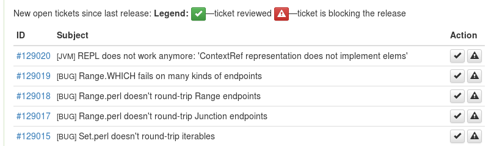

# I Botched a Raku Release And Now a Robot Is Taking My Job
    
*Originally published on [20 August 2016](https://perl6.party//post/I-Botched-A-Perl-6-Release-And-Now-A-Robot-Is-Taking-My-Job) by Zoffix Znet.*

*Deconfusion note: if you're just a regular Raku user, you likely use and only ever heard of Rakudo Star, which is a distribution that includes the Rakudo Raku Compiler, some modules, and the docs. This post details a release of that compiler* **only,** *which gets released more often than Rakudo Star.  So please don't think there's a new release, if Star is all you use.*

## Part I: Humans Make Errors

Today is the third Saturday of the month, which is an awesome day! It's when the Rakudo Raku Compiler sees its monthly release. I was at the helm today, so I chugged along through the [Rakudo release guide](https://github.com/rakudo/rakudo/blob/37bf470f92dd0f0389c3d2c78f85374232c76203/docs/release_guide.pod) and the [NQP release guide](https://github.com/raku/nqp/blob/a714ed740adcf6d64d9066d6f0a56986fa66c3a1/docs/release_guide.pod), whose release is part of the process as well.

### We're All Green To Go

As I was nearing the end of the process, the first hint of a problem surfaced when a user joined the [#raku-dev IRC channel](https://webchat.freenode.net/?channels=#raku-dev):

> **<nwc10>** the tag 2016.08 seems to be missing from the nqp github repository

> **<Zoffix>** nwc10, it was created about 44 minutes ago. Ensure you got the latest everything

> **<nwc10>** very strange. because if I pull again in my nqp checkout I still don't see it

> **<Zoffix>** Did you add --tags?   it's git pull --tags or git fetch --tags or something like that

> **<nwc10>** Zoffix: correct. no I didn't. thanks

> **<Zoffix>** \o/

> **<nwc10>** OK, why do I usually *not* need to do that?

Good question. I pulled in a fresh checkout and ran the full test suite again, just to be sure. Everything passed. Luckily, I got the answer rather quickly:
  
> **<nwc10>** git log --graph --decorate origin/master 2016.08

> **<nwc10>** how that it and master have diverged

> **<nwc10>** the tag is for a commit which is not a parent of nqp master

Here's the story: I have a local NQP checkout. I bump its version and its [MoarVM](http://moarvm.org/) dependency. **Tag the release.** And start the full build and test suite run.  That's a lengthly process, so while that is happening, I go to GitHub and use the online editor to make a minor tweak to the text of the NQP's release guide.

The tests finish. I try to push my tag and the version bump and get the usual error saying the online repo has diverged. Instinctively, I run my `gr` alias for `git pull --rebase` to bring in the new changes, and then push all of the work into the repo.

The problem is that `--rebase` doesn't move my tag, so it's still referencing that old commit. If you clone the repo, everything appears to work for that tag, but if you pull in the changes into the existing repo, you don't get the tag.  Also, `git describe` (which we use when doing mid-release NQP/MoarVM version bumps) was now missing my tag, because the commit my tag tagged is not the parent of the master HEAD.

At this point, I don't yet know about the breakage for folks who are doing `git pull` in an existing branch, and so I continue with the release, since all of my tests are green. Finish up. Then relax by departing to fly in [No Man's Sky](https://en.wikipedia.org/wiki/No_Man%27s_Sky). Awesome!

### The Robocide

The first hint (wait, the *second* hint?) of trouble showed up when the latest commits did not appear in our eval bot that's supposed to update itself to HEAD:
  
> **<Zoffix>** m: dd [ $*VM.version, $*PERL.compiler.version ]

> **<camelia>** rakudo-moar c201a7: OUTPUT«[v2016.07.24.g.31.eccd.7, v2016.07.1.243.gc.201.a.76]␤»

> **<Zoffix>** Oh. I guess camelia doesn't build every commit right away.

I did not create camelia, so was unfamiliar with her workings, but there was another bot whom I did create and knew for sure it was supposed to update to HEAD every hour... it didn't:
  
> **<Zoffix>** s: dd $*VM.version,  $*PERL.compiler.version

> **<SourceBaby>** Zoffix, Something's wrong: ␤ERR: v2016.07.24.g.31.eccd.7 v2016​.07.1.243.gc.201.a.76␤Cannot resolve caller sourcery(Nil); none of these signatures match:␤    ($thing, Str:D $method, Capture $c)␤ ($thing, Str:D $method)␤    (&code)␤    (&code, Capture $c)␤ in block <unit> at -e line 6␤␤

> *** Zoffix** gets a bad feeling

### The Fallout

I didn't have to wonder about what the hell was going on for too long, since shortly thereafter a user in [#raku channel](https://webchat.freenode.net/?channels=#raku) turned up, saying they can't build:
  
> **<cuonglm>** Hi, anyone got trouble when building 2016.08 rakudo release from source I got `error: pathspec '2016.08' did not match any file(s) know to git. Sounds like git history was overriden

After a short conversation with the person, it became obvious that while cloning and building the repo (or using the release I released) may have worked fine, simply `git pull`ing ran into the issue with the tag.

It was obvious there was an issue and it needed fixing. The question was: how.  The first suggestions seemed scary:
  
> **<mst>** you can always burn the tag with fire and replace it with a fixed one.

> **<mst>** the advantages may outweigh the risks

We already had users with checkouts with a broken tag asking for help in the chat channel and since I've sent the release announcement email, there may have been many users experiencing such a checkout issue. I didn't know what to do, so the first thing I did was panic and attempt to find someone else to fix my mess:
  
> **<Zoffix>** jnthn, [Coke], *TimToady* are you around? I made a booboo with the tag

A lot of the core devs are in Europe, so there's a bit of timezone conflict with me, and with [YAPC::Europe](http://act.yapc.eu/ye2016/) happening, some of them were not even in the chat at the time. Left to my own devices, I joined [#git on Freenode](https://webchat.freenode.net/?channels=#git), and the kind folks in there reaffirmed that replacing the tag might be a bad idea. Victory... I didn't have to learn how to do that:
  
> **<Zoffix>** What if I delete the tag and create a new one.  What happens to people who have cloned the branch with the incorrect tag?

> **<_ikke_>** Zoffix: A good question. Tags are kind of special as in they're not expecting to change (and git somewhat ignores changing tags from the remote)

> **<_ikke_>** Zoffix: man git tag has a section about it ("On retagging")

> **<gitinfo>** Zoffix: the git-tag manpage is available at http://jk.gs/git-tag.html

> **<Zoffix>** OK, then I think I'll leave it as it is, and wait for someone smarter than me to figure out a fix :P

> **<Zoffix>** Haha "Just admit you screwed up, and use a different name." Yup, I'll go with that :P

> **<Zoffix>** Thanks for the help!

> **<_ikke_>** YW ;-)

With tag mangling out of the question and users having issues, the next answer was to make an emergency point release with a corrected tag, so I proceeded to do so:
  
> **<Zoffix>** OK. I'm gonna do a 2016.08.1 'cause I'm not 100% sure just changing the tag will fix everything and won't introduce new problems.

Making another NQP release, with a correct tag, seemed to resolve the issue *on my box,* but I wasn't sure there wasn't any more fallout about to happen with the current Rakudo release, so I made a point release of the compiler as well, just to be safe, and to sync up versions with NQP (so folks don't think a 2016.08.01 Rakudo release is missing, when they see a 2016.08.1 NQP release).

Jumping into the release guides at mid-point proved challenging, and considering I've *just* done a release, so did trying to keep track of which steps I've already done. Tired. Embarrassed. And too sober for the occasion. I headed to the pub, knowing this is the last time I'll make a release like this.

## Part II: I, Robot

If you've heard of [The Joel Test](http://www.joelonsoftware.com/articles/fog0000000043.html), you may've noticed Raku's release process described above currently fails item #2:
  
> 2. Can you make a build in one step?

Painfully aware of the issue, I was thinking about improving the situation ever since the first time I stepped up to cut a release. If you follow the [#raku-dev channel](https://webchat.freenode.net/?channels=#raku-dev), you may have even seen me show off a couple of prototypes.  Such as my [Rele6sr web app](https://github.com/zoffixznet/Rele6sr) that lets you keep track of release-blocking bug tickets:

Or my Rele6sr bot that reminds you about an upcoming release, giving a list of new tickets since last release, as well as the ChangeLog entries to review:
  
> **<Zoffix>** Rele6sr: reminder

> **<Rele6sr>** 🎺🎺🎺 Friends! I bear good news! Rakudo's release will happen in just 1 days! Please update the ChangeLog with anything you worked on that should be known to our users. 🎺🎺🎺

> **<Rele6sr>** 🎺🎺🎺 Here are still-open new RT tickets since last release: http://bug.raku.party/1471608216.html And here is the git log output for commits since last release: http://bug.raku.party/1471608219.html 🎺🎺🎺

Today's incident indicated to me that it's time to stop messing around with prototypes and put out a complete plan of action.

### Spread It Out

There are two things the Release Guide contains that may make it seem like automating releases is a tough nut to crack: reviewing bug tickets for blockers and populating the ChangeLog with needed items. We can't make a robot reliably do those things (yet?), so the largest part of the release process requests a human to do so. But... what if we spread that job throughout the entire month between the releases?

This month, I will create a web app that will keep track of all the reported tickets and will let the release manager log in and mark the tickets they reviewed as either release blockers or non-blockers. As a bonus, the prototype `buggable` bug-queue interfacing bot that some of you may have seen will also use the app to do its thing more correctly, and the app will also serve as a nicer interface to tickets for people who don't like our original RT website.

The same principle will apply to ChangeLog entries too, where the site will keep track of the commits the release manager has reviewed and added to the ChangeLog. As such, by "keeping state" around, the web app will let the release manager spend only a couple of minutes every few days reviewing changes and bugs, instead of cramming all of the work into a single session on the release day.

### Build In One Step

Providing the release manager keeps up with the above steps throughout the month, on the release day they will have a single thing to do: issue the `release` command to the Rele6sr bot:
  
> **<Zoffix>** Rele6sr: release

> **<Rele6sr>** Yey! It's that time! Starting the release.  You can watch the progress on http://bug.raku.party/some-url Tell me to `abort` at any time to abort the process.

Since the issue review process has been subtracted from the release instructions, all that's left is grunt work that can be entirely automated. The bot will use [Google Compute Engine API](https://cloud.google.com/compute/docs/reference/latest/) to fire up my 24-core dev box. It will then `ssh` into it and clone the repos, update versions, run the builds, run the tests, tag stuff, generate tarballs, test the tarballs, `scp` the tarballs to [Rakudo's website](http://rakudo.org/), email the release announcement, and update the Wikipedia page (if there's an API for that).  The human can watch all of that happen on a page that feeds a websocket with the output from [`Proc::Async`](https://docs.raku.org/type/Proc$COLON$COLONAsync) and abort if anything goes wrong. The bot will automatically abort if any of the tests in the test suite fail.  As a bonus, I'm hoping to make the bot fire up instances of VMs with several different OSes, to add an extra layer of testing in different environments.

Granted, at least with the first several releases, there will be safety stop-measures and verification steps where a human can ensure the robot is doing the right thing, and abort the process, if needed. But there's no technical limitation to the bot correctly cutting a release after being issued a single command.

### Exterminate All Humans

Automating complex build jobs eliminates mistakes. A robot doesn't care if it has to rebuild from scratch a hundred times while you're trying to debug a release-blocker (OK, I *think* it doesn't care... any robots' rights activists in the audience to tell me I'm wrong?).

Both my today's mistake and the difficulty of fixing it could've been avoided if the release process were entirely automated. The fewer things you have to do manually, the fewer places a mistake can creep into.

[The Joel Test](http://www.joelonsoftware.com/articles/fog0000000043.html), while an amusing read, has a lot of truth and simplicity to it.  I suggest you re-evaluate any of the points your project fails the test on, and I believe you'll save yourself a lot of headache if you do so.

## Conclusion

Today's events were a great learning experience and a catalyst for improvement.  Humans are squishy and fallable and they make mistakes, especially out of habit.

Trying to follow a regular list of instructions during an irregular situation can prove difficult and introduce more mistakes, making a bad situation worse.

If you haven't yet, try to automate your release process as much as you can.  I know Raku will follow that advice. This was the last time I cut a release.  My job was taken by a robot.
