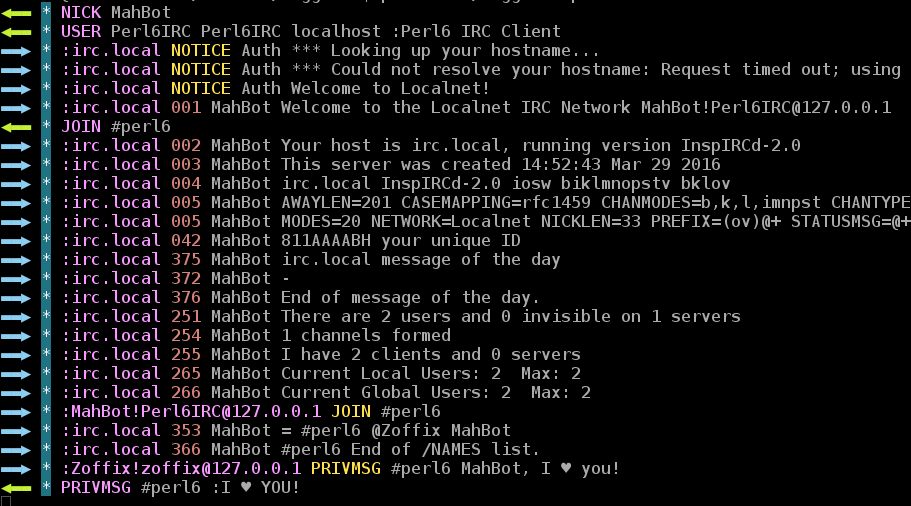
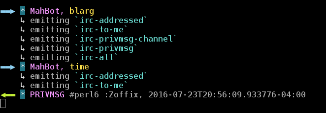
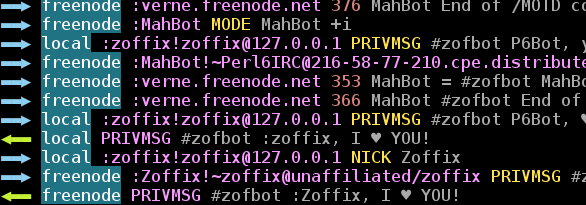

# IRC::Client: Raku Multi-Server IRC (or Awesome Async Interfaces with Raku)
    
*Originally published on [29 July 2016](https://perl6.party//post/IRC-Client-Perl-6-Multi-Server-IRC-Module) by Zoffix Znet.*

I wrote my first Raku program—a New Years IRC Party bot—around Christmas, 2015. The work included releasing the [IRC::Client module](https://github.com/zoffixznet/rakuRC-Client/), and given my virginity with the language and blood alcohol level appropriate for the Holiday Season, the module ended up sufficiently craptastic.

Recently, I needed a tool for some Raku bug queue work, so I decided to lock myself up for a weekend and re-design and re-write the module from scratch.  Multiple people bugged me to do so over the past months, so I figured I'd also write a tutorial for how to use the module—as an apology for being a master procrastinator. And should IRC be of no interest to you, I hope the tutorial will prove useful as a general example of async, non-blocking interfaces in Raku.

## The Basics

To create an IRC bot, instantiate an `IRC::Client` object, giving it some basic info, and call the `.run` method. Implement all of the functionality you need as classes with method names matching the events you want to listen to and hand those in via the `.plugins` attribute. When an IRC event occurs, it's passed to all of the plugins, in the order you specify them, stopping if a plugin claims it handled the event.

Here's a simple IRC bot that responds to being addressed in-channel, notices, and private messages sent to it. The response is the uppercased original message the bot received:

```` raku
use IRC::Client;
.run with IRC::Client.new:
    :nick<MahBot>
    :host<libera.chat>
    :channels<#raku>
    :debug
    :plugins(class { method irc-to-me ($_) { .text.uc } })
````

And here's what the bot looks like when running:
  
> **<Zoffix>** MahBot, I ♥ you!

> **<MahBot>** Zoffix, I ♥ YOU!

The `:nick`, `:host`, and `:channels` are the nick for your bot, the server it should connect to, and channels it should join. The `:debug` controls how much debugging output to display. We'll set it to value `1` here, for sparse debug output, just to see what's happening. Tip: install the optional [Terminal::ANSIColor](https://modules.raku.org/repo/Terminal::ANSIColor) module to make debug output purty:



For the `.plugins` attribute, we hand in an anonymous class. If you have multiple plugins, just shove them all in in the order you want them to receive events in:

```` raku
:plugins(PlugFirst.new, PlugSecond.new(:conf), class { ... })
````

The plugin class of our uppercasing bot has a single method that listens to `irc-to-me` event, triggered whenever the bot is addressed in-channel or is sent a private message or notice. It receives a single argument: one of the objects that does the `IRC::Client::Message` role. We stick it into the `$_` topical variable to save a bit of typing.

We reply to the event by returning a value from the method. The original text is contained inside the `.text` attribute of the message object, so we'll call `uc` method on it to uppercase the content and that's what our reply will be.

As awesome as our uppercasing bot is, it's as useful as an air conditioner on a polar expedition. Let's teach it some tricks.

## Getting Smarter

We'll call our new plugin `Trickster` and it'll respond to commands `time`—that will give the local time and date—and `temp`—that will convert temperature between Fahrenheit and Celsius. Here's the code:

```` raku
use IRC::Client;
class Trickster {
    method irc-to-me ($_) {
        given .text {
            when /time/ { DateTime.now }
            when /temp \s+ $<temp>=\d+ $<unit>=[F|C]/ {
                when $<unit> eq 'F' { "That's {($<temp> - 32) × .5556}°C" }
                default             { "That's { $<temp> × 1.8 + 32   }°F" }
            }
            'huh?'
        }
    }
}
.run with IRC::Client.new:
    :nick<MahBot>
    :host<libera.chat>
    :channels<#raku>
    :debug
    :plugins(Trickster)
````

> **<Zoffix>** MahBot, time

> **<MahBot>** Zoffix, 2016-07-23T19:00:15.795551-04:00

> **<Zoffix>** MahBot, temp 42F

> **<MahBot>** Zoffix, That's 5.556°C

> **<Zoffix>** MahBot, temp 42C

> **<MahBot>** Zoffix, That's 107.6°F

> **<Zoffix>** MahBot, I ♥ you!

> **<MahBot>** Zoffix, huh?

The code is trivial: we pass the given text over a couple of regexes. If it contains word `time`, we return the current time. If it contains word `temp` we do the appropriate math, based on whether the given number is postfixed by an `F` or a `C`. And if no matches happen, we end up returning the inquisitive `huh?`.

There's an obvious problem with this new and improved plugin: the bot no longer loves me! And while I'll survive the heartache, I doubt any other plugin will teach the bot to love again, as `Trickster` consumes *all* `irc-to-me` events, even if it doesn't recognize any of the commands it can handle. Let's fix that!

## Passing The Buck

There's a special value that can be returned by the event handler to signal that it did *not* handle the event and that it should be propagated to further plugins and event handlers. That value is provided by the `NEXT` attribute offered by the `IRC::Client::Plugin` role, which a plugin `does` to obtain that attribute. The role is automatically exported when you `use IRC::Client`.

Let's look at some code utilizing that special value. Note that since `NEXT` is an attribute and we can't look up attributes on type objects, you need to go the extra step and instantiate your plugin classes when giving them to `:plugins`.

```` raku
use IRC::Client;
class Trickster does IRC::Client::Plugin {
    method irc-to-me ($_) {
        given .text {
            when /time/ { DateTime.now }
            when /temp \s+ $<temp>=\d+ $<unit>=[F|C]/ {
                when $<unit> eq 'F' { "That's {($<temp> - 32) × .5556}°C" }
                default             { "That's { $<temp> × 1.8 + 32   }°F" }
            }
            $.NEXT;
        }
    }
}
class BFF does IRC::Client::Plugin {
    method irc-to-me ($_) {
        when .text ~~ /'♥'/ { 'I ♥ YOU!' };
        $.NEXT;
    }
}
.run with IRC::Client.new:
    :nick<MahBot>
    :host<libera.chat>
    :channels<#raku>
    :debug
    :plugins(Trickster.new, BFF.new)
````
  
> **<Zoffix>** MahBot, time

> **<MahBot>** Zoffix, 2016-07-23T19:37:45.788272-04:00

> **<Zoffix>** MahBot, temp 42F

> **<MahBot>** Zoffix, That's 5.556°C

> **<Zoffix>** MahBot, temp 42C

> **<MahBot>** Zoffix, That's 107.6°F

> **<Zoffix>** MahBot, I ♥ you!

> **<MahBot>** Zoffix, I ♥ YOU!

We now have two plugins that both subscribe to `irc-to-me` event. The `plugins` attribute receives `Trickster` plugin first, so its event handler will be run first. If the received text does not match either of the `Trickster`'s regexes, it returns `$.NEXT` from the method.

That signals the Client Object to go hunting for other handlers, so it gets to `BFF`'s `irc-to-me` handler. There, we reply if the input contains a heart, if not, we pre-emptively return `$.NEXT` here too.

While the bot got its sunny disposition back, it did so at the cost of quite a bit of extra typing. What can we do about that?

## Multify All The Things!

Raku supports multi-dispatch as well as type constraints in signatures. On top of that, smartmatch against `IRC::Client`'s message objects that have a `.text` attribute uses the value of that attribute. Combine all three of those features and you end up with ridiculously concise code:

```` raku
use IRC::Client;
class Trickster {
    multi method irc-to-me ($ where /time/) { DateTime.now }
    multi method irc-to-me ($ where /temp \s+ $<temp>=\d+ $<unit>=[F|C]/) {
        $<unit> eq 'F' ?? "That's {($<temp> - 32) × .5556}°C"
                       !! "That's { $<temp> × 1.8 + 32   }°F"
    }
}
class BFF { method irc-to-me ($ where /'♥'/) { 'I ♥ YOU!' } }
.run with IRC::Client.new:
    :nick<MahBot>
    :host<libera.chat>
    :channels<#raku>
    :debug
    :plugins(Trickster, BFF)
````

> **<Zoffix>** MahBot, time
> **<MahBot>** Zoffix, 2016-07-23T19:59:44.481553-04:00
> **<Zoffix>** MahBot, temp 42F
> **<MahBot>** Zoffix, That's 5.556°C
> **<Zoffix>** MahBot, temp 42C
> **<MahBot>** Zoffix, That's 107.6°F
> **<Zoffix>** MahBot, I ♥ you!
> **<MahBot>** Zoffix, I ♥ YOU!

Outside of the signature, we no longer have any need for the message object, so we use the anonymous `$` parameter in its place. We then [type-constrain](Raku-Types--Made-for-Humans) that parameter with a regex match, and so the method will be called only if the text of the message matches that regex. Since no methods will be called on failed matches, we no longer have to mess around with the whole `$.NEXT` business or compose any roles into our plugins.

The bodies of our methods each have a single statement that produces the response value for the event. In the temperature converter, we use the ternary operator to select which formula to use for the conversion, depending on the unit requested, and yes, the `$<unit>` and `$<temp>` captures created in the signature type constraint match *are* available in the method's body.

## An Eventful Day

Along with standard named and numerical IRC protocol events, `IRC::Client` offers convenience events. One of them we've already seen: the `irc-to-me` event. Such events are layered, so one IRC event can trigger several `IRC::Client`'s events. For example, if someone addresses our bot in a channel, the following chain of events will be fired:

````
irc-addressed  ▶  irc-to-me  ▶  irc-privmsg-channel  ▶  irc-privmsg  ▶  irc-all
````

The events are ordered from "narrowest" to "widest": `irc-addressed` can be triggered only in-channel, when our bot is addressed; `irc-to-me` can also be triggered via notice and private message, so it's wider; `irc-privmsg-channel` includes all channel messages, so it's wider still; and `irc-privmsg` also includes private messages to our bot. The chain ends by the widest event of them all: `irc-all`.

If a plugin's event handler returns any value other than `$.NEXT`, later events in the event chain won't be fired, just as plugins later in the plugin chain won't be tried for the same reason. Each event is tried on all of the plugins, before attempting to handle a wider event.

By setting the `:debug` attribute to level 3 or higher, you'll get emitted events in the debug output. Here's our bot attempting to handle unknown command `blarg` and then processing command `time` handled by `irc-to-me` event handler we defined:



All of `IRC::Client`'s events have `irc-` prefix, so you can freely define auxiliary methods in your plugin, without worrying about conflicting with event handlers. Speaking of emitting things...

## Keep 'Em Commin'

Responding to commands is sweet and all, but many bots will likely want to generate some output out of their own volition. As an example, let's write a bot that will annoy us whenever we have unread GitHub notifications!

```` raku
use IRC::Client;
use HTTP::Tinyish;
use JSON::Fast;
class GitHub::Notifications does IRC::Client::Plugin {
    has Str  $.token  = %*ENV<GITHUB_TOKEN>;
    has      $!ua     = HTTP::Tinyish.new;
    constant $API_URL = 'https://api.github.com/notifications';
    method irc-connected ($) {
        start react {
            whenever self!notification.grep(* > 0) -> $num {
                $.irc.send: :where<Zoffix>
                            :text("You have $num unread notifications!")
                            :notice;
            }
        }
    }
    method !notification {
        supply {
            loop {
                my $res = $!ua.get: $API_URL, :headers{ :Authorization("token $!token") };
                $res<success> and emit +grep *.<unread>, |from-json $res<content>;
                sleep $res<headers><X-Poll-Interval> || 60;
            }
        }
    }
}
.run with IRC::Client.new:
    :nick<MahBot>
    :host<libera.chat>
    :channels<#raku>
    :debug
    :plugins(GitHub::Notifications.new)
````
  
> [00:25:41] **-MahBot-** Zoffix,

>   You have 20 unread notifications!<br>

> [00:26:41] **-MahBot-** Zoffix,

>   You have 19 unread notifications!<br>

We create `GitHub::Notifications` class that `does` the `IRC::Client::Plugin` role. That role gives us the `$.irc` attribute, which is the `IRC::Client` object we'll use to send messages to us on IRC.

Aside from `irc-connected` method, the class is just like any other: a public `$.token` attribute for our GitHub API token, a private `$!ua` attribute that keeps our HTTP User Agent object around, and a private `notification` method, where all the action happens.

Inside `notification`, we create a [`Supply`](https://docs.raku.org/type/Supply) that will emit the number of unread notifications we have. It does so by using an [`HTTP::Tinyish`](https://modules.raku.org/repo/HTTP::Tinyish) object to access a GitHub API endpoint. On line 24, it parses the JSON returned by successful requests, and `grep`s the message list for any items with `unread` property set to `true`. The prefix `+` operator converts the list to an `Int` that is total items found, which is what we `emit` from our supply.

The `irc-connected` event handler gets triggered when we successfully connect to an IRC server. In it, we `start` an event loop that `react`s `whenever` we receive the current unread messages count from our `supply` given by `notifications` method. Since we're only interested in cases where we *do* have unread messages, we also pop a `grep` on the supply to filter out the cases without any messages (yes, we could avoid emitting those in the first place, but I'm showing off Raku here 😸). And once we do have unread messages, we simply call `IRC::Client`'s `.send` method, asking it to send us an IRC notice with the total number of unread messages. Pure awesomeness!

## Don't Wait Up

We've covered the cases where we either have an asynchronous supply of values we sent to IRC or where we reply to a command right away. It's not uncommon for a bot command to take some time to execute. In those cases, we don't want the bot to lock up while the command is doing its thing.

Thanks to Raku's excellent concurrency primitives, it doesn't have to! If an event handler returns a [`Promise`](https://docs.raku.org/type/Promise), the Client Object will use its `.result` as the reply when it is kept. This means that in order to make our blocking event handler non-blocking, all we have to do is wrap its body in a `start { ... }` block. What could be simpler?

As an example, let's write a bot that will respond to `bash` command. The bot will fetch [bash.org/?random1](http://bash.org/?random1), parse out the quotes from the HTML, and keep them in the cache. When the command is triggered, the bot will hand out one of the quotes, repeating the fetching when the cache runs out. In particular, we don't want the bot to block while retrieving and parsing the web page. Here's the full code:

```` raku
use IRC::Client;
use Mojo::UserAgent:from<Perl5>;
class Bash {
    constant $BASH_URL = 'http://bash.org/?random1';
    constant $cache    = Channel.new;
    has        $!ua    = Mojo::UserAgent.new;
    multi method irc-to-me ($ where /bash/) {
        start $cache.poll or do { self!fetch-quotes; $cache.poll };
    }
    method !fetch-quotes {
        $cache.send: $_
            for $!ua.get($BASH_URL).res.dom.find('.qt').each».all_text.lines.join: '  ';
    }
}
.run with IRC::Client.new:
    :nick<MahBot>
    :host<libera.chat>
    :channels<#raku>
    :debug
    :plugins(Bash.new)
````

> **<Zoffix>** MahBot, bash

> **<MahBot>** Zoffix, <Time> that reminds me of when Manning and I installed OS/2 Warp4 on a box and during the install routine it said something to the likes of 'join the hundreds of people on the internet'

For page fetching needs, I chose Perl's [Mojo::UserAgent](https://metacpan.org/pod/Mojo::UserAgent), since it has an HTML parser built-in. The `:from<Perl5>` adverb indicates to the compiler that we want to load a Perl, not Raku, module.

Since we're multi-threading, we'll use a [Channel](https://docs.raku.org/type/Channel) as a thread-safe queue for our caching purposes. We subscribe to the `irc-to-me` event where text contains word `bash`. When the event handler is triggered, we pop out to a new thread using the `start` keyword. Then we `.poll` our cache and use the cached value if we have one, otherwise, the logic will move onto the `do` block that that calls the `fetch-quotes` private method and when that completes, polls the cache once more, getting a fresh quote. All said and done, a quote will be the result of the `Promise` we return from the event handler.

The `fetch-quotes` method fires up our `Mojo::UserAgent` object that fetches the random quotes page from the website, finds all HTML elements that have `class="qt"` on them—those are paragraphs with quotes. Then, we use a hyper method call to convert those paragraphs to just text and that final list is fed to our `$cache` `Channel` via a `for` loop.  And there you go, we non-blockingly connected our bot to the cesspit of the IRC world. And speaking of things you may want to filter...

## Watch Your Mouth!

Our bot would get banned rather quickly if it spewed enormous amounts of output into channels. An obvious solution is to include logic in our plugins that would use a pastebin if the output is too large. However, it's pretty impractical to add such a thing to every plugin we write. Luckily, `IRC::Client` has support for filters!

For any method that issues a `NOTICE` or `PRIVMSG` IRC command, `IRC::Client` will pass the output through classes given to it via `:filters` attribute. This means we can set up a filter that will automatically pastebin large output, regardless of what plugin it comes from.

We'll re-use our bash.org quote bot, except this time it will pastebin large quotes to [Shadowcat pastebin](Pastebin::Shadowcat). Let's look at some code!

```` raku
use IRC::Client;
use Pastebin::Shadowcat;
use Mojo::UserAgent:from<Perl5>;
class Bash {
    constant $BASH_URL = 'http://bash.org/?random1';
    constant $cache    = Channel.new;
    has        $!ua    = Mojo::UserAgent.new;
    multi method irc-to-me ($ where /bash/) {
        start $cache.poll or do { self!fetch-quotes; $cache.poll };
    }
    method !fetch-quotes {
        $cache.send: $_
            for $!ua.get($BASH_URL).res.dom.find('.qt').each».all_text;
    }
}
.run with IRC::Client.new:
    :nick<MahBot>
    :host<libera.chat>
    :channels<#zofbot>
    :debug
    :plugins(Bash.new)
    :filters(
        -> $text where .lines > 1 || .chars > 300 {
            Pastebin::Shadowcat.new.paste: $text.lines.join: "\n";
        }
    )
````

> **<Zoffix>** MahBot, bash

> **<MahBot>** Zoffix, hmm maybe sumtime next week i will go outside

> **<Zoffix>** MahBot, bash

> **<MahBot>** Zoffix, <a href="http://fpaste.scsys.co.uk/528741">[http://fpaste.scsys.co.uk/528741](http://fpaste.scsys.co.uk/528741)</a>

The code that does all the filtering work is small enough that it's easy to miss—it's the last 5 lines in the program above. The `:filters` attribute takes a list of [Callables](https://docs.raku.org/type/Callable), and here we're passing a pointy block. In its signature we constraint the text to be more than 1 line or more than 300 characters long, so our filter will be run only when those criteria are met. Inside the block, we simply use the [Pastebin::Shadowcat](https://modules.raku.org/repo/Pastebin::Shadowcat) module to throw the output onto the pastebin. Its `.paste` method returns the URL of the newly-created paste, which is what our filter will replace the original content with. Pretty awesome!

## It Spreads Like Butter

In the past, when I used other IRC client tools, whenever someone asked me to place my bots on other servers, the procedure was simple: copy over the code to another directory, change config, and you're done. It almost made sense that a new server would mean a "new" bot: different channels, different nicknames, and so on.

In Raku's `IRC::Client`, I tried to re-imagine things a bit: a server is merely another identifier for a message, along with a channel or nickname. This means connecting your bot to multiple servers is as simple as adding new server configuration via `:servers` attribute:

```` raku
use IRC::Client;
class BFF {
    method irc-to-me ($ where /'♥'/) { 'I ♥ YOU!' }
}
.run with IRC::Client.new:
    :debug
    :plugins(BFF)
    :nick<MahBot>
    :channels<#zofbot>
    :servers(
        libera => %(
            :host<libera.chat>,
        ),
        local => %(
            :nick<RakuBot>,
            :channels<#zofbot #raku>,
            :host<localhost>,
        )
    )
````
  
> \[on Libera server]

> **<ZoffixW>** MahBot, I ♥ you

> **<MahBot>** ZoffixW, I ♥ YOU!

> \[on local server]

> **<ZoffixW>** RakuBot, I ♥ you

> **<RakuBot>** ZoffixW, I ♥ YOU!

First, our plugin remains oblivious that it's being run on multiple servers.  Its replies get redirected to the correct server and `IRC::Client` still executes its method handler in a thread-safe way.

In the `IRC::Client`'s constructor we added `:servers` attribute that takes a `Hash`. The keys of this `Hash` are servers' labels and values are server-specific configurations that override global settings. So `libera` server gets its `:nick` and `:channels` from the `:nick` and `:channels` attributes we give to `IRC::Client`, while the `local` server overrides those with its own values.

The debug output now has server labels printed, to indicate to which server the event applies:



And so, but simply telling the bot to connect to another server, we made it multi-server, without making any changes to our plugins. But what do we do when we *do* want to talk to a specific server?

## Send It That Way

When the bot is `.run`, the Client Object changes the values of `:servers` attribute to be `IRC::Client::Server` objects. Those stringify to the label for the server they represent and we can get them either from the `.server` attribute of the Message Object or `.servers` hash attribute of the Client Object. Client Object methods such as `.send` or `.join` take an optional `server` attribute that controls which server the message will be sent to and defaults to value `*`, which means *send to every server.*

Here's a bot that connects to two servers and joins several channels. Whenever it sees a channel message, it forwards it to all other channels and sends a private message to user `Zoffix` on server designated by label `local`.

```` raku
use IRC::Client;
class Messenger does IRC::Client::Plugin {
    method irc-privmsg-channel ($e) {
        for $.irc.servers.values -> $server {
            for $server.channels -> $channel {
                next if $server eq $e.server and $channel eq $e.channel;
                $.irc.send: :$server, :where($channel), :text(
                    "$e.`nick` over at $e.server.`host`/$e.`channel` says $e.`text`"
                );
            }
        }
        $.irc.send: :where<Zoffix>
                    :text('I spread the messages!')
                    :server<local>;
    }
}
.run with IRC::Client.new:
    :debug
    :plugins[Messenger.new]
    :nick<MahBot>
    :channels<#zofbot>
    :servers{
        libera => %(
            :host<libera.chat>,
        ),
        local => %(
            :nick<RakuBot>,
            :channels<#zofbot #raku>,
            :host<localhost>,
        )
    }
````

> \[on libera server/#zofbot]

> **<ZoffixW>** Yey!

> \[on local server/#zofbot]

> **<RakuBot>** ZoffixW over at libera.chat/#zofbot says Yey!

> \[on local server/#raku]

> **<RakuBot>** ZoffixW over at libera.chat/#zofbot says Yey!

> \[on local server/ZoffixW private message queue]

> **<RakuBot>** I spread the messages!

We subscribe to the `irc-privmsg-channel` event and when it's triggered, we loop over all the servers. For each server, we loop over all of the connected channels and use `$.irc.send` method to send a message to that particular channel and server, unless the server and channel are the same as where the message originated.

The message itself calls `.nick`, `.channel`, and `.server.host` methods on the Message Object to identify the sender and origin of the message.

## Conclusion

Raku offers powerful concurrency primitives, dispatch methods, and introspection that lets you build awesome non-blocking, event-based interfaces.  One of them is `IRC::Client` that lets you use IRC networks. It's here.  It's ready. Use it!
