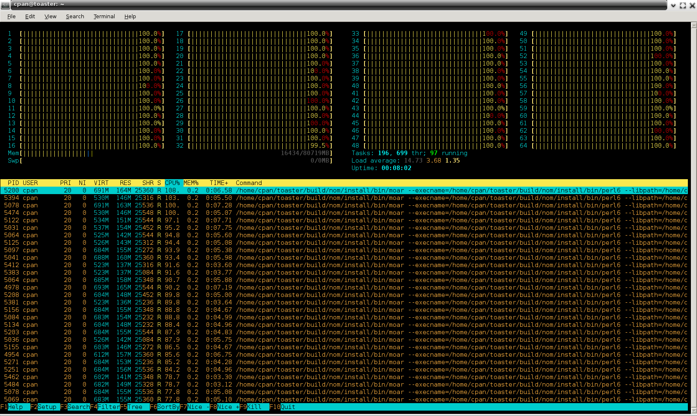
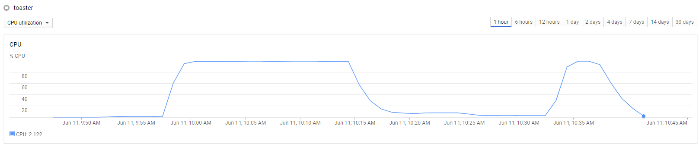

# Raku Release Quality Assurance: Full Ecosystem Toaster
    
*Originally published on [14 June 2017](https://perl6.party//post/Perl-6-Release-Quality-Assurance-Full-Ecosystem-Toaster) by Zoffix Znet.*

As some recall, [Rakudo's 2017.04 release was somewhat of a trainwreck](https://raku.party/post/The-Failure-Point-of-a-Release). It was clear the quality assurance of releases needed to be kicked up a notch. So today, I'll talk about what progress we've made in that area.

## Define The Problem

A particular problem that plagued the 2017.04 release were big changes and refactors made in the compiler that passed all the 150,000+ stresstests, however still caused issues in some ecosystem modules and users' code.

The upcoming 2017.06 has many, many more big changes:

- IO::ArgFiles were entirely replaced with the new IO::CatHandle implementation
- IO::Socket got a refactor and sync sockets no longer use libuv
- IO::Handle got a refactor with encoding and sync IO no longer uses libuv
- Sets/Bags/Mixes got optimization polish and op semantics finalizations
- Proc was refactored to be in terms of Proc::Async

The IO and Proc stuff is especially impactful, as it affects precomp and module loading as well. Merely passing stresstests just wouldn't give me enough of peace of mind of a solid release. It was time to extend the testing.

## Going All In

The good news is I didn't actually have to *write* any new tests. With [836 modules in the Raku ecosystem](http://modules.raku.org/), the tests were already there for the taking. Best of all, they were mostly written without bias due to implementation knowledge of core code, as well as have personal style variations from hundreds of different coders. This is all perfect for testing for any regressions of core code. The only problem is running all that.

While there's a [budding effort to get CPANTesters to smoke Raku dists](http://ugexe.com/perl-toolchain-summit-2017-cpan-and-raku/), it's not quite the data I need. I need to smoke a whole ton of modules on a particular *pre-release* commit, while also smoking them on a previous release on the same box, eliminating setup issues that might contribute to failures, as well as ensuring the results were for the same *versions* of modules.

My first crude attempt involved firing up a [32-core Google Compute Engine VM](https://console.cloud.google.com/compute) and writing [a 60-line script](https://github.com/zoffixznet/zefyr/blob/master/bin/zefyr.p6) that launched 836 [Proc::Asyncs](https://docs.raku.org/type/Proc::Async)—one for each module.

Other than [chewing through 125 GB of RAM with a single Raku program](https://twitter.com/zoffix/status/870108245502853120), the experiment didn't yield any useful data. Each module had to wait for locks, before being installed, and all the Procs were asking [`zef`](https://modules.raku.org/repo/zef) to install to the same location, so dependency handling was iffy. I needed a more refined solution...

## Procs, Kernels, and Murder

So, I started to polish my code. First, I wrote [`Proc::Q` module](https://modules.raku.org/dist/Proc::Q) that let me queue up a bunch of Procs, and scale the number of them running at the same time, based on the number of cores the box had. [`Supply.throttle`](https://docs.raku.org/type/Supply.html#method_throttle) core feature made the job a piece of cake.

However, some modules are naughty or broken and I needed a way to kill Procs that take too long to run. Alas, I discovered that [`Proc::Async.kill`](https://docs.raku.org/type/Proc::Async#method_kill) had a bug in it, where trying to simultaneously kill a bunch of Procs was failing. After some digging I found out the cause was [`$*KERNEL.signal`](https://docs.raku.org/language/variables#index-entry-%24*KERNEL) method the `.kill` was using isn't actually thread safe and the bug was due to a data race in initialization of the signal table.

After [refactoring Kernel.signal](https://github.com/rakudo/rakudo/commit/79b8ab9d3f9a5499e8a7859f34b4499fb352ac13), and [fixing Proc::Async.kill](https://github.com/rakudo/rakudo/commit/99421d4caa05ae952020a6d918f94fc7b68f2305), I released [`Proc::Q` module](https://modules.raku.org/dist/Proc::Q)—my first module [to require](https://modules.raku.org/repo/RakudoPrereq) (at the time) the bleedest of bleeding edges: a HEAD commit.

## Going Atomic

After cooking up [boilerplate DB and Proc::Q](https://github.com/zoffixznet/rakuoaster) code, I was ready to toast the ecosystem.  However, it appeared [`zef`](https://modules.raku.org/repo/zef) wasn't designed, or at least well-tested, in scenarious where up to 40 instances were running module installations simultaneously. I was getting JSON errors from reading ecosystem JSON, broken cache files (due to lack of file locking), and false positives in installations because modules claimed they were already installed.

I initially attempted to solve the JSON errors by [looking at an Issue](https://github.com/raku/ecosystem/issues/345) in the ecosystem repo about the updater script not writing atomically. However, even after [fixing the updater script](https://github.com/raku/ecosystem/commit/ffe71f7583e5ec8ca8ee38f438d00ff78ade6444), I was still getting invalid JSON errors from `zef` when reading ecosystem data.

It might be due to something in `zef`, but instead of investigating it further, I followed *ugexe*++'s advice and told zef not to fetch ecosystem in each Proc.  The broken cache issues were similarly eliminated by disabling caching support.  And the false positives were eliminated telling each zef instance to install the tested module into a separate location.

The final solution involved [programatically editing zef's config file](https://github.com/zoffixznet/rakuoaster/blob/3d8d217a925be3272f6633c18f4ec22c59c87b32/lib/Toaster.pm6#L104-L116) before a toast run to disable auto-updates of CPAN and p6c ecosystem data, and then in individual Procs `zef` module install command ended up being:

```` raku
«zef --/cached --debug install "$module" "--install-to=inst#$where"»
````

Where `$where` is a per-module, per-rakudo-commit location. The final issue was floppy test runs, which I resolved by re-testing failed modules one more time, to see if the new run succeeds.

## Time is Everything

The toasting of the entire ecosystem on HEAD and 2017.05 releases took about three hours on a 24-core VM, while being unattended. While watching over it and killing the few hanging modules at the end without waiting for them to time out
makes a single-commit run take about 65 minutes.

I also did a toast run on a 64-core VM...



Overall, the run took me 50 minutes, and I had to manually kill some modules' tests. However, looking at CPU utilization charts, it seems the run sat idle for dozens of minutes before I came along to kill stuff:



So I think after some polish of avoiding hanging modules and figuring out why (apparently) Proc::Async.kill still doesn't kill everything, the runs can be entirely automated and a single run can be completed in about 20-30 minutes.

This means that even with last-minute big changes pushed to Rakudo, I can still toast the entire ecosystem reasonably fast, detect any potential regressions, fix them, and re-test again.

## Reeling In The Catch

The [Toaster database is available for viewing at toast.raku.party](https://toast.raku.party/). As more commits get toasted, they get added to the database. I plan to clear them out after each release.

The toasting runs I did so far weren't just a chance to play with powerful hardware.  The [very first issue](https://rt.perl.org/Ticket/Display.html?id=131561) was detected when toasting [`Clifford` module](http://modules.raku.org/dist/Clifford).

The issue was to do with [`Lists`](https://docs.raku.org/type/List) of [`Pairs`](https://docs.raku.org/type/Pair) with same keys coerced into a [`MixHash`](https://docs.raku.org/type/MixHash), when the final accumulative weight was zero. The issue was introduced on June 7th and it took me about an hour of digging through the module's guts to find it. Considering it's quite an edge case, I imagine without the toaster runs it would take a lot longer to identify this bug. [*lizmat*++ squashed this bug](https://github.com/rakudo/rakudo/commit/bf95bcb6c050bf7fbaa80d0754defc9d003fd072) hours after identification and it never made it into any releases.

The other issue detected by toasting had to do with the VM-backed decoder serialization introduced during IO refactor and [*jnthn*++ fixed it](https://github.com/MoarVM/MoarVM/commit/c4dbebe119d6c0bafaf11607caba083314322871) a day after detection. One more bug had to do with Proc refactor making Proc not synchronous-enough. It was [mercilessly squashed, while fixing a couple of longstanding issues with Proc](https://github.com/rakudo/rakudo/commit/e4468c610c1565be267dc6688d050c985e056afc).

All of these issues weren't detected by the 150,000+ tests in the testsuite and while an argument can be made that the tests are sparse in places, there's no doubt the Toaster has paid off for the effort in making it by catching bugs that might've otherwise made it into the release.

## The Future

The future plans for the Toaster would be first to make it toast on more platforms, like Windows and MacOS. Eventually, I hope to make toast runs continuous, on less-powerful VMs that are entirely automated. An IRC bot would watch for any failures and report them to the [dev channel](https://webchat.freenode.net/?channels=#raku-dev).

## Conclusion

The ecosystem Toaster lets core devs test a Rakudo commit on hundreds of software pieces, made by hundreds of different developers, all within a single hour. During its short existence, the Toaster already found issues with ecosystem infrastructure, highly-multi-threaded Raku programs, as well as detected regressions and new bugs that we were able to fix before the release.

The extra testing lets core devs deliver higher-quality releases, which makes Raku more trustworthy to use in production-quality software. The future will see the Toaster improved to test on a wider range of systems, as well as being automated for continued extended testing.

And most importantly, the Toaster makes it possible for any Raku programmer to help core development of Raku, by simply [publishing a module](https://docs.raku.org/language/modules).

-Ofun
