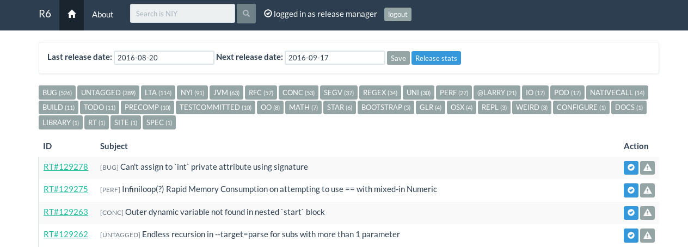
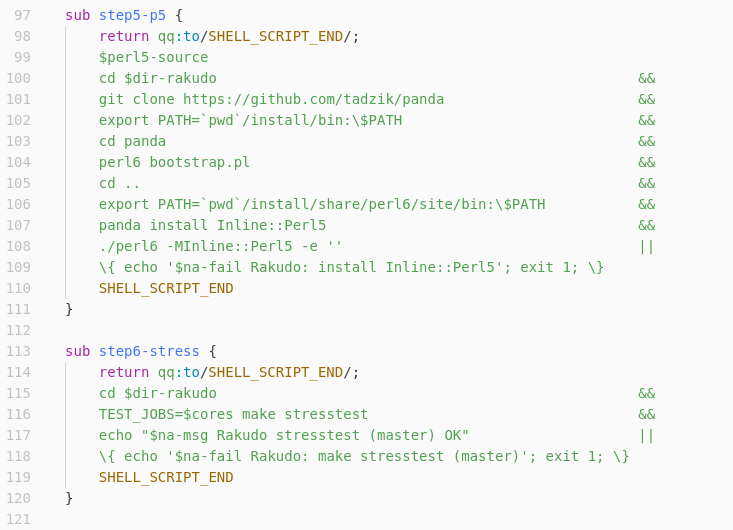
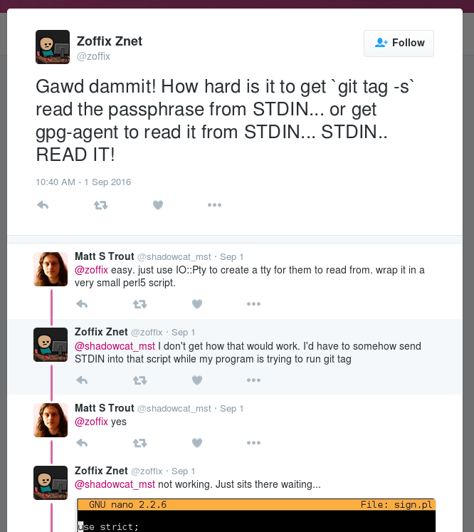

# Perl6.Fail, Release Robots, and Other Goodies
    
*Originally published on [17 September 2016](https://perl6.party//post/Perl6-Fail-Release-Robots-And-Other-Goodies) by Zoffix Znet.*

*Deconfusion note: if you're just a regular Raku user, you likely use and only ever heard of Rakudo Star, which is a distribution that includes the Rakudo Raku Compiler, some modules, and the docs. This post details a release of that compiler* **only,** *which gets released more often than Rakudo Star.  So please don't think there's a new release, if Star is all you use.*

If you follow [what I write](http://raku.party), you know that last month I messed up a Raku release and vowed to [improve the process](/post/I-Botched-A-Perl-6-Release-And-Now-A-Robot-Is-Taking-My-Job), by making a release robot. Well, I didn't lie!
  
> *** Zoffix** dissapears for a couple of weeks

> **<Zoffix>** Can be reached via twitter if needed

I popped in [some relaxing music](https://www.youtube.com/watch?v=2eRgh-dNjAk) and got cracking. Today, I'll talk about the goodies I've made, which touch a much broader scope than just releasing Raku.

Let the gift unwrapping begin!

## Raku.Fail: R6 Is The New RT

First thing I needed was a web app where a release manager could view new bug tickets since last release and mark them as release-blockers, if needed.  The app needs to keep track of what tickets were already reviewed, so the release manager can spend just a couple of minutes of their time every few days, instead of cramming everything into a single sitting on release date.

I named that app **R6**.  The six fits the Raku theme, and `6` is above `T` on the keyboard, which I found apropos, since my app is better than [stock RT](https://bestpractical.com/request-tracker) we currently use 😜.  With the name for the bug app in place, I went to hunt for neat domain names to host it on and nearly immediately found the perfectest one: **[raku.fail](http://raku.fail)**.

Helping release managers is the smaller side of the utility of the app and it aims to address some of the major pain points with RT (or rather with our particular instance of RT that we also have to share with Perl).

### Viewing Tags

The RT version has [overly complicated interface](/post/A-Date-With-The-Bug-Queue-or-Let-Me-Help-You-Help-Me-Help-You--Part-2#lesson4:tagyourticketsandmakethemeasytofind) when it comes to trying to find a ticket tagged with a particular tag. Worse still, some tags are just special codes in ticket subject lines, while others use the actual tag interface. Annoying!

This is one of the first things I solved in R6. The home page lists all available tags, along with ticket counts for each tag. Simply clicking the tag will show the tickets just for that tag.



Simple. Just the way it's supposed to be.

### Searching and Decent Editor

Once I get more tuits, I plan to also add full-text ticket search and a decent Markdown editor for ticket replies.

### Release Managers

If you log in as a release manager, you get extra bells and whistles in the interface that let you mark tickets as was the original plan, as well as mark commits as reviewed, when updating changelog.

### API

The release robot has to fetch info from this app to know whether all tickets and commits have been reviewed. As such, [adding `.json` to the URL](http://raku.fail/t/BUG.json) of most pages will cause the app provide output in JSON format, rather than plain ol' HTML.

Speaking of robots...

## Buggable

Some of you have already seen my prototype bot `buggable`. It was... well, let's just say the name suits it.
  
> **<buggable>** ☠ [travis build above] One job failed but NOT due to the timeout.

> **<lizmat>** 'No output has been received in the last 10m0s, this potentially indicates a stalled build or something wrong with the build itself.'

> **<lizmat>** sounds like timeout to me
  
> **<buggable>** geekosaur, Found 2 tickets tagged with STAR.  Details: http://bug.raku.party/1470861574.html

> **<geekosaur>** o.O

> **<geekosaur>** buggable appears to have a math problem

First, I fixed the Travis bogus-failure watcher and taught it to handle missing build logs and GitHub connectivity issues:
  
> **<buggable>** [travis build above] ✓ All failures are due to timeout (0), missing build log (1), or GitHub connectivity (0)

As for tags and tickets, I completely threw away the old backend that used RT API and its own database. Instead, the bot now uses the API of the R6 app I made.
  
> **<Zoffix>** buggable, tags

> **<buggable>** Zoffix, **Total: 439;** **BUG:** 189; **UNTAGGED:** 58; **LTA:** 54; **RFC:** 40; **CONC:** 20; **SEGV:** 18; **JVM:** 14; **UNI:** 13; **PERF:** 12; **TESTNEEDED:** 12; **POD:** 9; **PRECOMP:** 9; **@LARRY:** 7; **NATIVECALL:** 7; **NYI:** 6; **IO:** 5; **REGEX:** 5; **BUILD:** 3; **MATH:** 3; **REPL:** 3; **GLR:** 2; **OSX:** 2; **WEIRD:** 2; **BOOTSTRAP:** 1; **CONFIGURE:** 1; **OO:** 1; **RT:** 1; **SITE:** 1; **SPEC:** 1; **STAR:** 1; **TESTCOMMITTED:** 1; See [http://raku.fail/](http://raku.fail/) for details

> **<Zoffix>** buggable, tag bug,rfc

> **<buggable>** Zoffix, There are **2 tickets** tagged with **BUG, RFC**; See [http://raku.fail/t/BUG,RFC](http://raku.fail/t/BUG,RFC) for details

Not only all the issues are gone, it now picks up the proper RT tags too and not just the ones in the subject line. You can specify multiple tags with a comma, to find tickets with a combination of tags.

Once ticket search is implemented in R6, `buggable` will be able to search for tickets, which can be handy in-chat when trying to decide whether something was or needs to be rakudobugged.

## NeuralAnomaly

Finally, I'm proud to present the star of the hour and the newest member of the release team: `NeuralAnomaly`. It graciously made the release of the Rakudo Raku Compiler this month, successfully replacing me at the job:
  
> **<Zoffix>** NeuralAnomaly, yo

> **<NeuralAnomaly>** Zoffix, hey

> **<Zoffix>** NeuralAnomaly, it's time

> **<NeuralAnomaly>** Zoffix, Oh boy! Really?! We're doing a realease‽‽ YEY!

> **<Zoffix>** Yup

> **<Zoffix>** NeuralAnomaly, cut the release

> **<NeuralAnomaly>** Zoffix, Will do! If you're feeling particularly naughty, you can watch me at http://raku.fail/release/progress or go look at some cats http://www.lolcats.com/

> **<NeuralAnomaly>** Zoffix, ♥♥♥♥♥♥ Prep done

> **<NeuralAnomaly>** Zoffix, ♥♥♥♥♥♥ nqp tests OK

> **<NeuralAnomaly>** Zoffix, ♥♥♥♥♥♥ nqp release tarball tests OK

> **<NeuralAnomaly>** Zoffix, ♥♥♥♥♥♥ nqp release DONE

> **<NeuralAnomaly>** Zoffix, ♥♥♥♥♥♥ Rakudo stresstest (master) OK

> **<NeuralAnomaly>** Zoffix, ♥♥♥♥♥♥ Rakudo stresstest (6.c-errata) OK

> **<NeuralAnomaly>** Zoffix, ♥♥♥♥♥♥ Rakudo release DONE

> **<NeuralAnomaly>** Zoffix, ♥♥♥♥♥♥ Post: upload tarballs to rakudo.org

> **<NeuralAnomaly>** Zoffix, 🎺🎺🎺📯📯📯📯📯📯🌈🌈🌈📦📦📦

> **<NeuralAnomaly>** Zoffix, The release of **Rakudo #103 2016.09** has now been completed

> **<NeuralAnomaly>** Zoffix, 🎺🎺🎺📯📯📯📯📯📯🌈🌈🌈📦📦📦

> *** NeuralAnomaly** celebrates with an appropriate amount of fun

## The Tech

The code for all of the deliverables is [available on GitHub](https://github.com/zoffixznet), in [R6 repo](https://github.com/zoffixznet/r6), [Buggable repo](https://github.com/zoffixznet/rakuuggable), and [NeuralAnomaly repo](https://github.com/zoffixznet/na).

### R6

The R6 app uses [RT's REST API](https://rt-wiki.bestpractical.com/wiki/REST) to ask the running RT instance for updated tickets every 10 minutes.

I chose Perl as the weapon of choice, utilizing the talents of the [Mojolicious web framework](http://mojolicious.org/) and [`DBIx::Class` ORM](https://metacpan.org/pod/DBIx::Class).

I attempted to use [`RT::Client::REST`](https://metacpan.org/pod/RT::Client::REST) for API interfacing, but found the module oddly designed and requiring too many requests to obtain information I needed. So I implemented the relevant portions of the RT's REST API interface myself.

For user accounts, I ~~stole~~ borrowed, `RT::Client::REST` authentication mechanism, although at the time of this writing, no user-account features are available to users (and raku.fail still runs on plain HTTP). And *Will "Coke" Coleda* was very helpful in pointing out a relevant portion of the API that let me save making a huge number of requests. And current implementation makes just a single request every 10 minutes, asking only for updated tickets since last request.

### Buggable

The bot uses my very own [`IRC::Client` Raku module](https://modules.raku.org/dist/IRC::Client) and is pretty thin and isn't much to look at. Using [`JSON::Fast`](https://modules.raku.org/dist/JSON::Fast) and [`HTTP::UserAgent`](https://modules.raku.org/dist/HTTP::UserAgent) modules it accesses [R6](http://raku.fail) using its JSON endpoints to fetch the tag info and perform ticket searches.

Travis features use [Travis API](https://docs.travis-ci.com/api). Since the stuff I use does not require authentication, this is nothing more than fetching data from an endpoint and decoding JSON.  I found [JSONViewer.Stack.Hu](http://jsonviewer.stack.hu/) helpful when figuring out what bits of data I wanted to keep.

### NeuralAnomaly

When I planned this bot, I suspected developing it would be somewhat difficult, with lots of thinking... In reality, *writing code for it* turned out to be super easy.  Popping `ssh` into [`Proc::Async`](https://docs.raku.org/type/Proc::Async) was child's play, and the Proc bailed out on non-zero exit codes, which made it super easy for me to abort failing stages of the process. I basically ended up with Raku-super-charged bash scripts... quite literally:



However, when it came to giving `gpg` and `git tag` the passphrase for the key, that... is worth its own section.

#### *Won't You Take My Passphrase Please*

The major roadblock was trying to pass the GPG passphrase to the `gpg` (which was easy) and to the `git` when signing the tag (which got annoying quick).

Avoiding [idiotic solutions that tell you to write your passphrase into world-readable files](http://stackoverflow.com/a/11270814), I went to enable the `gpg-agent` by installing `gnupg-agent`, uncommenting `use-agent` in `~/.gnupg/gpg.conf`, and running `eval $(gpg-agent --daemon --sh)`

That did the trick with starting the agent, *but* `git tag` was now outright choking when attempting to sign, telling me `'gpg: cancelled by user'`, even though I did naught.

After several hours of trying things and getting a helping hand from *mst*, the solution was nowhere in sight:



However, after installing a program called `unbuffer```` (`sudo apt-get install expect-dev`), reading its help page, and inserting an appropriate amount of sleeps, I ended up with these chunks of code in my release bot that seemed to do the trick when passing them to commands requiring keys:

````
constant $with-github-credentials is export
    = "(sleep 6; echo -e '$github-user\\n';"
    ~ " sleep 6; echo -e '$github-pass\\n'; sleep 12) | unbuffer -p";
constant $with-gpg-passphrase     is export
    = "(sleep 6; echo '$gpg-keyphrase'; sleep 12) | unbuffer -p";
...
gpg --batch --no-tty --passphrase-fd 0 -b \\
    --armor rakudo-$rakudo-ver.tar.gz                           ||
\{ echo '$na-fail Rakudo: Sign the tarball'; exit 1; \}
$gpg-keyphrase
...
$with-github-credentials git push
````

Echoing like that is not ideal, but this is running in a single-user VM, so it'll do for now.

The remaining bits of the scripting were easy.

#### Step Right Up

After completing full release scripts for NQP and Rakudo and ensuring they work, it was time to break them. If a single spectest test fails in final tarball testing due to being floppy, you don't want to repeat the whole process from scratch. So I broke up release scripts into bite-size pieces and made the bot able to run individual pieces on command.

That had a positive unintended effect:
  
> **<Zoffix>** NeuralAnomaly, run pre r-clone r-build r-p5 r-stress r-stress-v6c

> **<NeuralAnomaly>** Zoffix, ♥♥♥♥♥♥ Prep done

> **<NeuralAnomaly>** Zoffix, ♥♥♥♥♥♥ Rakudo stresstest (master) OK

> **<NeuralAnomaly>** ♥♥♥♥♥♥ Rakudo stresstest (6.c-errata) OK

> **<NeuralAnomaly>** ♥♥♥ All Done! ♥♥♥

> **<Zoffix>** :D

> **<Zoffix>** So the release bot doubles as a stresstester too :)

#### Testing

The most ~~difficult~~ annoying phase was testing. Not only does the full build runs for about 40 minutes even on my 24-core VM, but I had to delete and then re-clone both NQP and Rakudo repos, because their state had to be pristine.

After countless hours and hundreds of Rakudos built, I can now recite the build process with my eyes closed :)

## The Future

All of these goodies burnt me out a bit—stuff started to feel like "work" rather than enjoyment. It wasn't the code, but the testing. There's nothing quite like 40-minute test sessions, where a single typo sends you to square one. So I plan to take the next month or so "off," working on other things in Rakudo. But eventually, I plan to improve both R6 and the release robot.

Currently, the bot does not send email announcements and I've not even checked whether Wikipedia has an API to make automated updates. R6 also has a ton of improvement potential by allowing to view and comment on existing tickets, as well as provide useful search features.

## Conclusion

This month, Raku's release cycle received an awesome upgrade: release steps got abstracted into commands to be issued to an IRC bot. More to it, release managers no longer have to cram all of their work into a single day, but are now free to spread it out throughout the month.

The new website [raku.fail](http://raku.fail) makes it easy to locate tickets tagged with a particular tag and will be eventually expanded into a more usable bug tracker interface.

More than getting just the release robot, the Raku development team now also has a spectest robot that will regularly "practice" doing releases, spotting any of the issues much sooner than previously was possible.

Things got better.

-Ofun
