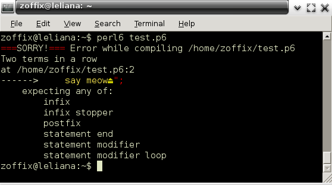

# The Awesome Errors of Raku
    
*Originally published on [15 August 2016](https://perl6.party//post/The-Awesome-Errors-of-Perl-6) by Zoffix Znet.*

If you're following tech stuff, you probably know by now about the folks at Rust land working on [some totally awesome error reporting capabilities](https://internals.rust-lang.org/t/new-error-format/3438). Since Raku is also known for its Awesome Errors, [mst](https://twitter.com/shadowcat_mst) inquired for some examples to show off to the rustaceans, and unfortunately I drew a blank...

Errors are something I try to avoid and rarely read in full. So I figured I'll hunt down some cool examples of Awesome Errors and write about them. While I could just bash my head on the keyboard and paste the output, that'd be quite boring to read, so I'll talk about some of the tricky errors that might not be obvious to beginners, and how to fix them.

Let the head bashing begin!

## The Basics

Here's some code with an error in it;

```` raku
say "Hello world!;
say "Local time is {DateTime.now}";
# ===SORRY!=== Error while compiling /home/zoffix/test.p6
# Two terms in a row (runaway multi-line "" quote starting at line 1 maybe?)
# at /home/zoffix/test.p6:2
# ------> say "⏏Local time is {DateTime.now}";
#     expecting any of:
#         infix
#         infix stopper
#         postfix
#         statement end
#         statement modifier
#         statement modifier loop
````

The first line is missing the closing quote on the string, so everything until the opening quote on the second line is still considered part of the string. Once the supposedly closing quote is found, Raku sees word "Local," which it identifies as a term. Since two terms in a row are not allowed in Raku, the compiler throws an error, offering some suggestions on what it was expecting, and it detects we're in a string and suggests we check we didn't forget a closing quote on line 1.

The `===SORRY!===` part doesn't mean you're running the Canadian version of the compiler, but rather that the error is a compile-time (as compared to a run-time) error.

## Nom-nom-nom-nom

Here's an amusing error. We have a subroutine that returns things, so we call it and use a `for` loop to iterate over the values:

```` raku
sub things { 1 … ∞ }
for things {
    say "Current stuff is $_";
}
# ===SORRY!===
# Function 'things' needs parens to avoid gobbling block
# at /home/zoffix/test.p6:5
# ------> }⏏<EOL>
# Missing block (apparently claimed by 'things')
# at /home/zoffix/test.p6:5
# ------> }⏏<EOL>
````

Raku lets you omit parentheses when calling subroutines. The error talks about gobbling blocks. What happens is the block we were hoping to give to the `for` loop is actually being passed to the subroutine as an argument instead. The second error in the output corroborates by saying the `for` loop is missing its block (and makes a suggestion it was taken by the our `things` subroutine).

The first error tells us how to fix the issue: `Function 'things' needs parens`, so our loop needs to be:

```` raku
for `things` {
    say "Current stuff is $_";
}
````

However, were our subroutine actually expecting a block to be passed, no parentheses would be necessary. Two code blocks side by side would result in "two terms in a row" error we've seen above, so Raku knows to pass the first block to the subroutine and use the second block as the body of the `for` loop:

```` raku
sub things (&code) { code }
for things { 1 … ∞ } {
    say "Current stuff is $_";
}
````

## Did You Mean Levestein?

Here's a cool feature that will not only tell you you're wrong, but also point out what you might've meant:

```` raku
sub levenshtein {}
levestein;
# ===SORRY!=== Error while compiling /home/zoffix/test.p6
# Undeclared routine:
#     levestein used at line 2. Did you mean 'levenshtein'?
````

When Raku encounters names it doesn't recognize it computes [Levenshtein distance](https://en.wikipedia.org/wiki/Levenshtein_distance) for the things it *does* know to try to offer a useful suggestion. In the instance above it encountered an invocation of a subroutine it didn't know about. It noticed we do have a similar subroutine, so it offered it as an alternative.  No more staring at the screen, trying to figure out where you made the typo!

The feature doesn't consider everything under the moon each time it's triggered, however. Were we to capitalize the sub's name to `Levenshtein`, we would no longer get the suggestion, because for things that start with a capital letter, the compiler figures it's likely a type name and not a subroutine name, so it checks for those instead:

```` raku
class Levenshtein {}
Lvnshtein.new;
# ===SORRY!=== Error while compiling /home/zoffix/test.p6
# Undeclared name:
#    Lvnshtein used at line 2. Did you mean 'Levenshtein'?
````

## Once You Go Seq, You Never Go Back

Let's say you make a short sequence of Fibonacci numbers. You print it and then you'd like to print it again, but this time square each member. What happens?

```` raku
my $seq = (1, 1, * + * … * > 100);
$seq             .join(', ').say;
$seq.map({ $_² }).join(', ').say;
# 1, 1, 2, 3, 5, 8, 13, 21, 34, 55, 89, 144
# This Seq has already been iterated, and its values consumed
# (you might solve this by adding .cache on usages of the Seq, or
# by assigning the Seq into an array)
#   in block <unit> at test.p6 line 3
````

Ouch! A run-time error. What's happening is the [`Seq` type](https://docs.raku.org/type/Seq) we get from the [the sequence operator](https://docs.raku.org/language/operators#index-entry-..._operators) doesn't keep stuff around. When you iterate over it, each time it gives you a value, it discards it, so once you've iterated over the entire `Seq`, you're done.

Above, we're attempting to iterate over it again, and so the Rakudo runtime cries and complains, because it can't do it. The error message does offer two possible solutions.  We can either use the [`.cache` method](https://docs.raku.org/routine/cache) to obtain a `List` we'll iterate over:

```` raku
my $seq = (1, 1, * + * … * > 100).cache;
$seq             .join(', ').say;
$seq.map({ $_² }).join(', ').say;
````

Or we can use an [Array](https://docs.raku.org/type/Array) from the get go:

```` raku
my @seq = 1, 1, * + * … * > 100;
@seq             .join(', ').say;
@seq.map({ $_² }).join(', ').say;
````

And even though we're storing the `Seq` in an `Array`, it won't get reified until it's actually needed:

```` raku
my @a = 1 … ∞;
say @a[^10];
# OUTPUT:
# (1 2 3 4 5 6 7 8 9 10)
````

## These Aren't The Attributes You're Looking For

Imagine you have a class. In it, you have some private attributes and you've got a method that does a regex match using the value of that attribute as part of it:

```` raku
class {
    has $!prefix = 'foo';
    method has-prefix ($text) {
        so $text ~~ /^ $!prefix/;
    }
}.new.has-prefix('foobar').say;
# ===SORRY!=== Error while compiling /home/zoffix/test.p6
# Attribute $!prefix not available inside of a regex, since regexes are methods on Cursor.
# Consider storing the attribute in a lexical, and using that in the regex.
# at /home/zoffix/test.p6:4
# ------>         so $text ~~ /^ $!prefix⏏/;
#     expecting any of:
#         infix stopper
````

Oops! What happened?

It's useful to understand that as far as the parser is concerned, Raku is actually braided from several languages: Raku, Quote, and Regex languages are parts of that braiding. This is why stuff like this Just Works™:

```` raku
say "foo { "bar" ~ "meow" } ber ";
# OUTPUT:
# foo barmeow ber
````

Despite the interpolated code block using the same `"` quotes to delimit the strings within it as the quotes on our original string, there's no conflict.  However, the same mechanism presents us with a limitation in regexes, because in them, the looked up attributes belong to the `Cursor` object responsible for the regex.

To avoid the error, simply use a temporary variable to store the `$!prefix` in—as suggested by the error message—or use the `given` block:

```` raku
class {
    has $!prefix = 'foo';
    method has-prefix ($text) {
        given $!prefix { so $text ~~ /^ $_/ }
    }
}.new.has-prefix('foobar').say;
````

## De-Ranged

Ever tried to access an element of a list that's out of range?

```` raku
my @a = <foo bar ber>;
say @a[*-42];
# Effective index out of range. Is: -39, should be in 0..Inf
#  in block <unit> at test.p6 line 2
````

In Raku, to index an item from the end of a list, you use funky syntax: `[*-42]`. That's actually a closure that takes an argument (which is the number of elements in the list), subtracts 42 from it, and the return value is used as an actual index. You could use `@a[sub ($total) { $total - 42 }]` instead, if you were particularly bored.

In the error above, that index ends up being `3 - 42`, or `-39`, which is the value we see in the error message. Since indexes cannot be negative, we receive the error, which also tells us the index must be 0 to positive infinity (with any indexes above what the list contains returning `Any` when looked up).

## A Rose By Any Other Name, Would Code As Sweet

If you're an active user of Raku's sister language, the Perl, you may sometimes write Perl-5-isms in your Raku code:

```` raku
say "foo" . "bar";
# ===SORRY!=== Error while compiling /home/zoffix/test.p6
# Unsupported use of . to concatenate strings; in Raku please use ~
# at /home/zoffix/test.p6:1
# ------> say "foo" .⏏ "bar";
````

Above, we're attempting to use Perl's concatenation operator to concatenate two strings. The error mechanism is smart enough to detect such usage and to recommend the use of the correct `~` operator instead.

This is not the only case of such detection. There are many. Here's another example, detecting accidental use of Perl's diamond operator, with several suggestions of what the programmer may have meant:

```` raku
while <> {}
# ===SORRY!=== Error while compiling /home/zoffix/test.p6
# Unsupported use of <>; in Raku please use `lines` to read input, ('') to
# represent a null string or () to represent an empty list
# at /home/zoffix/test.p6:1
# ------> while <⏏> {}
````

## Heredoc, Theredoc, Everywheredoc

Here's an evil error and there's nothing awesome about it, but I figured I'd mention it, since it's easy to debug if you know about it, and quite annoying if you don't. The error is evil enough that it may have been already improved if you're reading this far enough in the future from when I'm writing this.

Try to spot what the problem is... read the error at the bottom first, as if you were the one who wrote (and so, are familiar with) the code:

```` raku
my $stuff = qq:to/END/;
Blah blah blah
END;
for ^10 {
    say 'things';
}
for ^20 {
    say 'moar things';
}
sub foo ($wtf) {
    say 'oh my!';
}
# ===SORRY!=== Error while compiling /home/zoffix/test.p6
# Variable '$wtf' is not declared
# at /home/zoffix/test.p6:13
# ------> sub foo (⏏$wtf) {
````

Huh? It's crying about an undeclared variable, but it's pointing to a signature of a subroutine. Of course it won't be declared. What sort of e-Crack is the compiler smoking?

For those who didn't spot the problem: it's the spurious semicolon after the closing `END` of the heredoc. The heredoc ends where the closing delimiter appears on a line all by itself. As far as the compiler is concerned, we've not seen the delimiter at `END;`, so it *continues* parsing as if it were still parsing the heredoc.  A `qq` heredoc lets you interpolate variables, so when the parser gets to the `$wtf` variable in the signature, it has no idea it's in a signature of an actual code and not just some random text, so it cries about the variable being undeclared.

## Won't Someone Think of The Reader?

Here's a great error that prevents you from writing horrid code:

```` raku
my $a;
sub {
    $a.say;
    $^a.say;
}
# ===SORRY!=== Error while compiling /home/zoffix/test.p6
# $a has already been used as a non-placeholder in the surrounding sub block,
#   so you will confuse the reader if you suddenly declare $^a here
# at /home/zoffix/test.p6:4
# ------>         $^a⏏.say;
````

Here's a bit of a background: you can use the [`$^` twigil](https://docs.raku.org/language/variables#index-entry-%24^) on variables to create an implicit signature. To make it possible to use such variables in nested blocks, this syntax actually creates the same variable without the twigil, so `$^a` and `$a` are the same thing, and the signature of the sub above is `($a)`.

In our code, we also have an `$a` in outer scope and supposedly we print it first, before using the `$^` twigil to create another `$a` in the same scope, but one that contains the argument to the sub... complete brain-screw! To avoid this, just rename your variables to something that doesn't clash. How about some Thai?

```` raku
my $ความสงบ = 'peace';
sub {
    $ความสงบ.say;
    $^กับตัวแปรของคุณ.say;
}('to your variables');
# OUTPUT:
# peace
# to your variables
````

## Well, Colour Me Errpressed!

If your terminal supports it, the compiler will emit ANSI codes to colourize the output a bit:

```` raku
for ^5 {
    say meow";
}
````



That's all nice and spiffy, but if you're, say, capturing output from the
compiler to display it elsewhere, you may get the ANSI code as is, like `31m===[0mSORRY to set it as soon as the assignment is compiled:

```` raku
BEGIN %*ENV<RAKUDO_ERROR_COLOR> = 0;
for ^5 {
    say meow";
}
````

## An Exceptional Failure

Raku has a special exception—[`Failure`](https://docs.raku.org/type/Failure)—that doesn't explode until you try to use it as a value, and you can even defuse it entirely by using it in boolean context. You can produce your own Failures by calling the [`fail`](https://docs.raku.org/routine/fail) subroutine and Raku uses them in core whenever it can.

Here's a piece of code where we define a prefix operator for calculating the circumference of an object, given its radius. If the radius is negative, it calls `fail`, returning a `Failure` object:

```` raku
sub prefix:<⟳> (\𝐫) {
    𝐫 < 0 and fail 'Your object warps the Universe a new one';
    τ × 𝐫;
}
say 'Calculating the circumference of the mystery object';
my $cₘ = ⟳ −𝑒;
say 'Calculating the circumference of the Earth';
my $cₑ = ⟳ 6.3781 × 10⁶;
say 'Calculating the circumference of the Sun';
my $cₛ = ⟳ 6.957 × 10⁸;
say "The circumference of the largest object is {max $cₘ, $cₑ, $cₛ} metres";
# OUTPUT:
# Calculating the circumference of the mystery object
# Calculating the circumference of the Earth
# Calculating the circumference of the Sun
# Your object warps the Universe a new one
#   in sub prefix:<⟳> at test.p6 line 2
#   in block <unit> at test.p6 line 7
#
# Actually thrown at:
#   in block <unit> at test.p6 line 15
````

We're calculating the circumference for a negative radius on line 7, so if it were just a regular exception, our code would die there and then. Instead, by the output we can see that we *continue* to calculate the circumference of the Earth and the Sun, until we get to the last line.

There we try to use the `Failure` in `$cₘ` variable as one of the arguments to the [`max` routine](https://docs.raku.org/routine/max). Since we're asking for the actual value, the Failure explodes and gives us a nice backtrace. The error message includes the point where our Failure blew up (line 15), where we received it (line 7) as well as where it came from (line 2). Pretty sweet!

## Conclusion

Useful, descriptive errors are becoming the industry standard and Raku and [Rust](https://doc.rust-lang.org/book/README.html) languages are leading that effort. The errors must go beyond merely telling you the line number to look at. They should point to a piece of code you wrote.  They should make a guess at what you meant. They should be referencing your code, even if they originate in some third party library you're using.

Most of Raku errors display the piece of code containing the error. They use algorithms to offer valid suggestions when you mistyped a subroutine name.  If you're used to other languages, Raku will detect your "accent," and offer the correct way to pronounce your code in Raku. And instead of immediately blowing up, Raku offers a mechanism to propagate errors right to the code the programmer is writing.

Raku has Awesome Errors.
