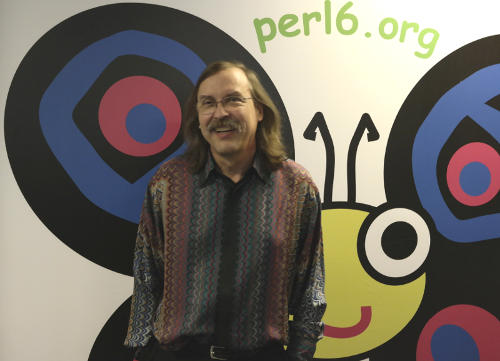

# WANTED: Raku Historical Items
    
*Originally published on [16 April 2018](https://perl6.party//post/WANTED-Perl-6-Historical-Items) by Zoffix Znet.*

The Raku programming language had a turbulent birth. It was announced in the summer of 2000 and the first stable language release shipped out only 2 years ago, on Christmas, 2015. A lot has happened during that decade and a half, yet the details are hard to piece together.

After my recent facelift to [rakudo.org](https://rakudo.org/), I'm working on a (second) facelift to [raku.org](https://raku.org) website.

Part of the work involves bringing all the Raku deliverables under one umbrella, so the user isn't thrown around multiple websites, trying to find what to install. At the same time, we want to strengthen the distinction between Raku the language and the compilers that implement it, as well as encourage more implementors to give it a go at implementing a Raku programming language compiler.

The Raku Programming Language Museum will be part of that effort and along with interesting tidbits of Raku history, it'll showcase past implementation attempts that may no longer be in active development today. Since I don't know much about what happened before I came to the language sometime in 2015, I need your help in collecting those tidbits.

In my mind's eye, I'm imagining a few pages on raku.org; something in the same vein as [Computer History Museum's pages](http://www.computerhistory.org/timeline/software-languages/)—pictures, years, and info, and potentially links to code repositories. Depending on the content we collect, it's possible there will be a digital PDF version of the Museum that can also be printed and handed out at events, if desired.

I'm looking for:

- Descriptions of interesting/significant events (like the mug throwing incident).
- Descriptions of interesting/significant implementations of Raku or influential Raku projects. Having links to repos/tarballs of their code is a plus.
- Samples of interesting/significant email threads or chat logs.
- Pictures of interesting/significant objects (first sight at plush Camelias?).
- Pictures of interesting/significant humans ([a filled out model release form is required](https://github.com/raku/museum-items/blob/master/MODEL-RELEASE-FORM.md)).
- Anything else that's Museum worthy.

If you have any of these items, please submit them to the appropriate year directory in the [Raku Museum Items repository](https://github.com/raku/museum-items). If you're a member of Raku GitHub org, you should already have a commit bit to that repo. Otherwise, submit your items via a pull request.

Let's build something cool and interesting for the people using Raku a hundred years from now to look at and remember!

If you have any questions or need help, [talk to a human on our IRC chat](https://webchat.freenode.net/?channels=#raku).

-OFun
